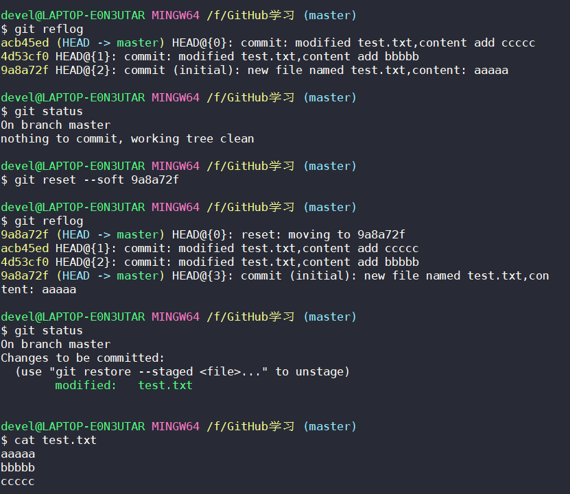
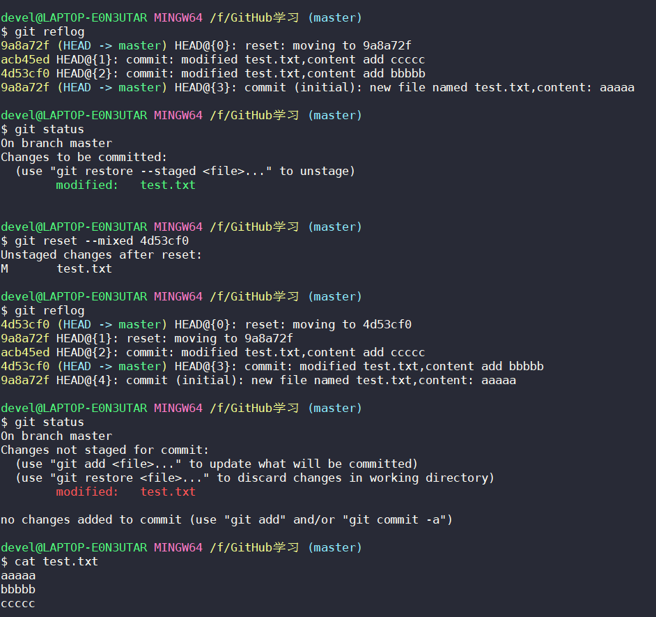
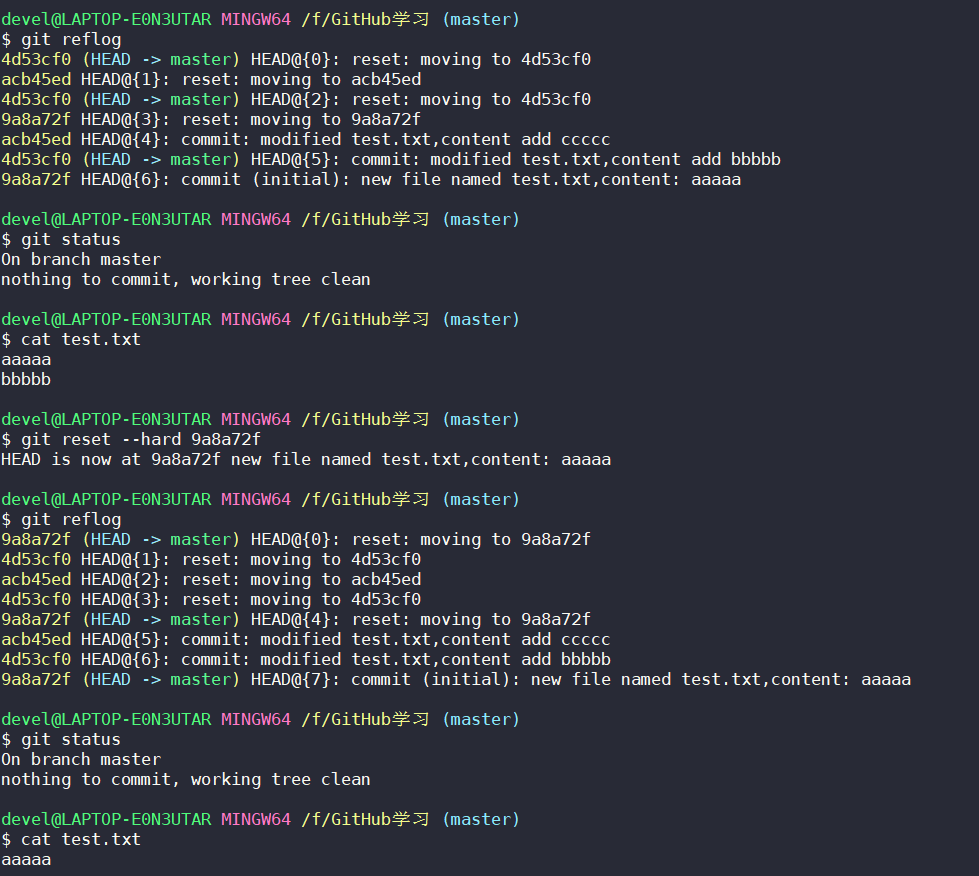
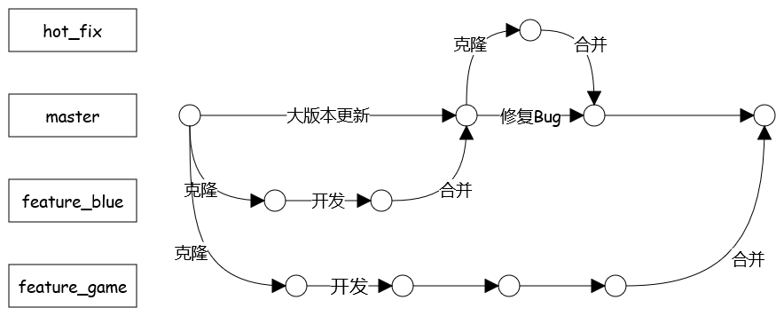
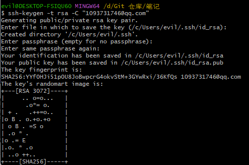
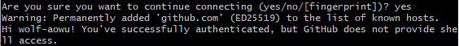
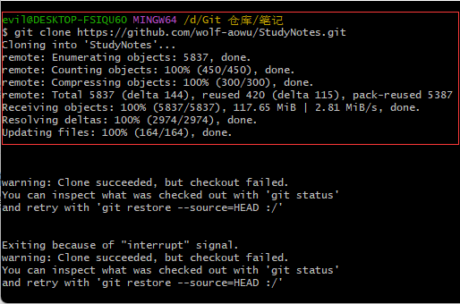

# 安装

**git官网**：https://git-scm.com/

直接安装即可

**GitHub官网**：https://github.com/

# 本地库初始化

在当前目录下本地库初始化，会在当前目录中生成隐藏文件夹 .git

```shell
git init
```

# 查看命令帮助文档

```shell
git help 命令
```

# bash 中文乱码

先尝试下面代码（我试了就成功了）

```shell
git config --global core.quotepath false
```

如果不成功，尝试下面代码

```shell
git config --global gui.encoding utf-8
git config --global i18n.commit.encoding utf-8
git config --global i18n.logoutputencoding utf-8
export LESSCHARSET=utf-8
```

# 设置签名

必须要设置签名。

**作用**：区分不同开发者身份

用户名：wolf

Email：1093731746@qq.com

与 GitHub 上的账号和密码没有任何关系

签名有两个级别，两个级别中必须至少设置其中一个：

* 项目级别/仓库级别

  仅在当前本地库范围有效

* 系统用户级别

  在登录 Windows 当前操作系统范围有效

项目级别优先于系统用户级别

```shell
# 项目级别/仓库级别
git config user.name wolf
git config user.email 1093731746@qq.com
# 配置文件路径：本地库的 .git 文件夹中 config 文件
cat .git/config

# 系统用户级别
git config --global user.name wolf
git config --global user.email 1093731746@qq.com
# 配置文件路径：家目录下的隐藏文件 .gitconfig
cat ~/.gitconfig
```

# 文件管理机制

​		git 把数据看作是小型文件系统的一组快照。每次提交更新时 Git 都会对当前全部文件制作一个快照并保存这个快照索引。为了高效，如果文件没有修改， Git 不再重新存储该文件，而是只保留一个链接指向之前存储的文件。所以 Git 的工作方式可以称之为快照流。

# 查看状态

```shell
# 查看工作区、暂存区状态
git status
```

# 提交文件至暂存区

```shell
# 将工作区的 “新建/修改” 提交至暂存区
git add 文件名
```

# 将文件移出暂存区

```shell
git rm --cached 文件名
```

# 提交文件

```shell
# 将暂存区的内容提交到本地库
git commit -m "提交文件的日志" 文件名
```

# 提交所有修改过的文件

```shell
# 方法一
# 正常提交，一个文件一个提交：先提交暂存区，再提交到本地库
# 方法二
# 所有修改过的文件会一次性提交（除从未被提交过的文件）
git commit -m "提交文件的日志" -a
```

# 查看版本历史记录

```shell
# 查看所有版本历史记录,详细显示
git log
# 多屏显示控制方式
## 空格 向下翻页
## b 向上翻页
## q 退出

# 查看所有版本历史记录，在一行内显示，签名不显示
git log --pretty=oneline

# 查看过去版本历史记录，在一行内显示，签名不显示，哈希索引只显示一部分
git log --oneline

# 查看所有版本历史记录，在一行内显示，签名不显示，哈希索引只显示一部分，
# 多了 HEAD@{} {} 中的数字为移动到最新版本需要的步数
git reflog
```

# 版本前进后退

- 基于索引值操作（推荐）

  ```shell
  # 前进后退都可
  git reset --hard 索引值 （# 局部索引值即可）
  
  # 本地库、暂存区、工作区都前进至 HEAD 指针位置
  git reset --hard HEAD
  ```

- 使用 ^ 符号

  只能后退

  ```shell
  git reset --hard HEAD^ （# 一个 ^ 符号后退一步，后退三步则 ^^^）
  ```

- 使用 ~ 符号

  只能后退

  ```shell
  git reset --hard HEAD~后退步数 （# ~3为后退3步）
  ```


reset 的三个参数对比:

- --soft 参数

  1. 仅仅在本地库移动 HEAD 指针

  ``` shell
  git reset --soft 索引值 （# 局部索引值即可）
  ```

  soft 参数版本移动效果图

  

  

- --mixed 参数

  1. 在本地库移动 HEAD 指针

  2. 重置暂存区

   ```shell
   git reset --mixed 索引值 （# 局部索引值即可）
   ```

   mixed 参数版本移动效果图

  

  

- --hard 参数

  1. 在本地库移动 HEAD 指针
  
  2. 重置暂存区
  
  3. 重置工作区
  
   ```shell
   git reset --hard 索引值 （# 局部索引值即可）
   ```
  
  hard 参数版本移动效果图
  
  
  
  

# 删除文件

​		删除文件仅仅是在当前版本删除文件，之前的版本中仍存在已删除的文件，因此恢复文件只需后退到之前版本即可。删除文件的记录是永远不肯能被删除的，除非将本地库删除，即删除隐藏文件 .git 。

​		被删除的文件一定要已提交至本地库，才可被找回。

```shell
rm 文件名
```

# 比较文件

```shell
# 将工作区内文件与暂存区内文件进行比较
# 因此对于新建的文件需要先使用 git add 命令将文件提交至暂存区
git diff 文件名

# 当前目录内多个文件比较，不写文件名即可
git diff

# 将工作区内文件与本地库内当前文件进行比较
git diff HEAD 文件名

# 将工作区内文件与本地库内上一版本历史文件进行比较
git diff HEAD^ 文件名
```

# 分支管理

## 什么是分支？

在版本控制过程中，使用多条线同时推进多个任务。

git 中主干为 master 。各个分支的功能是互相独立的，不会造成互相干扰。

​		当一个项目中需要实现多个功能，而这些功能只是最初设计，此时可以使用分支，克隆主干，在分支中开发，这样即使分支出现致命错误或需要弃用等情况，也不会影响整个项目。当分支完成开发时，可以将分支合并回主干，相当于大版本升级。若主干出现 bug 一般会创建一个名为 hot_fix 的分支，在该分支内修复 bug ，因为如今的项目一般是在网上跑且不能停止，否则用户的体验感很差。所以，一般创建 hot_fix 分支紧急修复 bug，然后合并回主干。



## 分支好处

- 同时并行推进多个功能开发，提高开发效率

- 各个分支在开发过程中，如果某一个分支开发失败，不会对其他分支有任何影响，失败的分支删除重新开始即可

## 分支操作

### 查看所有分支

```shell
git branch -v
```

### 创建分支

```shell
git branch 分支名
```

### 切换分支

```shell
git checkout 分支名
```

### 合并分支

步骤：

1. 切换到 接收修改的分支 上，即 被合并的分支 上

2. 合并

   ```shell
   git merge 分支名（# 已修改过的分支）
   ```

3. 合并分支时可能会存在冲突（ conflicts ），此时需要修改冲突文件中的冲突

   文件中的冲突表现为：

   ```shell
   # 各分支内容间用一行 = 隔开
   <<<<<<< 分支一名
   分支一内容
   =======
   分支二内容
   >>>>>>> 分支二名
   ```

4. 删除冲突的特殊符号，将文件修改正确后保存

5. 提交文件至暂存区

6. 提交文件至本地库

   ```shell
   git commit -m "提交文件的日志" （# 此处不能加文件名，加文件名会报错）
   ```

**注意 ：** 在分支上的文件修改后要提交至本地库，否则即使在切换至主干上该文件也为修改过的文件。文件提交至本地库后再切换至主干，主干中的文件为修改前文件。

# 查看所有地址别名

```shell
# fetch 表示获取 push 表示推送
git remote -v
```

# 添加地址和对应别名

```shell
git remote add 地址别名 github 上的 https 地址
```

# 推送分支至 GitHub

如果我们的本地仓库不是通过 `git clone` 命令从网上拉取的，而是先在本地自己使用 `git init` 命令创建的。那么我们需要先执行下面这句来与远程仓库的某个分支建立联系：

```shell
git pull --rebase 远程地址别名 远程分支名
```

推送分支至 GitHub：

```shell
git push 地址别名 本地分支:远程分支
```

# 克隆他人 GitHub 项目

## 使用 https 下载

```shell
git clone 他人项目的 https 地址
```

## 使用 ssh 下载

### 设置 config

需要设置 name 和 email，设置方法见 设置签名。

### 新建 ssh key

```shell
ssh-keygen -t rsa -C "config中配置的邮箱"
```

会询问 ssh key 文件的存放位置，一般直接回车使用默认的存放位置。

然后会询问设置密码，一般直接回车。



然后前往默认路径或者刚刚自己设置的路径，找到 id_rsa.pub 文件复制全部。

如果不知道默认路径可以使用以下命令进入并查看具体内容

```shell
cd ~/.ssh
cat id_rsa.pub
```

### 为 GitHub 设置 SSH

右上角，进入个人设置页面 Settings，选择左侧 SSH and GPG keys，然后点击右上角 New SSH key。

Title 是为 SSH key 起的名字，我一般以使用的设备进行命名。

Key type 使用默认的 Authentication Key 就行。

Key 为从 id_rsa.pub 中复制的内容，把内容结尾自己的邮箱去掉，最后应该是以 `=` 结尾。

### 验证

可以使用以下命令验证 ssh 是否配置成功

```shell
ssh -T git@github.com
```

成功会出现：



警告的翻译：

永久添加 github.com 到已知主机列表。你已经认证成功了，但是 GitHub 不提供 shell 访问。

所以这个警告没什么，可以忽略。

### 下载

```shell
git clone ssh 地址
```

# 上传大文件

Github 限制上传大于 100M 的文件，如果上传大于 100M 的文件会报错<font color=grass>（光顾着处理报错没有截图，下次再出现补上）。</font>

目前有两种解决方案，方法一亲测有用，方法二没有试过。

## 使用 Git LFS

我们可以通过 Git LFS（Large File Storage）来实现大文件上传。

下载 Git LFS 地址：https://git-lfs.github.com/

Windows 用户似乎不需要下载，应该已经在装 git 时安装了。

安装命令：（Windows 执行时应该是已经装完了的，至少我是这样）

```shell
git lfs install
```

让 Git LFS 追踪上大文件

```shell
git lfs track 文件名
```

提交生成的 .gitattributes 文件，<font color = skyblue>一定要先于大文件提交</font>，否则报错概不负责🤡。<font color = skyblue>如果不小心先交了大文件，可以使用版本后退功能后退版本，再重复下面步骤。</font>

官网上说：

Note that defining the file types Git LFS should track will not, by itself, convert any pre-existing files to Git LFS, such as files on other branches or in your prior commit history. 

请注意，定义 Git LFS 应追踪的文件类型本身并不会将任何已存在的文件转换为 Git LFS，例如其他分支上的文件或先前提交历史中的文件。

To do that, use the  [`git lfs migrate`](https://github.com/git-lfs/git-lfs/blob/main/docs/man/git-lfs-migrate.1.ronn?utm_source=gitlfs_site&utm_medium=doc_man_migrate_link&utm_campaign=gitlfs)  command, which has a range of options designed to suit various potential use cases.

要做到这一点，可以使用 `git lfs migrate` 命令，它有一系列的选项，旨在适应各种潜在的使用情况。

```shell
git add .gitattributes
```
按正常流程提交大文件：

```shell
git add 大文件文件名
git commit -m "Add design file"
# 提交到远程分支
git push origin main
```

### git lfs migrate 的补充

官方网站：https://github.com/git-lfs/git-lfs

别人的中文笔记：https://murphypei.github.io/blog/2019/12/git-lfs

# 下载含大文件的仓库

对于使用 lfs 来上传大文件的仓库，需要使用 lfs 来拉取仓库。如果没有使用 lfs 来拉去仓库，下载会卡住。使用 lfs 拉取仓库时下载大文件可能需要很久，需要耐心等待，主要注意下载速度是否改变，改变就慢慢等。

下载大文件失败如下图所示，会卡在红框那停住，Ctrl + C 终止会出下面这段提示。



使用 lfs 下载仓库：

```shell
git lfs clone 项目的 https/ssh 地址
```

## 改 git 的配置文件

这句是修改上传缓冲上限：524288000 = 500 * 1024 * 1024 = 500M

```shell
git config http.postBuffer 524288000
```

查看修改后的 config 文件

```shell
git config -l
```

