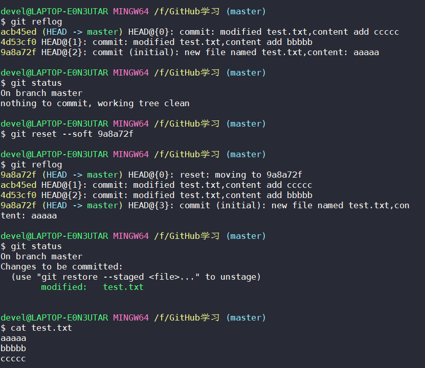
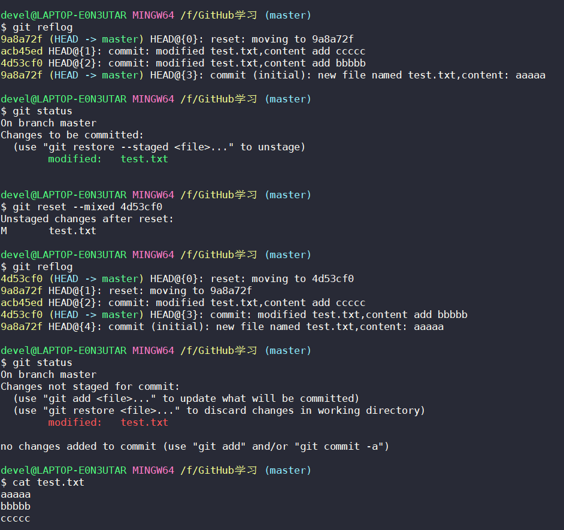
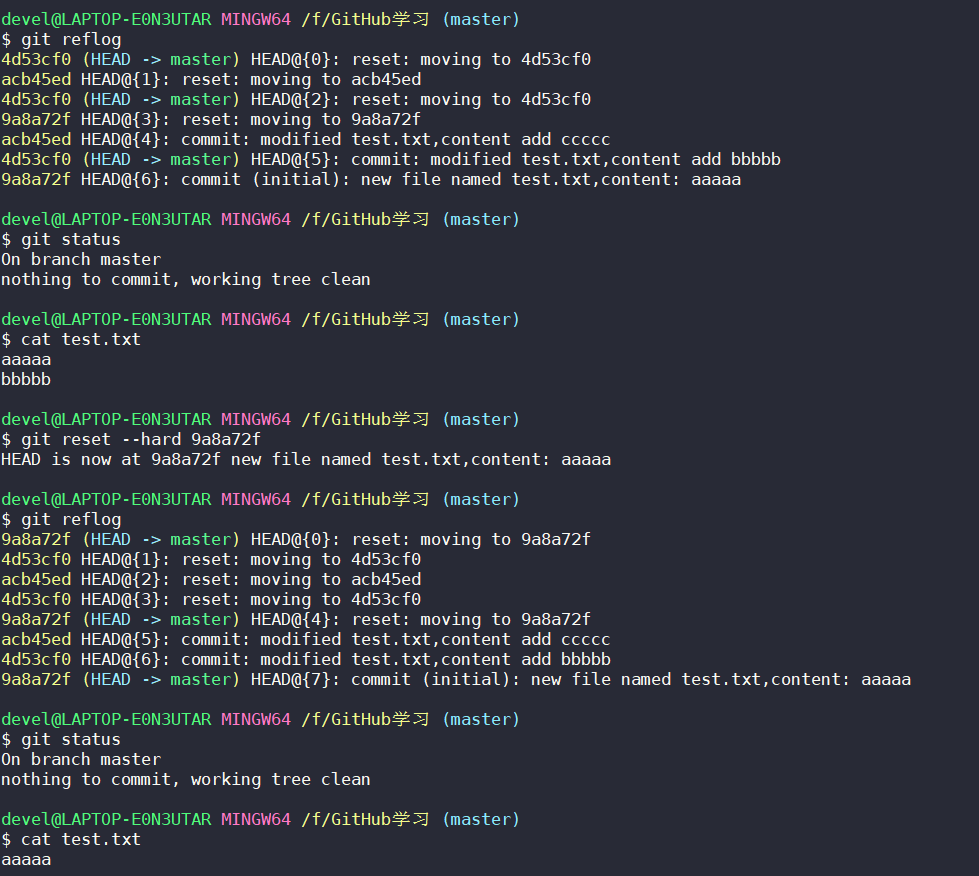

# 安装

**git官网**：https://git-scm.com/

直接安装即可

**GitHub官网**：https://github.com/

# 本地库初始化

在当前目录下本地库初始化，会在当前目录中生成隐藏文件夹 .git

```
git init
```

# 查看命令帮助文档

```
git help 命令
```

# 设置签名

必须要设置签名。

**作用**：区分不同开发者身份

用户名：wolf

Email：1093731746@qq.com

与 GitHub 上的账号和密码没有任何关系

签名有两个级别，两个级别中必须至少设置其中一个：

* 项目级别/仓库级别

  仅在当前本地库范围有效

* 系统用户级别

  在登录 Windows 当前操作系统范围有效

项目级别优先于系统用户级别

```
# 项目级别/仓库级别
git config user.name wolf
git config user.email 1093731746@qq.com
# 配置文件路径：本地库的 .git 文件夹中 config 文件
cat .git/config

# 系统用户级别
git config --global user.name wolf
git config --global user.email 1093731746@qq.com
# 配置文件路径：家目录下的隐藏文件 .gitconfig
cat ~/.gitconfig
```

# 文件管理机制

​		git 把数据看作是小型文件系统的一组快照。每次提交更新时 Git 都会对当前全部文件制作一个快照并保存这个快照索引。为了高效，如果文件没有修改， Git 不再重新存储该文件，而是只保留一个链接指向之前存储的文件。所以 Git 的工作方式可以称之为快照流。

# 查看状态

```
# 查看工作区、暂存区状态
git status
```

# 提交文件至暂存区

```
# 将工作区的 “新建/修改” 提交至暂存区
git add 文件名
```

# 将文件移出暂存区

```
git rm --cached 文件名
```

# 提交文件

```
# 将暂存区的内容提交到本地库
git commit -m "提交文件的日志" 文件名
```

# 提交所有修改过的文件

```
# 方法一
# 正常提交，一个文件一个提交：先提交暂存区，再提交到本地库
# 方法二
# 所有修改过的文件会一次性提交（除从未被提交过的文件）
git commit -m "提交文件的日志" -a
```

# 查看版本历史记录

```
# 查看所有版本历史记录,详细显示
git log
# 多屏显示控制方式
## 空格 向下翻页
## b 向上翻页
## q 退出

# 查看所有版本历史记录，在一行内显示，签名不显示
git log --pretty=oneline

# 查看过去版本历史记录，在一行内显示，签名不显示，哈希索引只显示一部分
git log --oneline

# 查看所有版本历史记录，在一行内显示，签名不显示，哈希索引只显示一部分，
# 多了 HEAD@{} {} 中的数字为移动到最新版本需要的步数
git reflog
```

# 版本前进后退

- 基于索引值操作（推荐）

  ```
  # 前进后退都可
  git reset --hard 索引值 （# 局部索引值即可）
  
  # 本地库、暂存区、工作区都前进至 HEAD 指针位置
  git reset --hard HEAD
  ```

- 使用 ^ 符号

  只能后退

  ```
  git reset --hard HEAD^ （# 一个 ^ 符号后退一步，后退三步则 ^^^）
  ```

- 使用 ~ 符号

  只能后退

  ```
  git reset --hard HEAD~后退步数 （# ~3为后退3步）
  ```


reset 的三个参数对比:

- --soft 参数

  1. 仅仅在本地库移动 HEAD 指针

  ``` 
  git reset --soft 索引值 （# 局部索引值即可）
  ```

  soft 参数版本移动效果图

  

  

- --mixed 参数

  1. 在本地库移动 HEAD 指针

  2. 重置暂存区

   ```
   git reset --mixed 索引值 （# 局部索引值即可）
   ```

   mixed 参数版本移动效果图

  

  

- --hard 参数

  1. 在本地库移动 HEAD 指针
  
  2. 重置暂存区
  
  3. 重置工作区
  
   ```
   git reset --hard 索引值 （# 局部索引值即可）
   ```
  
  hard 参数版本移动效果图
  
  
  
  

# 删除文件

​		删除文件仅仅是在当前版本删除文件，之前的版本中仍存在已删除的文件，因此恢复文件只需后退到之前版本即可。删除文件的记录是永远不肯能被删除的，除非将本地库删除，即删除隐藏文件 .git 。

​		被删除的文件一定要已提交至本地库，才可被找回。

```
rm 文件名
```

# 比较文件

```
# 将工作区内文件与暂存区内文件进行比较
# 因此对于新建的文件需要先使用 git add 命令将文件提交至暂存区
git diff 文件名

# 当前目录内多个文件比较，不写文件名即可
git diff

# 将工作区内文件与本地库内当前文件进行比较
git diff HEAD 文件名

# 将工作区内文件与本地库内上一版本历史文件进行比较
git diff HEAD^ 文件名
```

# 分支管理

## 什么是分支？

在版本控制过程中，使用多条线同时推进多个任务。

git 中主干为 master 。各个分支的功能是互相独立的，不会造成互相干扰。

​		当一个项目中需要实现多个功能，而这些功能只是最初设计，此时可以使用分支，克隆主干，在分支中开发，这样即使分支出现致命错误或需要弃用等情况，也不会影响整个项目。当分支完成开发时，可以将分支合并回主干，相当于大版本升级。若主干出现 bug 一般会创建一个名为 hot_fix 的分支，在该分支内修复 bug ，因为如今的项目一般是在网上跑且不能停止，否则用户的体验感很差。所以，一般创建 hot_fix 分支紧急修复 bug，然后合并回主干。


## 分支好处

- 同时并行推进多个功能开发，提高开发效率

- 各个分支在开发过程中，如果某一个分支开发失败，不会对其他分支有任何影响，失败的分支删除重新开始即可

## 分支操作

### 查看所有分支

```
git branch -v
```

### 创建分支

```
git branch 分支名
```

### 切换分支

```
git checkout 分支名
```

### 合并分支

步骤：

1. 切换到 接收修改的分支 上，即 被合并的分支 上

2. 合并

   ```
   git merge 分支名（# 已修改过的分支）
   ```

3. 合并分支时可能会存在冲突（ conflicts ），此时需要修改冲突文件中的冲突

   文件中的冲突表现为：

   ```
   # 各分支内容间用一行 = 隔开
   <<<<<<< 分支一名
   分支一内容
   =======
   分支二内容
   >>>>>>> 分支二名
   ```

4. 删除冲突的特殊符号，将文件修改正确后保存

5. 提交文件至暂存区

6. 提交文件至本地库

   ```
   git commit -m "提交文件的日志" （# 此处不能加文件名，加文件名会报错）
   ```

**注意 ：** 在分支上的文件修改后要提交至本地库，否则即使在切换至主干上该文件也为修改过的文件。文件提交至本地库后再切换至主干，主干中的文件为修改前文件。

# 查看所有地址别名

```
# fetch 表示获取 push 表示推送
git remote -v
```

# 添加地址和对应别名

```
git remote add 地址别名 github 上的 https 地址
```

# 推送分支至 GitHub

```
git push 地址别名 本地分支:远程分支
```

# 克隆他人 GitHub 项目

```
git clone 他人项目的 https 地址
```

