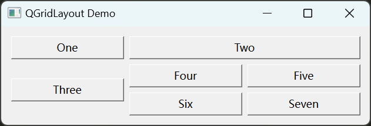
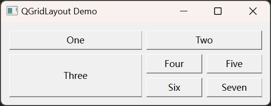
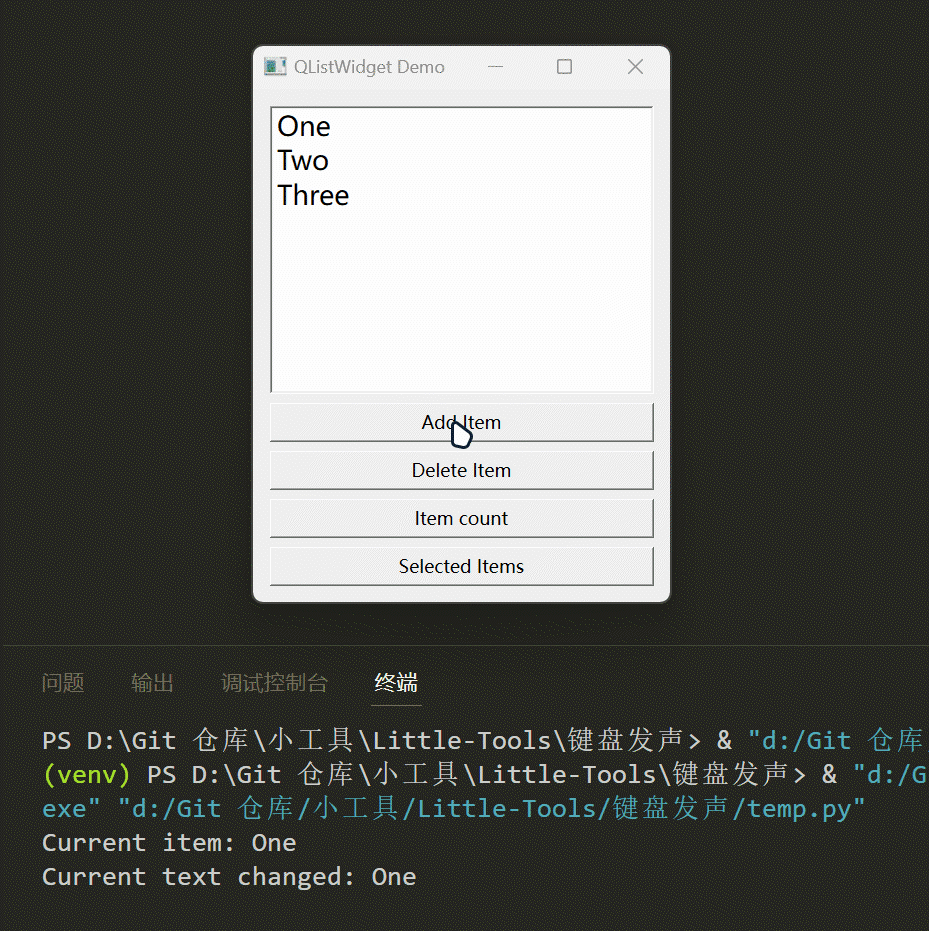
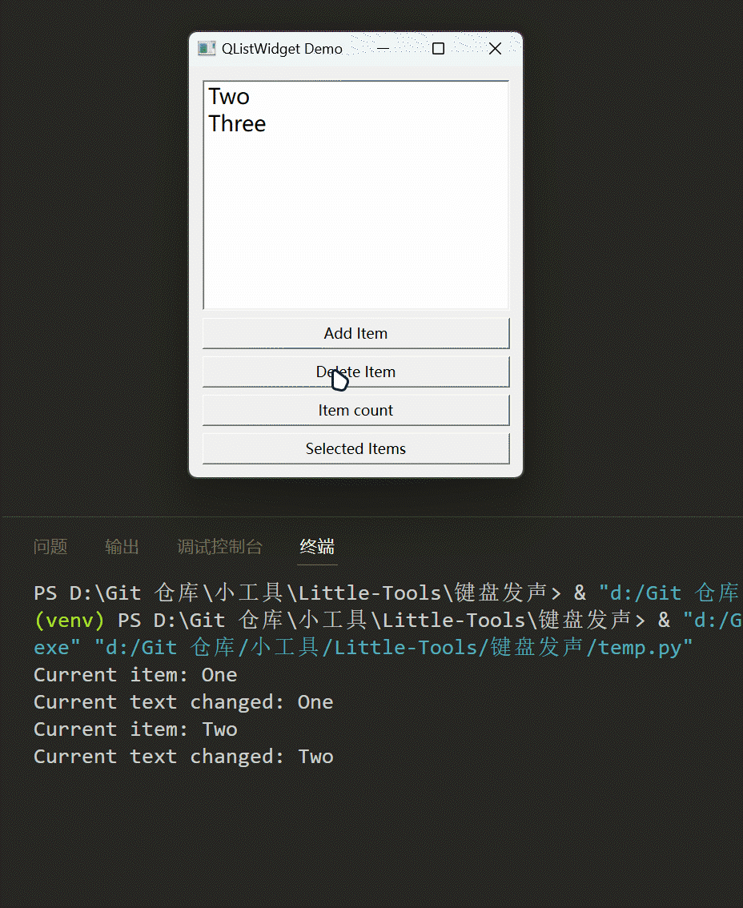
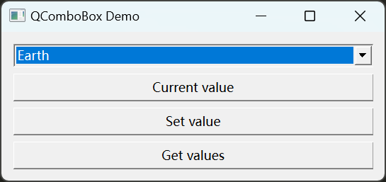
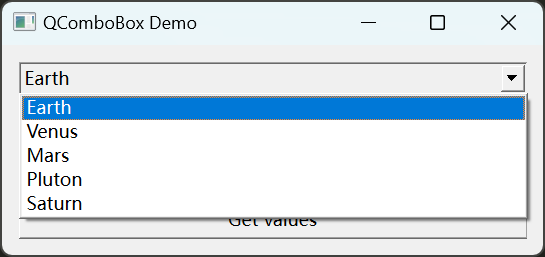
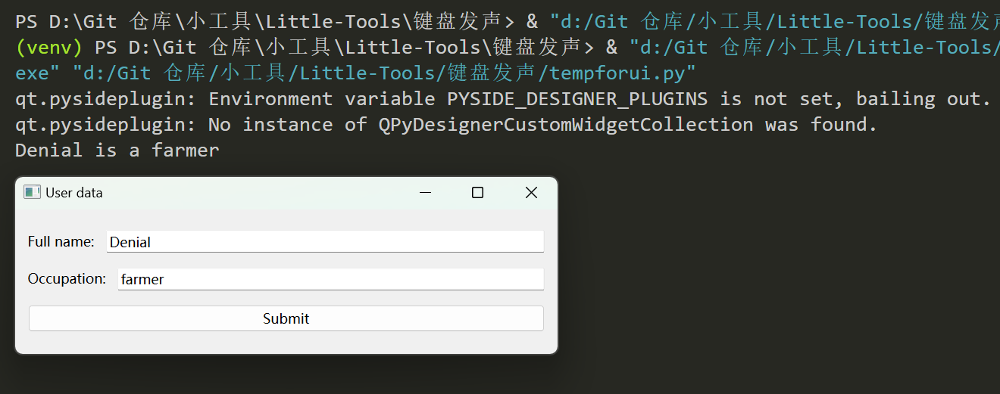
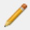

# 官方 PySide6 视频笔记

视频网址：

https://www.bilibili.com/video/BV16d4y1s73t/?spm_id_from=333.999.0.0&vd_source=4137720edced5cb595fbae555e2d840f

## 创建一个窗口

```python
from PySide6.QtWidgets import QApplication, QWidget
# 导入 sys 模块是为了处理命令行传入的参数
import sys

# 创建一个应用程序对象，在使用 python 语句执行该文件时可以接受其他命令行参数
app = QApplication(sys.argv)
# Qt 窗口默认是隐藏的，所以需要使用 show 来显示
window = QWidget()
window.show()
# 启动事件循环，它会疯狂循环以捕捉事件
app.exec()
```

输出：


## 窗口中创建一个按钮

```python
from PySide6.QtWidgets import QApplication, QMainWindow, QPushButton
import sys

app = QApplication(sys.argv)
window = QMainWindow()
# 有了一个 button 对象
button = QPushButton()
button.setText("Press Me")
# window 代表 button 会在这个 window 里
window.setCentralWidget(button)
window.show()
app.exec()
```

输出：


改进代码，将窗口和按钮整合到一个新的类（ButtonHolder）中：

```python
from PySide6.QtWidgets import QApplication, QMainWindow, QPushButton
import sys

# 创建一个名为 ButtonHoldeer 的类，继承于 QMainWindow
class ButtonHolder(QMainWindow):
    def __init__(self):
        super().__init__()
        self.setWindowTitle("Button Holder app")
        button = QPushButton("Press Me!")
        self.setCentralWidget(button)

app = QApplication(sys.argv)
window = ButtonHolder()
window.show()
app.exec()
```

继续改进，将 ButtonHolder 类与主代码分开在不同的文件中：

button_holder.py

```python
from PySide6.QtWidgets import QMainWindow, QPushButton


class ButtonHolder(QMainWindow):
    def __init__(self):
        super().__init__()
        self.setWindowTitle("Button Holder app")
        button = QPushButton("Press Me!")
        self.setCentralWidget(button)
```

main.py

```python
import sys
from PySide6.QtWidgets import QApplication
from button_holder import ButtonHolder

app = QApplication(sys.argv)
window = ButtonHolder()
window.show()
app.exec()
```

## 信号与信号槽(signals and slots)

例如有一个按钮。当被按下时，它会发送一次信号。与此信号对应的信号槽每接收到一次该信号就会触发一次信号槽中的方法。

```python
from PySide6.QtWidgets import QApplication, QPushButton

def button_colicked():
    print("You clicked the button, didn't you!")

app = QApplication()
button = QPushButton("Press Me")
# clicked 是 QPushButton 的一个信号，当点击按钮时会发送 clicked 信号
# 其他信号可以通过查询 PySide6 QPushButton -> QtWidgets.QAbstractButton -> Signals
button.clicked.connect(button_colicked)
button.show()
app.exec()
```

设置获取按钮是否按下的状态

```python
from PySide6.QtWidgets import QApplication, QPushButton

# 不需要检查按钮是否被按下时，可以不设置传入参数 data
def button_colicked(data):
    print("You clicked the button, didn't you! checked:", data)

app = QApplication()
button = QPushButton("Press Me")
# 设置获取按钮状态，按下为 True，未按下为 False
button.setCheckable(True)
# 其他信号可以通过查询 PySide6 QPushButton -> QtWidgets.QAbstractButton -> Signals
button.clicked.connect(button_colicked)
button.show()
app.exec()
```

输出：

当按钮被按下时，data 为 True，当按钮被再次按下后复原后 data 为 False

```python
You clicked the button, didn't you! checked: True
You clicked the button, didn't you! checked: False
You clicked the button, didn't you! checked: True
You clicked the button, didn't you! checked: False
```

滑条相关信号与信号槽

```python
from PySide6.QtCore import Qt
from PySide6.QtWidgets import QApplication,QSlider

def respond_to_slider(data):
    print("slider moved to:",data)

app = QApplication()
# 设置横向滑条
slider = QSlider(Qt.Horizontal)
# 设置滑条的最小值和最大值
slider.setMinimum(1)
slider.setMaximum(100)
# 设置滑条的值
slider.setValue(25)
# 设置滑条滑动事件
slider.valueChanged.connect(respond_to_slider)
slider.show()
app.exec()
```

输出：


## 水平和垂直组件布局

rock_widget.py

```python
from PySide6.QtWidgets import QPushButton, QWidget, QHBoxLayout, QVBoxLayout

class RockWidget(QWidget):
    def __init__(self):
        super().__init__()
        self.setWindowTitle("RockWidget")

        button1 = QPushButton("Button 1")
        button1.clicked.connect(self.button1_clicked)
        button2 = QPushButton("Button 2")
        button2.clicked.connect(self.button2_clicked)

        # 创建水平布局
        widget_layout = QHBoxLayout()
        # 创建垂直布局
        # widget_layout = QVBoxLayout()
        widget_layout.addWidget(button1)
        widget_layout.addWidget(button2)

        # 窗口设置布局
        self.setLayout(widget_layout)

    def button1_clicked(self):
        print("Button1 clicked")

    def button2_clicked(self):
        print("Button2 clicked")
```

main.py

```python
from PySide6.QtWidgets import QApplication
from rock_widget import RockWidget
import sys

app = QApplication(sys.argv)

widget = RockWidget()
widget.show()

app.exec()
```

输出：

水平布局


垂直布局


## 创建一个有菜单栏、工具栏和状态栏的窗口

main_window.py

```python
from PySide6.QtCore import QSize
from PySide6.QtGui import QAction, QIcon
from PySide6.QtWidgets import QMainWindow, QToolBar, QPushButton, QStatusBar

class MainWindow(QMainWindow):
    def __init__(self, app):
        super().__init__()
        self.app = app
        self.setWindowTitle("Custom MainWindow")

        # 创建菜单栏
        menu_bar = self.menuBar()
        # 在菜单栏中创建一个名为 File 的菜单
        file_menu = menu_bar.addMenu("&File")
        # 在 File 菜单下创建一个名为 Quit 的动作
        quit_action = file_menu.addAction("Quit")
        quit_action.triggered.connect(self.quit)

        edit_menu = menu_bar.addMenu("&Edit")
        edit_menu.addAction("Copy")
        edit_menu.addAction("Cut")
        edit_menu.addAction("Paste")
        edit_menu.addAction("Undo")
        edit_menu.addAction("Redo")

        menu_bar.addMenu("&Window")
        menu_bar.addMenu("&Setting")
        menu_bar.addMenu("&Help")

        # 创建工具栏
        toolBar = QToolBar("My Main toolbar")
        toolBar.setIconSize(QSize(16,16))
        self.addToolBar(toolBar)

        toolBar.addAction(quit_action)

        # 创建一个名为 Some Action 的动作
        action1 = QAction("Some Action",self)
        # 当鼠标悬停在工具栏的动作上时会在状态栏上显示
        action1.setStatusTip("Status message for some action")
        action1.triggered.connect(self.toolbar_button_click)
        toolBar.addAction(action1)

        # Some other action 在鼠标悬浮于动作上时显示
        action2 = QAction(QIcon("start.png"), "Some other action", self)
        action2.setStatusTip("Status message for some other action")
        action2.triggered.connect(self.toolbar_button_click)
        # 按下后不会自动弹起，需要再次点击
        action2.setCheckable(True)
        toolBar.addAction(action2)

        # 创建分割线
        toolBar.addSeparator()
        toolBar.addWidget(QPushButton("Click here"))

        # 状态栏
        self.setStatusBar(QStatusBar(self))

        button1 = QPushButton("Button 1")
        button1.clicked.connect(self.button1_clicked)
        self.setCentralWidget(button1)

    def button1_clicked(self):
        print("Clicked on button1")
    
    def toolbar_button_click(self):
        # 3 秒后消失
        self.statusBar().showMessage(f"Some message ...", 3000)

    def quit(self):
        self.app.quit() 
```

main.py

```python
from PySide6.QtWidgets import QApplication
from main_window import MainWindow
import sys

app = QApplication(sys.argv)

widget = MainWindow(app)
widget.show()

app.exec()
```

输出：


## 消息框

Widget.py

```python
from PySide6.QtWidgets import QWidget, QPushButton, QVBoxLayout, QMessageBox

class Widget(QWidget):
    def __init__(self):
        super().__init__()

        self.setWindowTitle("QMessageBox")
        # 消息框类型：critical、question、information、warning、about
        button_hard = QPushButton("Hard")
        # 创建对应消息框按钮，并触发
        button_hard = QPushButton("Hard")
        button_hard.clicked.connect(self.button_clicked_hard)
        button_critical = QPushButton("Critical")
        button_critical.clicked.connect(self.button_clicked_critical)
        button_question = QPushButton("Question")
        button_question.clicked.connect(self.button_clicked_question)
        button_information = QPushButton("Information")
        button_information.clicked.connect(self.button_clicked_information)
        button_warning = QPushButton("Warning")
        button_warning.clicked.connect(self.button_clicked_warning)
        button_about = QPushButton("About")
        button_about.clicked.connect(self.button_clicked_about)

        # 设置布局，否则看不见上面设置的按钮
        layout = QVBoxLayout()
        layout.addWidget(button_hard)
        layout.addWidget(button_critical)
        layout.addWidget(button_question)
        layout.addWidget(button_information)
        layout.addWidget(button_warning)
        layout.addWidget(button_about)
        self.setLayout(layout)

    # 可自定义的部分更多的写法
    def button_clicked_hard(self):
        message = QMessageBox()
        # 设置消息框最小尺寸
        message.setMinimumSize(700, 200)
        message.setWindowTitle("Message Title")
        # 设置文字
        message.setText("Something happened!")
        # 设置信息性文字
        message.setInformativeText("Do you want to do something about it?")
        # 控制消息框类型以改变图标
        message.setIcon(QMessageBox.Critical)
        message.setStandardButtons(QMessageBox.Ok | QMessageBox.Cancel)
        # 设置默认按钮，会被默认打开或突出显示
        message.setDefaultButton(QMessageBox.Ok)
        # 将消息框弹出，返回用户的选择
        ret = message.exec()
        if ret == QMessageBox.Ok:
            print("User chose OK")
        else:
            print("User chose Cancel")

    # 更方便的写法
    def button_clicked_critical(self):
        # 创建重要级别的消息框
        ret = QMessageBox.critical(
            self,
            "Message Title",
            "Critical Message!",
            QMessageBox.Ok | QMessageBox.Cancel,
        )
        if ret == QMessageBox.Ok:
            print("User chose OK")
        else:
            print("User chose Cancel")

    def button_clicked_question(self):
        # 创建询问消息框
        ret = QMessageBox.question(
            self,
            "Message Title",
            "Question Message!",
            QMessageBox.Ok | QMessageBox.Cancel,
        )
        if ret == QMessageBox.Ok:
            print("User chose OK")
        else:
            print("User chose Cancel")

    def button_clicked_information(self):
        # 创建信息消息框
        ret = QMessageBox.information(
            self,
            "Message Title",
            "Some information!",
            QMessageBox.Ok | QMessageBox.Cancel,
        )
        if ret == QMessageBox.Ok:
            print("User chose OK")
        else:
            print("User chose Cancel")

    def button_clicked_warning(self):
        # 创建警告消息框
        ret = QMessageBox.warning(
            self,
            "Message Title",
            "Some Warning!",
            QMessageBox.Ok | QMessageBox.Cancel,
        )
        if ret == QMessageBox.Ok:
            print("User chose OK")
        else:
            print("User chose Cancel")

    def button_clicked_about(self):
        # 创建关于消息框
        ret = QMessageBox.about(self, "Message Title", "Some about message!")
        if ret == QMessageBox.Ok:
            print("User chose OK")
        else:
            print("User chose Cancel")
```

main.py

```python
from PySide6.QtWidgets import QApplication
from Widget import Widget
import sys

app = QApplication(sys.argv)

widget = Widget()
widget.show()

app.exec()
```

输出：

主界面


自定义消息框


Critical


Question


Information


Warning


About


## 按钮的各种事件

Widget.py

```python
from PySide6.QtWidgets import QWidget, QPushButton, QVBoxLayout, QMessageBox

class Widget(QWidget):
    def __init__(self):
        super().__init__()

        self.setWindowTitle("Custom MainWindow")

        button = QPushButton("Click")
        # 按钮被按下后释放且释放时鼠标在按钮区域内时触发
        button.clicked.connect(self.button_clicked)
        # 按钮被按下时触发
        button.pressed.connect(self.button_pressed)
        # 按钮被释放时触发
        button.released.connect(self.button_released)

        layout = QVBoxLayout()
        layout.addWidget(button)

        self.setLayout(layout)

    def button_clicked(self):
        print("Clicked")

    def button_pressed(self):
        print("Pressed")

    def button_released(self):
        print("Released")
```

main.py

``` python
from PySide6.QtWidgets import QApplication
from Widget import Widget
import sys

app = QApplication(sys.argv)

widget = Widget()
widget.show()

app.exec()
```

输出：


## 标签和单行输入框的各种事件

Widget.py

``` python
from PySide6.QtWidgets import (
    QWidget,
    QLabel,
    QLineEdit,
    QPushButton,
    QHBoxLayout,
    QVBoxLayout,
)

class Widget(QWidget):
    def __init__(self):
        super().__init__()

        self.setWindowTitle("QLabel and QLineEdit")

        label = QLabel("Fullname:")
        # line_edit 设置为成员变量，因为想要在实例化 Widget 对象时能够被访问
        self.line_edit = QLineEdit()
        # 文本发生变动时触发
        self.line_edit.textChanged.connect(self.text_changed)
        # 光标位置发生变动时触发
        self.line_edit.cursorPositionChanged.connect(self.cursor_position_changed)
        # 当用户按下回车 或者 行编辑失去焦点且自上次发出此信号后内容已更改 会触发
        # 所以，editingFinished 一般用的比 returnPressed 更多
        self.line_edit.editingFinished.connect(self.editing_finished)
        # 当用户按下回车时触发
        self.line_edit.returnPressed.connect(self.return_pressed)
        # 选中文本时触发,只要在鼠标聚焦于文本框且发生移动就会触发
        self.line_edit.selectionChanged.connect(self.selection_changed)
        # 当编辑文本时触发,如果通过程序改变文本则不会触发
        self.line_edit.textEdited.connect(self.text_edited)
        button = QPushButton("Grab Data")
        button.clicked.connect(self.button_clicked)
        self.text_holder_label = QLabel("I AM HERE")

        h_layout = QHBoxLayout()
        h_layout.addWidget(label)
        h_layout.addWidget(self.line_edit)

        v_layout = QVBoxLayout()
        v_layout.addLayout(h_layout)
        v_layout.addWidget(button)
        v_layout.addWidget(self.text_holder_label)

        self.setLayout(v_layout)

    def button_clicked(self):
        # 重新设置 label
        self.text_holder_label.setText(self.line_edit.text())

    def text_changed(self):
        self.text_holder_label.setText(self.line_edit.text())

    def cursor_position_changed(self, old, new):
        print("cursor old position:", old)
        print("cursor new position:", new)

    def editing_finished(slef):
        print("Editing finished")

    def return_pressed(self):
        print("Return pressed")

    def selection_changed(self):
        # 获取选中的文本内容
        print("Selection Changed:", self.line_edit.selectedText())

    def text_edited(self, new_text):
        print("Text edited. New text:", new_text)
```

main.py

``` python
from PySide6.QtWidgets import QApplication
from Widget import Widget
import sys

app = QApplication(sys.argv)

widget = Widget()
widget.show()

app.exec()
```

输出：

textChanged：


cursorPositionChanged：


editingFinished：


returnPressed：


selectionChanged：


textEdited：


## 使用标签显示图片

Widget.py

``` python
from PySide6.QtGui import QPixmap
from PySide6.QtWidgets import QWidget, QLabel, QVBoxLayout


class Widget(QWidget):
    def __init__(self):
        super().__init__()

        self.setWindowTitle("QLabel Image")

        image_label = QLabel()
        # 可以使用中文路径，但不能使用 jpg
        image_label.setPixmap(QPixmap("图片\皮卡丘.png"))

        layout = QVBoxLayout()
        layout.addWidget(image_label)

        self.setLayout(layout)
```

main.py

``` python
from PySide6.QtWidgets import QApplication
from Widget import Widget
import sys

app = QApplication(sys.argv)

widget = Widget()
widget.show()

app.exec()
```

输出：


## 自制文本编辑器

Widget.py

``` python
from PySide6.QtWidgets import (
    QWidget,
    QTextEdit,
    QPushButton,
    QHBoxLayout,
    QVBoxLayout,
)

class Widget(QWidget):
    def __init__(self):
        super().__init__()

        self.setWindowTitle("QTextEdit")

        self.text_edit = QTextEdit()

        current_text_button = QPushButton("当前文本")
        current_text_button.clicked.connect(self.current_text_button_clicked)

        copy_button = QPushButton("复制")
        # 在官网的文档中 Slots 代表内置的事件，可以直接拿来用
        # 复制文本编辑器中选中的文本
        copy_button.clicked.connect(self.text_edit.copy)

        cut_button = QPushButton("剪切")
        cut_button.clicked.connect(self.text_edit.cut)

        paste_button = QPushButton("粘贴")
        paste_button.clicked.connect(self.text_edit.paste)

        undo_button = QPushButton("撤销")
        undo_button.clicked.connect(self.text_edit.undo)

        redo_button = QPushButton("恢复")
        redo_button.clicked.connect(self.text_edit.redo)

        # 显示自定义的纯文本内容
        set_plain_text_button = QPushButton("设置纯文本")
        set_plain_text_button.clicked.connect(self.set_plain_text)

        # 显示自定义的 html 格式内容
        set_html_button = QPushButton("设置 html")
        set_html_button.clicked.connect(self.set_html)

        clear_button = QPushButton("清空")
        # 删除文本编辑器中的所有文本，撤销于恢复操作的历史记录也会被删除
        clear_button.clicked.connect(self.text_edit.clear)

        h_layout = QHBoxLayout()
        h_layout.addWidget(current_text_button)
        h_layout.addWidget(copy_button)
        h_layout.addWidget(cut_button)
        h_layout.addWidget(paste_button)
        h_layout.addWidget(undo_button)
        h_layout.addWidget(redo_button)
        h_layout.addWidget(set_plain_text_button)
        h_layout.addWidget(set_html_button)
        h_layout.addWidget(clear_button)

        v_layout = QVBoxLayout()
        v_layout.addLayout(h_layout)
        v_layout.addWidget(self.text_edit)

        self.setLayout(v_layout)

    def current_text_button_clicked(self):
        # 将文本编辑器的内容作为纯文本保存
        # 当该属性被设置时，以前的内容被删除，撤销/重做历史被重置。
        # currentCharFormat() 也被重置，除非 textCursor() 已经在文档的开头。
        # 如果文本编辑有其他内容类型，如果你调用 toPlainText()，它将不会被替换成纯文本。
        # 唯一的例外是非断裂空间，nbsp;，它将被转换为标准空间。
        # 默认情况下，对于一个没有内容的编辑器，这个属性包含一个空字符串。
        print(self.text_edit.toPlainText())

    def set_plain_text(self):
        self.text_edit.setPlainText("Today is a nice day.\nI'm so happy.")

    def set_html(self):
        self.text_edit.setHtml(
            "<h1>daily</h1><p>Today is a nice day.\nI'm so happy.</p><ul><li>happy</li><li>wonderful</li></ul>"
        )
```

main.py

``` python
from PySide6.QtWidgets import QApplication
from Widget import Widget
import sys

app = QApplication(sys.argv)

widget = Widget()
widget.show()

app.exec()
```

输出：

复制、粘贴、剪切:


撤销与恢复：


设置纯文本：


设置 html：


清空：


## 标签、单行输入框、按钮的拓展

Widget.py

```python
from PySide6.QtWidgets import (
    QWidget,
    QLabel,
    QLineEdit,
    QPushButton,
    QHBoxLayout,
    QVBoxLayout,
    QSizePolicy,
)

class Widget(QWidget):
    def __init__(self):
        super().__init__()

        self.setWindowTitle("Size policies and stretches")

        label = QLabel("Some text: ")
        line_edit = QLineEdit()
        # line_edit.setSizePolicy 默认设置为 QSizePolicy.Expanding, QSizePolicy.Fixed
        # QSizePolicy.Fixed 代表固定长度，不会跟随窗口大小变化
        # QSizePolicy.Expanding 代表跟随窗口大小变化
        # line_edit.setSizePolicy(QSizePolicy.Expanding, QSizePolicy.Fixed)
        # line_edit.setSizePolicy(QSizePolicy.Fixed, QSizePolicy.Fixed)
        # 单行文本框在水平和纵向上都拓展
        line_edit.setSizePolicy(QSizePolicy.Expanding, QSizePolicy.Expanding)
        # label.setSizePolicy 默认设置为 QSizePolicy.Fixed, QSizePolicy.Fixed
        # label.setSizePolicy(QSizePolicy.Fixed, QSizePolicy.Fixed)
        # 标签仅在水平方向拓展
        label.setSizePolicy(QSizePolicy.Expanding, QSizePolicy.Fixed)

        h_layout_1 = QHBoxLayout()
        h_layout_1.addWidget(label)
        h_layout_1.addWidget(line_edit)

        button_1 = QPushButton("One")
        button_2 = QPushButton("Two")
        button_3 = QPushButton("Three")

        h_layout_2 = QHBoxLayout()
        # 窗口被拉伸后，button_1 的长度是 button2 的长度的 2 倍
        h_layout_2.addWidget(button_1, 2)
        h_layout_2.addWidget(button_2, 1)
        h_layout_2.addWidget(button_3, 1)

        v_layout = QVBoxLayout()
        v_layout.addLayout(h_layout_1)
        v_layout.addLayout(h_layout_2)

        self.setLayout(v_layout)
```

main.py

``` python
from PySide6.QtWidgets import QApplication
from Widget import Widget
import sys

app = QApplication(sys.argv)

widget = Widget()
widget.show()

app.exec()
```

输出：


## 网格布局

Widget.py

``` python
from PySide6.QtWidgets import QWidget, QPushButton, QSizePolicy, QGridLayout

class Widget(QWidget):
    def __init__(self):
        super().__init__()

        self.setWindowTitle("QGridLayout Demo")

        button_1 = QPushButton("One")
        button_2 = QPushButton("Two")
        button_3 = QPushButton("Three")
        button_3.setSizePolicy(QSizePolicy.Expanding, QSizePolicy.Expanding)
        button_4 = QPushButton("Four")
        button_5 = QPushButton("Five")
        button_6 = QPushButton("Six")
        button_7 = QPushButton("Seven")

        grid_layout = QGridLayout()
        grid_layout.addWidget(button_1, 0, 0)
        # button_2 从 (0,1) 开始，占用 1 行 2 列
        grid_layout.addWidget(button_2, 0, 1, 1, 2)
        grid_layout.addWidget(button_3, 1, 0, 2, 1)
        grid_layout.addWidget(button_4, 1, 1)
        grid_layout.addWidget(button_5, 1, 2)
        grid_layout.addWidget(button_6, 2, 1)
        grid_layout.addWidget(button_7, 2, 2)

        self.setLayout(grid_layout)
```

main.py

``` python
from PySide6.QtWidgets import QApplication
from Widget import Widget
import sys

app = QApplication(sys.argv)

widget = Widget()
widget.show()

app.exec()
```

输出：

如果不设置按钮拓展：



设置按钮拓展：



## 多选复选框与单选按钮

Widget.py

``` python
from PySide6.QtWidgets import (
    QWidget,
    QGroupBox,
    QCheckBox,
    QRadioButton,
    QButtonGroup,
    QHBoxLayout,
    QVBoxLayout,
)

class Widget(QWidget):
    def __init__(self):
        super().__init__()

        self.setWindowTitle("QCheckBox and QRadioButton")

        # 创建分组结构
        # 复选框
        os = QGroupBox("Choose operating system")
        windows = QCheckBox("Windows")
        windows.toggled.connect(self.windows_box_toggled)
        linux = QCheckBox("Linux")
        linux.toggled.connect(self.linux_box_toggled)
        mac = QCheckBox("Mac")
        mac.toggled.connect(self.mac_box_toggled)

        os_layout = QVBoxLayout()
        os_layout.addWidget(windows)
        os_layout.addWidget(linux)
        os_layout.addWidget(mac)
        os.setLayout(os_layout)

        # 单选框
        drinks = QGroupBox("Choose your drink")
        beer = QCheckBox("Beer")
        juice = QCheckBox("juice")
        coffe = QCheckBox("coffe")
        beer.setChecked(True)

        exclusive_button_group = QButtonGroup(self)
        exclusive_button_group.addButton(beer)
        exclusive_button_group.addButton(juice)
        exclusive_button_group.addButton(coffe)
        exclusive_button_group.setExclusive(True)

        drink_layout = QVBoxLayout()
        drink_layout.addWidget(beer)
        drink_layout.addWidget(juice)
        drink_layout.addWidget(coffe)
        drinks.setLayout(drink_layout)

        # 单选，圆点形式
        answers = QGroupBox("Choose Answer")
        answer_a = QRadioButton("A")
        answer_b = QRadioButton("B")
        answer_c = QRadioButton("C")
        answer_a.setChecked(True)

        answer_layout = QVBoxLayout()
        answer_layout.addWidget(answer_a)
        answer_layout.addWidget(answer_b)
        answer_layout.addWidget(answer_c)
        answers.setLayout(answer_layout)

        h_layout = QHBoxLayout()
        h_layout.addWidget(os)
        h_layout.addWidget(drinks)

        v_layout = QVBoxLayout()
        v_layout.addLayout(h_layout)
        v_layout.addWidget(answers)

        self.setLayout(v_layout)

    def windows_box_toggled(self, checked):
        if checked:
            print("Windows box checked")
        else:
            print("Windows box unchecked")

    def linux_box_toggled(self, checked):
        if checked:
            print("Linux box checked")
        else:
            print("Linux box unchecked")

    def mac_box_toggled(self, checked):
        if checked:
            print("Mac box checked")
        else:
            print("Mac box unchecked")
```

main.py

``` python
from PySide6.QtWidgets import QApplication
from Widget import Widget
import sys

app = QApplication(sys.argv)

widget = Widget()
widget.show()

app.exec()
```

输出：


## 创建列表和设置事件

Widget.py

``` python
from PySide6.QtWidgets import (
    QWidget,
    QListWidget,
    QAbstractItemView,
    QVBoxLayout,
    QPushButton,
)

class Widget(QWidget):
    def __init__(self):
        super().__init__()

        self.setWindowTitle("QListWidget Demo")

        self.list_widget = QListWidget(self)
        # 可以选择多个
        self.list_widget.setSelectionMode(QAbstractItemView.MultiSelection)
        # 为列表添加元素
        self.list_widget.addItem("One")
        self.list_widget.addItems(["Two", "Three"])

        self.list_widget.currentItemChanged.connect(self.current_item_changed)
        self.list_widget.currentTextChanged.connect(self.current_text_changed)

        # 添加元素
        button_add_item = QPushButton("Add Item")
        button_add_item.clicked.connect(self.add_item)
		# 删除元素
        button_delete_item = QPushButton("Delete Item")
        button_delete_item.clicked.connect(self.delete_item)
		# 获取元素个数
        button_item_count = QPushButton("Item count")
        button_item_count.clicked.connect(self.item_count)
		# 获取选中的元素
        button_selected_items = QPushButton("Selected Items")
        button_selected_items.clicked.connect(self.selected_items)

        v_layout = QVBoxLayout()
        v_layout.addWidget(self.list_widget)
        v_layout.addWidget(button_add_item)
        v_layout.addWidget(button_delete_item)
        v_layout.addWidget(button_item_count)
        v_layout.addWidget(button_selected_items)

        self.setLayout(v_layout)

    def current_item_changed(self, item):
        if item is None:
            print("Current item is None")
        else:
            print("Current item:", item.text())

    def current_text_changed(self, text):
        print("Current text changed:", text)

    def add_item(self):
        self.list_widget.addItem("New Item")

    def delete_item(self):
        self.list_widget.takeItem(self.list_widget.currentRow())

    def item_count(self):
        print("Item count:", self.list_widget.count())

    def selected_items(self):
        list = self.list_widget.selectedItems()
        for i in list:
            print(i.text())
```

main.py

``` python
from PySide6.QtWidgets import QApplication
from Widget import Widget
import sys

app = QApplication(sys.argv)

widget = Widget()
widget.show()

app.exec()
```

输出：

添加元素：



删除元素



获取选中的元素


## 创建页签窗口

Widget.py

``` python
from PySide6.QtWidgets import (
    QWidget,
    QTabWidget,
    QLabel,
    QLineEdit,
    QHBoxLayout,
    QVBoxLayout,
    QPushButton
)

class Widget(QWidget):
    def __init__(self):
        super().__init__()

        self.setWindowTitle("QTabWidget Demo")

        # 创建一个 Tab，并设定其父窗口
        tab_Widget = QTabWidget(self)

        # Information
        widget_form = QWidget()
        label_full_name = QLabel("Full name: ")
        line_edit_full_name = QLineEdit()
        form_layout = QHBoxLayout()
        form_layout.addWidget(label_full_name)
        form_layout.addWidget(line_edit_full_name)
        widget_form.setLayout(form_layout)

        # Buttons
        widget_buttons = QWidget()
        button_1 = QPushButton("One")
        button_1.clicked.connect(self.button_1_clicked)
        button_2 = QPushButton("Two")
        button_3 = QPushButton("Three")
        buttons_layout = QVBoxLayout()
        buttons_layout.addWidget(button_1)
        buttons_layout.addWidget(button_2)
        buttons_layout.addWidget(button_3)
        widget_buttons.setLayout(buttons_layout)

        tab_Widget.addTab(widget_form, "Information")
        tab_Widget.addTab(widget_buttons, "Button")

        layout = QVBoxLayout()
        layout.addWidget(tab_Widget)

        self.setLayout(layout)

    def button_1_clicked(self):
        print("Button clicked")
```

main.py

``` python
from PySide6.QtWidgets import QApplication
from Widget import Widget
import sys

app = QApplication(sys.argv)

widget = Widget()
widget.show()

app.exec()
```

输出：

Information：


Button：


## 创建下拉框

Widget.py

``` python
from PySide6.QtWidgets import QWidget, QComboBox, QVBoxLayout, QPushButton

class Widget(QWidget):
    def __init__(self):
        super().__init__()

        self.setWindowTitle("QComboBox Demo")

        self.combo_box = QComboBox(self)
        self.combo_box.addItem("Earth")
        self.combo_box.addItem("Venus")
        self.combo_box.addItem("Mars")
        self.combo_box.addItem("Pluton")
        self.combo_box.addItem("Saturn")

        button_current_value = QPushButton("Current value")
        button_current_value.clicked.connect(self.current_value)
        button_set_current = QPushButton("Set value")
        button_set_current.clicked.connect(self.set_current)
        button_get_values = QPushButton("Get values")
        button_get_values.clicked.connect(self.get_values)

        v_layout = QVBoxLayout()
        v_layout.addWidget(self.combo_box)
        v_layout.addWidget(button_current_value)
        v_layout.addWidget(button_set_current)
        v_layout.addWidget(button_get_values)

        self.setLayout(v_layout)

    def current_value(self):
        print(
            "Current item:",
            self.combo_box.currentText(),
            "- current index:",
            self.combo_box.currentIndex(),
        )

    def set_current(self):
        self.combo_box.setCurrentIndex(2)

    def get_values(self):
        for i in range(self.combo_box.count()):
            print("index [", i, "]:", self.combo_box.itemText(i))
```

main.py

``` python
from PySide6.QtWidgets import QApplication
from Widget import Widget
import sys

app = QApplication(sys.argv)

widget = Widget()
widget.show()

app.exec()
```

输出：





``` python
# 按了 Current value 按钮
Current item: Earth - current index: 0
# 选择 Saturn 后，按了 Current value 按钮
Current item: Saturn - current index: 4
# 按了 Set value 按钮后，下拉框的值变为 Mars
# 按了 Get values 按钮后
index [ 0 ]: Earth
index [ 1 ]: Venus
index [ 2 ]: Mars
index [ 3 ]: Pluton
index [ 4 ]: Saturn
```

## 加载 .ui 文件

.ui 文件是使用 Qt Designer 编辑器编辑窗口布局保存后产生的文件。使用 `QUiLoader.load()` 函数可以加载 .ui 文件。此函数会在每次程序运行时将 .ui 文件转换为 .py 文件，很耗性能，所以不推荐这么做。

main.py

``` python
import sys
from PySide6 import QtWidgets
from PySide6.QtUiTools import QUiLoader

def do_something():
    print(window.full_name_line_edit.text(), "is a", window.occupation_line_edit.text())

# 创建一个加载对象
loader = QUiLoader()

app = QtWidgets.QApplication(sys.argv)
# 加载使用 Qt designer 编辑器创建的 .ui 文件
window = loader.load("Widget.ui", None)

window.setWindowTitle("User data")

window.submit_button.clicked.connect(do_something)
window.show()
app.exec()
```

Widget.ui

```xml
<?xml version="1.0" encoding="UTF-8"?>
<ui version="4.0">
 <class>Form</class>
 <widget class="QWidget" name="Form">
  <property name="geometry">
   <rect>
    <x>0</x>
    <y>0</y>
    <width>477</width>
    <height>127</height>
   </rect>
  </property>
  <property name="windowTitle">
   <string>Form</string>
  </property>
  <layout class="QVBoxLayout" name="verticalLayout">
   <item>
    <layout class="QHBoxLayout" name="horizontalLayout">
     <property name="spacing">
      <number>6</number>
     </property>
     <item>
      <widget class="QLabel" name="full_name">
       <property name="text">
        <string>Full name: </string>
       </property>
      </widget>
     </item>
     <item>
      <widget class="QLineEdit" name="full_name_line_edit">
       <property name="layoutDirection">
        <enum>Qt::RightToLeft</enum>
       </property>
      </widget>
     </item>
    </layout>
   </item>
   <item>
    <layout class="QHBoxLayout" name="horizontalLayout_2">
     <property name="spacing">
      <number>6</number>
     </property>
     <item>
      <widget class="QLabel" name="occupation">
       <property name="text">
        <string>Occupation: </string>
       </property>
      </widget>
     </item>
     <item>
      <widget class="QLineEdit" name="occupation_line_edit">
       <property name="layoutDirection">
        <enum>Qt::RightToLeft</enum>
       </property>
       <property name="autoFillBackground">
        <bool>false</bool>
       </property>
       <property name="text">
        <string/>
       </property>
       <property name="alignment">
        <set>Qt::AlignLeading|Qt::AlignLeft|Qt::AlignVCenter</set>
       </property>
      </widget>
     </item>
    </layout>
   </item>
   <item>
    <widget class="QPushButton" name="submit_button">
     <property name="text">
      <string>Submit</string>
     </property>
    </widget>
   </item>
  </layout>
 </widget>
 <resources/>
 <connections/>
</ui>
```

输出：



改进代码：

将加载 .ui 文件重新封装一个类。

UserInterface.py

``` python
from PySide6 import QtCore
from PySide6.QtUiTools import QUiLoader

loader = QUiLoader()

# 继承 QtCore.QObject，为了能够使用 Signal 和 Slot
class UserInterface(QtCore.QObject):
    def __init__(self):
        super().__init__()
        self.ui = loader.load("Widget.ui", None)
        self.ui.setWindowTitle("User Data")
        self.ui.submit_button.clicked.connect(self.do_something)

    def show(self):
        self.ui.show()

    def do_something(self):
        print(
            self.ui.full_name_line_edit.text(),
            "is a",
            self.ui.occupation_line_edit.text(),
        )
```

main.py

``` python
import sys
from PySide6 import QtWidgets
from UserInterface import UserInterface

app = QtWidgets.QApplication(sys.argv)
window = UserInterface()
window.show()
app.exec()
```

## 编译 .ui 文件

在 Terminal 中输入 `pyside6-uic Widget.ui > ui_Widget.py`，即 `pyside6-uic .ui文件名 > .py文件名`，可将 .ui 文件转换为 .py 文件。

生成的 .py 文件使用的字符集是 UTF-16，而我们代码通常是 UTF-8 的，这会导致出现报错 `ValueError: source code string cannot contain null bytes`。

解决方法：

将生成的 .py 文件另存为 UTF-8 的字符集。

Visual Studio Code 另存方法：

单击下面状态栏 UTF-16 -> Save with Encoding（通过编码保存）-> UTF-8


生成的 .py 文件中的类名由 Qt Designer 编辑器中根节点的 objectName 来决定：Ui_根节点的 objectName

如果想要调用生成 .py 文件，参考下面例子：

Widget.ui

``` xml
<?xml version="1.0" encoding="UTF-8"?>
<ui version="4.0">
 <class>Widget</class>
 <widget class="QWidget" name="Widget">
  <property name="geometry">
   <rect>
    <x>0</x>
    <y>0</y>
    <width>477</width>
    <height>127</height>
   </rect>
  </property>
  <property name="windowTitle">
   <string>Form</string>
  </property>
  <layout class="QVBoxLayout" name="verticalLayout">
   <item>
    <layout class="QHBoxLayout" name="horizontalLayout">
     <property name="spacing">
      <number>6</number>
     </property>
     <item>
      <widget class="QLabel" name="full_name">
       <property name="text">
        <string>Full name: </string>
       </property>
      </widget>
     </item>
     <item>
      <widget class="QLineEdit" name="full_name_line_edit">
       <property name="layoutDirection">
        <enum>Qt::RightToLeft</enum>
       </property>
      </widget>
     </item>
    </layout>
   </item>
   <item>
    <layout class="QHBoxLayout" name="horizontalLayout_2">
     <property name="spacing">
      <number>6</number>
     </property>
     <item>
      <widget class="QLabel" name="occupation">
       <property name="text">
        <string>Occupation: </string>
       </property>
      </widget>
     </item>
     <item>
      <widget class="QLineEdit" name="occupation_line_edit">
       <property name="layoutDirection">
        <enum>Qt::RightToLeft</enum>
       </property>
       <property name="autoFillBackground">
        <bool>false</bool>
       </property>
       <property name="text">
        <string/>
       </property>
       <property name="alignment">
        <set>Qt::AlignLeading|Qt::AlignLeft|Qt::AlignVCenter</set>
       </property>
      </widget>
     </item>
    </layout>
   </item>
   <item>
    <widget class="QPushButton" name="submit_button">
     <property name="text">
      <string>Submit</string>
     </property>
    </widget>
   </item>
  </layout>
 </widget>
 <resources/>
 <connections/>
</ui>
```

生成的 ui_Widget.py

``` python
# -*- coding: utf-8 -*-

################################################################################
## Form generated from reading UI file 'Widget.ui'
##
## Created by: Qt User Interface Compiler version 6.4.1
##
## WARNING! All changes made in this file will be lost when recompiling UI file!
################################################################################

from PySide6.QtCore import (QCoreApplication, QDate, QDateTime, QLocale,
    QMetaObject, QObject, QPoint, QRect,
    QSize, QTime, QUrl, Qt)
from PySide6.QtGui import (QBrush, QColor, QConicalGradient, QCursor,
    QFont, QFontDatabase, QGradient, QIcon,
    QImage, QKeySequence, QLinearGradient, QPainter,
    QPalette, QPixmap, QRadialGradient, QTransform)
from PySide6.QtWidgets import (QApplication, QHBoxLayout, QLabel, QLineEdit,
    QPushButton, QSizePolicy, QVBoxLayout, QWidget)

class Ui_Widget(object):
    def setupUi(self, Widget):
        if not Widget.objectName():
            Widget.setObjectName(u"Widget")
        Widget.resize(477, 127)
        self.verticalLayout = QVBoxLayout(Widget)
        self.verticalLayout.setObjectName(u"verticalLayout")
        self.horizontalLayout = QHBoxLayout()
        self.horizontalLayout.setSpacing(6)
        self.horizontalLayout.setObjectName(u"horizontalLayout")
        self.full_name = QLabel(Widget)
        self.full_name.setObjectName(u"full_name")

        self.horizontalLayout.addWidget(self.full_name)

        self.full_name_line_edit = QLineEdit(Widget)
        self.full_name_line_edit.setObjectName(u"full_name_line_edit")
        self.full_name_line_edit.setLayoutDirection(Qt.RightToLeft)

        self.horizontalLayout.addWidget(self.full_name_line_edit)


        self.verticalLayout.addLayout(self.horizontalLayout)

        self.horizontalLayout_2 = QHBoxLayout()
        self.horizontalLayout_2.setSpacing(6)
        self.horizontalLayout_2.setObjectName(u"horizontalLayout_2")
        self.occupation = QLabel(Widget)
        self.occupation.setObjectName(u"occupation")

        self.horizontalLayout_2.addWidget(self.occupation)

        self.occupation_line_edit = QLineEdit(Widget)
        self.occupation_line_edit.setObjectName(u"occupation_line_edit")
        self.occupation_line_edit.setLayoutDirection(Qt.RightToLeft)
        self.occupation_line_edit.setAutoFillBackground(False)
        self.occupation_line_edit.setAlignment(Qt.AlignLeading|Qt.AlignLeft|Qt.AlignVCenter)

        self.horizontalLayout_2.addWidget(self.occupation_line_edit)


        self.verticalLayout.addLayout(self.horizontalLayout_2)

        self.submit_button = QPushButton(Widget)
        self.submit_button.setObjectName(u"submit_button")

        self.verticalLayout.addWidget(self.submit_button)


        self.retranslateUi(Widget)

        QMetaObject.connectSlotsByName(Widget)
    # setupUi

    def retranslateUi(self, Widget):
        Widget.setWindowTitle(QCoreApplication.translate("Widget", u"Form", None))
        self.full_name.setText(QCoreApplication.translate("Widget", u"Full name: ", None))
        self.occupation.setText(QCoreApplication.translate("Widget", u"Occupation: ", None))
        self.occupation_line_edit.setText("")
        self.submit_button.setText(QCoreApplication.translate("Widget", u"Submit", None))
    # retranslateUi
```

Widget.py

除了需要继承 QWidget 类，还要多继承一个 Ui_Widget 类，也就是刚转换出来的 .py 文件中的类。通过调用 `setupUi()` 方法初始化布局。

``` python
from PySide6.QtCore import Qt
from PySide6.QtWidgets import QWidget
from ui_Widget import Ui_Widget

class Widget(QWidget, Ui_Widget):
    def __init__(self):
        super().__init__()
        self.setupUi(self)
        self.setWindowTitle("User data")
        self.submit_button.clicked.connect(self.do_something)

    def do_something(self):
        print(self.full_name_line_edit.text(), "is a", self.occupation_line_edit.text())
```

main.py

``` python
import sys
from PySide6 import QtWidgets
from Widget import Widget

app = QtWidgets.QApplication(sys.argv)
window = Widget()
window.show()
app.exec()
```

输出：


## 创建和编译 .qrc 文件

### 创建 .qrc 文件

.qrc 文件中存放这项目中用到的图片，将它们作为资源保存。

在 Qt Designer 右下角的资源浏览器（Resource Browser）中，单击编辑资源图标 。

在打开的编辑资源窗口中，单击新建资源图标 。

单击添加前缀图标 。<font color = grass>作用应该是为资源分类？</font>

选中前缀，再单击添加文件图标 ，导入项目中需要用到的资源。<font color = orange>注意</font>：资源路径不支持中文。

最后单击确定即可。

导入的图片路径可以直接通过选中资源浏览器中的资源右键 -> 复制路径。

### 编译 .qrc 文件

使用 `pyside6-rcc resource.qrc -o resource_rc.py` 命令可以将资源文件 .qrc 格式转换为 .py 文件，即 `pyside6-rcc .qrc文件名 -o 生成的.py文件名`。同样，也需要注意生成的 .py 文件是否是 UTF-16 的字符集，如果是需要将其改为 UTF-8。

### 例子

Widget.ui

``` xml
<?xml version="1.0" encoding="UTF-8"?>
<ui version="4.0">
 <class>Widget</class>
 <widget class="QWidget" name="Widget">
  <property name="geometry">
   <rect>
    <x>0</x>
    <y>0</y>
    <width>400</width>
    <height>42</height>
   </rect>
  </property>
  <property name="windowTitle">
   <string>Form</string>
  </property>
  <layout class="QHBoxLayout" name="horizontalLayout">
   <item>
    <widget class="QPushButton" name="minus_button">
     <property name="text">
      <string>Minus</string>
     </property>
    </widget>
   </item>
   <item>
    <widget class="QSpinBox" name="spin_box"/>
   </item>
   <item>
    <widget class="QPushButton" name="plus_button">
     <property name="text">
      <string>Plus</string>
     </property>
    </widget>
   </item>
  </layout>
 </widget>
 <resources>
  <include location="resource.qrc"/>
 </resources>
 <connections/>
</ui>
```

resource.qrc

``` xml
<RCC>
  <qresource prefix="images">
    <file>minus.png</file>
    <file>plus.png</file>
  </qresource>
</RCC>
```

ui_widget.py 通过下面命令编译生成：

``` shell
pyside6-uic Widget.ui > ui_widget.py
```

ui_widget.py

``` python
# -*- coding: utf-8 -*-

################################################################################
## Form generated from reading UI file 'Widget.ui'
##
## Created by: Qt User Interface Compiler version 6.4.1
##
## WARNING! All changes made in this file will be lost when recompiling UI file!
################################################################################

from PySide6.QtCore import (QCoreApplication, QDate, QDateTime, QLocale,
    QMetaObject, QObject, QPoint, QRect,
    QSize, QTime, QUrl, Qt)
from PySide6.QtGui import (QBrush, QColor, QConicalGradient, QCursor,
    QFont, QFontDatabase, QGradient, QIcon,
    QImage, QKeySequence, QLinearGradient, QPainter,
    QPalette, QPixmap, QRadialGradient, QTransform)
from PySide6.QtWidgets import (QApplication, QHBoxLayout, QPushButton, QSizePolicy,
    QSpinBox, QWidget)
import resource_rc

class Ui_Widget(object):
    def setupUi(self, Widget):
        if not Widget.objectName():
            Widget.setObjectName(u"Widget")
        Widget.resize(400, 42)
        self.horizontalLayout = QHBoxLayout(Widget)
        self.horizontalLayout.setObjectName(u"horizontalLayout")
        self.minus_button = QPushButton(Widget)
        self.minus_button.setObjectName(u"minus_button")

        self.horizontalLayout.addWidget(self.minus_button)

        self.spin_box = QSpinBox(Widget)
        self.spin_box.setObjectName(u"spin_box")

        self.horizontalLayout.addWidget(self.spin_box)

        self.plus_button = QPushButton(Widget)
        self.plus_button.setObjectName(u"plus_button")

        self.horizontalLayout.addWidget(self.plus_button)


        self.retranslateUi(Widget)

        QMetaObject.connectSlotsByName(Widget)
    # setupUi

    def retranslateUi(self, Widget):
        Widget.setWindowTitle(QCoreApplication.translate("Widget", u"Form", None))
        self.minus_button.setText(QCoreApplication.translate("Widget", u"Minus", None))
        self.plus_button.setText(QCoreApplication.translate("Widget", u"Plus", None))
    # retranslateUi
```

resource_rc.py 通过下面命令编译生成：

``` shell
pyside6-rcc resource.qrc -o resource_rc.py
```

resource_rc.py

``` python
# Resource object code (Python 3)
# Created by: object code
# Created by: The Resource Compiler for Qt version 6.4.1
# WARNING! All changes made in this file will be lost!

from PySide6 import QtCore

qt_resource_data = b"\
\x00\x00\x02\xc5\
\x89\
PNG\x0d\x0a\x1a\x0a\x00\x00\x00\x0dIHDR\x00\
\x00\x002\x00\x00\x002\x08\x06\x00\x00\x00\x1e?\x88\xb1\
\x00\x00\x00\x06bKGD\x00\xff\x00\xff\x00\xff\xa0\xbd\
\xa7\x93\x00\x00\x02zIDATh\x81\xed\x9a\xcbj\
\x14A\x14\x86?5\xd8\x115\x18/\x89;\x03^P\
_\xc1K6\x92\x907P\xf3\x0c\xa2\xe41\xc4\x85\xa2\
 n\xc5G0H\xc4MP!\x04\xd7\xb9\xcd\xe0\xc2\
\xe8BQ\x08^\x16\x9a\x90qq\xfa`\xd1\xa4\xa7\xbb\
\xba\xaa\xbb\xaa%\x1f\x1c\xa8\xe9\x9e\xae:\x7f\x9f\xaa3\
\xdd\xa7\x06v\x89\x8b=\x1e\xfb\x1a\x06\xc6\x81K\xc0E\
\xe040\x02\x1cL\xcf\xff\x02>\x03\xef\x81%\xe0\x0d\
0\x0flx\xf4\xa12\x090\x0d\xcc\x01[@\xcf\xd2\
\xb6\x80\x17\xc0\xcd\xb4\xaf\xc69\x00\xcc\x00\x9fJ8[\
\xd6>\x02w\x80\xc1\xa6DL\x01]\x8f\x02\xb2\xd6\x01\
&\xeb\x14\x90\x00\x0fj\x14\x90\xb5\xa7H\xe4\xbd2\x0a\
\xbckP\x84\xda\x22\x920\xbc0\x86\x84\xbbi\x11j\
k\xa9\x0fN\x9c\x00V\x02\x8aP\xeb\x02'\xab\x8a\x18\
$\xcct\xea7\xcd*\xa5\xe8\xc7\x118\x9f\xb5\x87\xb6\
\x22\xa6\x22p:\xcf&\xca\x8aH\x80U\x8f\x03+\xbe\
\xfa\xebP\xf2Gs\xc6\xe3\xa0u\x08\xe9\x01\xb7\x8bD\
$\xc8\xa3B\xecB\xd6)X\xf8\xd3\x9e\x07\xacKH\
\x0f\xb8\xd1O\xc8\x5c\x8b\x84\xcc\xe6\x89\x18\xa6\xda\xa3x\
(!\x9b\xc0\x90v\xbe\xd7\x18h\x1c\xd8\x97\xa72B\
\x06\x80\xab\xfa\xc1\x14r\xb9y_\x9c\xd9Q\xc8\x85\x00\
\x8e\xb8r^\x1b\xa6\x90\xb3\x01\x1cq\xe5\x9c6L!\
\xc7\x028\xe2\xcaQm\x0c\x18\x07\x0fYtP\xa5\xfa\
bsM\xaf\xf8+@N\xd6j5fD~b\x84\
\xaa\x80\xb2w\x0c\xfeE\xc2\xe6\x9a\xb2|\xd7\x86\x19\x91\
\xaf5\x0cT7\xdf\xb4a\x0a\xe9\x06p\xc4\x95\x8e6\
L!K\x01\x1cqeY\x1b\xa6\x90\xb7\x01\x1cq\xe5\
\xf5N\x07\x8f\xd0\xae\x87\xc6?\xe4\xa4\xdf\x0d\xe0\x95\xd5\
\xfd\x08\xcbKr\xb2\x16H\x99\xb2-<\xebw\xb2M\
\xaf\xba\xfbM\xc7\xb3\x11\xf9\x0d\xdc+\xb8\x131p\x17\
Y#}I\xf0[&U|\xf5\xb7\x86E\xc5q\xd2\
\xe3\xc0>m\x1b\xb8VV\x84\xf2(\x02\xc7\xb3v\xdf\
V\x04H\xf8\x16#p^m\x81\xcc\x02\xb7\xe18\xf1\
l+\x8cV\x15\xa1\x8c!\x0b,\x94\x88U\xe0\x94\xab\
\x08e\x840\xd3l\x01\xd9l\xf2\x8an\x86n7$\
\xe2\x095\xef\xbdOP\xefT[\xa1B\x8a\xadJ\x82\
\x94\xf6\xd7=\x0a\xf8\x00\xdc\x22\xd0? \x12\xa4*>\
\x8b\xd4bm\x9d\xdf\x04\x9e\x03\xd7qH\xad\xe0\xf7O\
5CH\xfd\xf8\x0aR\xb5<\x83,\xd4\xc3\xe9\xf9\x1f\
\xc0\x17$\x95.#/E\xf3\xe9\xf1]\xfe;\xfe\x02\
\xb3\xaf\xd6\xe8S\x8b\xf8G\x00\x00\x00\x00IEND\
\xaeB`\x82\
\x00\x00\x02\xca\
\x89\
PNG\x0d\x0a\x1a\x0a\x00\x00\x00\x0dIHDR\x00\
\x00\x002\x00\x00\x002\x08\x06\x00\x00\x00\x1e?\x88\xb1\
\x00\x00\x00\x06bKGD\x00\xff\x00\xff\x00\xff\xa0\xbd\
\xa7\x93\x00\x00\x02\x7fIDATh\x81\xed\xda\xc9j\
\x14Q\x14\xc6\xf1\x9f\x03\xb6\xe2\x8011\x0a\x0a\x06\x1c\
P_\xc1i#\x86l\xc5\x85\x13\xbe\x81(y\x0cq\
\xa1(\x88[\xf1\x11\x14Q\xdc\x88\x0aA\x5ckb\x82\
\x0b\x87\x85\x13\x84\xa8\x0bMH\x5c\xdc\xbeP\x16\x89]\
\xddU]U-\xf9\xc3\x81SUM\xf1}u\x87\xba\
un\xb3L\xbdXQ\xe0\xbd\xfap\x0c\x87p\x10\xbb\
1\x88\xf5\xcd\xeb?\xf1\x09o\xf1\x0a\xcf\xf0\x04\xd3\x05\
j\xe8\x98\x06\xce\xe1!\xe6\xb0\xd0f\xcc\xe1\x01\xce6\
\xefU:\xeb0\x8a\x8f\x19\xc4f\x8d\x0f\xb8\x8c\xb5e\
\x99\x18\xc1T\x81\x06\xd21\x89\xe1n\x1ah\xe0z\x17\
\x0d\xa4\xe3\x8e\xd0\xf2\x85\xb2\x0d/K4\x11\xe3\x850\
a\x14\xc2\x90\xd0\xdce\x9b\x88\xf1\xa6\xa9!\x17[1\
^\xa1\x89\x18S\xd8\xde\xa9\x89\xb5\xaa\xe9N\xff\xeaf\
\x1dM\xd1\xb7j >\x1d7\xda51R\x03\xd1K\
\xc5\x89\xac&\x1a\x98\xa8\x81\xe0\xa5bR\xc6\x97\xe6h\
\x0d\xc4\xb6\x8aK\xadL4\x84\xa5B\xd5B[\xc5{\
\xa9\x81\xbf2e\xe4\x14v\xb4r[\x03v\xe2d\xf2\
D\xda\xc8\x85\xf2\xb4\xe4\xe6|\xf2 \xf9=\xd2\x87/\
XU\xaa\x9c\xce\x99C?f\xf8\xbbE\x8e\xe9\x1d\x13\
\xb0\x1aG\xe3A\xd2\xc8\xe1\xf2\xb5\xe4fQ#\x07*\
\x10\x92\x97\xfd1I\x1a\xd9[\x81\x90\xbc\xec\x8bI\xd2\
H\x7f\x05B\xf2\xb2%&\xab\x13'7\xb4q\x83\x22\
\xab/\x8b\xb1\x90\xf1w\x9bb\x92~\x8f\xf4,\xc9\x16\
\xf9!\xd1T-\xc8\xfa\xc4\xba\xcdLL\x92-\xf2\xb5\
\x02!y\xf9\x16\x93\xa4\x91\xa9\x0a\x84\xe4e2&I\
#\xaf*\x10\x92\x97\xd71I\x1ay^\x81\x90\xbc<\
\x8dIr\x1a\xdd,\x8c\x93^Yo\xcdb\xc0\x22\x8b\
\xc6i<\xaeBQ\x87<\xb2\xc4\xacE(S\xf6\x0a\
w\xffu\xb1\x97>u\xd7$\x85\xa7[\xe4\x17\xaef\
z\x1e\xd5r\x05\xbf[\xfd\xa8\xa1\x1ee\xd2\xa5\xe2\x8d\
6*\x8e\xc35\x10\xbcX\xcc\xe3xV\x13\x91\x9b5\
\x10\x9e\x8ek\xed\x9a 4\xdf\x8b\x1a\x88\x8f1&5\
\xc0\xdba@=\xc6\xcb\x94\xb0\xd9\x94\x8b!a\x80U\
eb\x02\xbb\xf2\x9a\x88\x0c\xaa\xa6\x9b\x8d\x09\x9bM\x85\
\x127C\xe7K2q[\x97\xf7\xdeO\xe8nW\x1b\
\xd7\xc1\x14\xdb)\x0d\xa1\xb4\xff\xbe@\x03\xefpQE\
\xff\x80h\xe0\x0c\xee\x0b\xcb\xeav\xc5\xcf\xe2\x1eN\xcb\
1\xb5RlYg\x93P?>\x22T-\xf7\x08\x03\
uc\xf3\xfaw|\x16\xa6\xd2\xd7\xc2G\xd1\x93\xe6\xf9\
e\xfe;\xfe\x00l\xadA\xce6m\x81\xc6\x00\x00\x00\
\x00IEND\xaeB`\x82\
"

qt_resource_name = b"\
\x00\x06\
\x07\x03}\xc3\
\x00i\
\x00m\x00a\x00g\x00e\x00s\
\x00\x08\
\x03\xc6Y\xa7\
\x00p\
\x00l\x00u\x00s\x00.\x00p\x00n\x00g\
\x00\x09\
\x05\xc6\xbfG\
\x00m\
\x00i\x00n\x00u\x00s\x00.\x00p\x00n\x00g\
"

qt_resource_struct = b"\
\x00\x00\x00\x00\x00\x02\x00\x00\x00\x01\x00\x00\x00\x01\
\x00\x00\x00\x00\x00\x00\x00\x00\
\x00\x00\x00\x00\x00\x02\x00\x00\x00\x02\x00\x00\x00\x02\
\x00\x00\x00\x00\x00\x00\x00\x00\
\x00\x00\x00\x12\x00\x00\x00\x00\x00\x01\x00\x00\x00\x00\
\x00\x00\x01\x86\x01ma\xd0\
\x00\x00\x00(\x00\x00\x00\x00\x00\x01\x00\x00\x02\xc9\
\x00\x00\x01\x86\x01m\x004\
"

def qInitResources():
    QtCore.qRegisterResourceData(0x03, qt_resource_struct, qt_resource_name, qt_resource_data)

def qCleanupResources():
    QtCore.qUnregisterResourceData(0x03, qt_resource_struct, qt_resource_name, qt_resource_data)

qInitResources()
```

Widget.py

``` python
from PySide6.QtWidgets import QWidget
from PySide6.QtGui import QIcon
from ui_widget import Ui_Widget

class Widget(QWidget, Ui_Widget):
    def __init__(self):
        super().__init__()
        self.setupUi(self)
        self.setWindowTitle("User data")
        self.spin_box.setValue(50)
        self.plus_button.clicked.connect(self.plus)
        self.minus_button.clicked.connect(self.minus)

        plus_icon = QIcon(":/images/plus.png")
        minus_icon = QIcon(":/images/minus.png")

        self.plus_button.setIcon(plus_icon)
        self.minus_button.setIcon(minus_icon)

    def plus(self):
        value = self.spin_box.value()
        self.spin_box.setValue(value + 1)

    def minus(self):
        value = self.spin_box.value()
        self.spin_box.setValue(value - 1)
```

main.py

``` python
from PySide6.QtWidgets import QApplication
from Widget import Widget
import sys

app = QApplication(sys.argv)

widget = Widget()
widget.show()

app.exec()
```

输出：


## 使用 Qt Designer 创建 MainWindow

如下图可以创建菜单栏和菜单子项，添加分割符可以将菜单子项分开。


右下角动作编辑器可以设置动作图标等，只需双击动作名称即可。可以直接拖动动作到工具栏。


main_window.ui

``` xml
<?xml version="1.0" encoding="UTF-8"?>
<ui version="4.0">
 <class>MainWindow</class>
 <widget class="QMainWindow" name="MainWindow">
  <property name="geometry">
   <rect>
    <x>0</x>
    <y>0</y>
    <width>800</width>
    <height>600</height>
   </rect>
  </property>
  <property name="windowTitle">
   <string>MainWindow</string>
  </property>
  <widget class="QWidget" name="centralwidget">
   <layout class="QHBoxLayout" name="horizontalLayout">
    <item>
     <widget class="QTextEdit" name="textEdit"/>
    </item>
   </layout>
  </widget>
  <widget class="QMenuBar" name="menubar">
   <property name="geometry">
    <rect>
     <x>0</x>
     <y>0</y>
     <width>800</width>
     <height>29</height>
    </rect>
   </property>
   <widget class="QMenu" name="menuFile">
    <property name="title">
     <string>File</string>
    </property>
    <addaction name="actionQuit"/>
   </widget>
   <widget class="QMenu" name="menuEdit">
    <property name="title">
     <string>Edit</string>
    </property>
    <addaction name="actionCut"/>
    <addaction name="actionCopy"/>
    <addaction name="actionPaste"/>
    <addaction name="separator"/>
    <addaction name="actionundo"/>
    <addaction name="actionredo"/>
   </widget>
   <widget class="QMenu" name="menuHelp">
    <property name="title">
     <string>Help</string>
    </property>
    <addaction name="actionAbout"/>
    <addaction name="actionAboutQt"/>
   </widget>
   <addaction name="menuFile"/>
   <addaction name="menuEdit"/>
   <addaction name="menuHelp"/>
  </widget>
  <widget class="QStatusBar" name="statusbar"/>
  <widget class="QToolBar" name="toolBar">
   <property name="windowTitle">
    <string>toolBar</string>
   </property>
   <attribute name="toolBarArea">
    <enum>TopToolBarArea</enum>
   </attribute>
   <attribute name="toolBarBreak">
    <bool>false</bool>
   </attribute>
   <addaction name="actionQuit"/>
   <addaction name="separator"/>
   <addaction name="actionCut"/>
   <addaction name="actionCopy"/>
   <addaction name="actionPaste"/>
   <addaction name="separator"/>
   <addaction name="actionundo"/>
   <addaction name="actionredo"/>
   <addaction name="separator"/>
   <addaction name="actionAbout"/>
  </widget>
  <action name="actionQuit">
   <property name="icon">
    <iconset resource="resource.qrc">
     <normaloff>:/images/close.png</normaloff>:/images/close.png</iconset>
   </property>
   <property name="text">
    <string>Quit</string>
   </property>
  </action>
  <action name="actionCut">
   <property name="icon">
    <iconset resource="resource.qrc">
     <normaloff>:/images/cut.png</normaloff>:/images/cut.png</iconset>
   </property>
   <property name="text">
    <string>Cut</string>
   </property>
  </action>
  <action name="actionCopy">
   <property name="icon">
    <iconset resource="resource.qrc">
     <normaloff>:/images/file-copy.png</normaloff>:/images/file-copy.png</iconset>
   </property>
   <property name="text">
    <string>Copy</string>
   </property>
  </action>
  <action name="actionPaste">
   <property name="icon">
    <iconset resource="resource.qrc">
     <normaloff>:/images/file-paste.png</normaloff>:/images/file-paste.png</iconset>
   </property>
   <property name="text">
    <string>Paste</string>
   </property>
  </action>
  <action name="actionundo">
   <property name="icon">
    <iconset resource="resource.qrc">
     <normaloff>:/images/undo.png</normaloff>:/images/undo.png</iconset>
   </property>
   <property name="text">
    <string>undo</string>
   </property>
  </action>
  <action name="actionredo">
   <property name="icon">
    <iconset resource="resource.qrc">
     <normaloff>:/images/redo.png</normaloff>:/images/redo.png</iconset>
   </property>
   <property name="text">
    <string>redo</string>
   </property>
  </action>
  <action name="actionAbout">
   <property name="icon">
    <iconset resource="resource.qrc">
     <normaloff>:/images/start.png</normaloff>:/images/start.png</iconset>
   </property>
   <property name="text">
    <string>About</string>
   </property>
  </action>
  <action name="actionAboutQt">
   <property name="text">
    <string>AboutQt</string>
   </property>
  </action>
 </widget>
 <resources>
  <include location="resource.qrc"/>
 </resources>
 <connections/>
</ui>
```

resource.qrc

``` xml
<RCC>
  <qresource prefix="images">
    <file>close.png</file>
    <file>copy.png</file>
    <file>cut.png</file>
    <file>delete.png</file>
    <file>file-copy.png</file>
    <file>file-paste.png</file>
    <file>redo.png</file>
    <file>start.png</file>
    <file>undo.png</file>
  </qresource>
</RCC>
```

main_window.py

``` python
from PySide6.QtWidgets import QApplication, QMainWindow, QMessageBox
from ui_main_window import Ui_MainWindow


class MainWindow(QMainWindow, Ui_MainWindow):
    def __init__(self, app):
        super().__init__()
        self.setupUi(self)
        self.app = app
        self.actionQuit.triggered.connect(self.quit)
        self.actionCopy.triggered.connect(self.copy)
        self.actionCut.triggered.connect(self.cut)
        self.actionPaste.triggered.connect(self.paste)
        self.actionundo.triggered.connect(self.undo)
        self.actionredo.triggered.connect(self.redo)
        self.actionAbout.triggered.connect(self.about)
        self.actionAboutQt.triggered.connect(self.aboutQt)

    def quit(self):
        self.app.quit()

    def copy(self):
        self.textEdit.copy()

    def cut(self):
        self.textEdit.cut()

    def paste(self):
        self.textEdit.paste()

    def undo(self):
        self.textEdit.undo()

    def redo(self):
        self.textEdit.redo()

    def about(self):
        QMessageBox.information(
            self, "Going pro!", "QMainWindow,Qt Designer and Resources:Going pro!"
        )

    def aboutQt(self):
        QApplication.aboutQt()
```

main.py

``` python
import sys
from PySide6.QtWidgets import QApplication
from main_window import MainWindow

app = QApplication(sys.argv)
window = MainWindow(app)
window.show()
app.exec()
```

输出：


