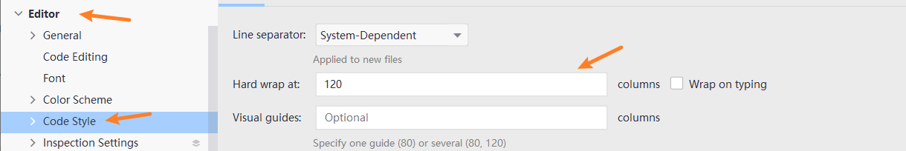
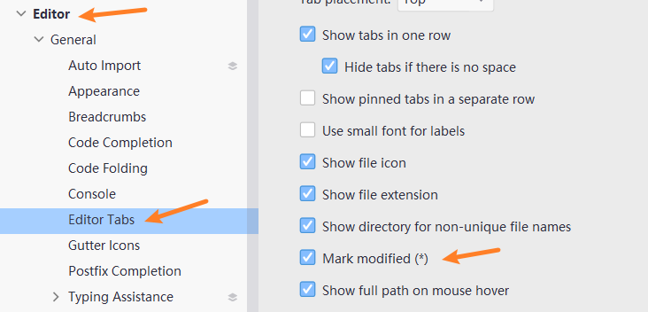
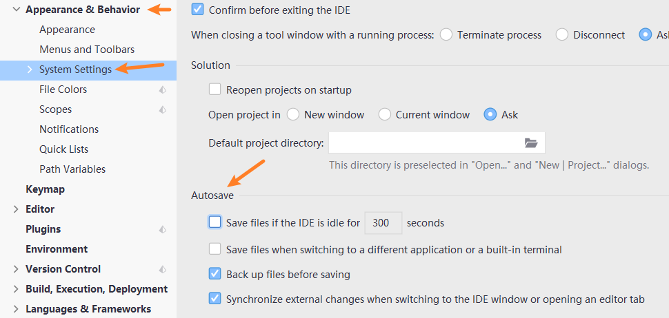
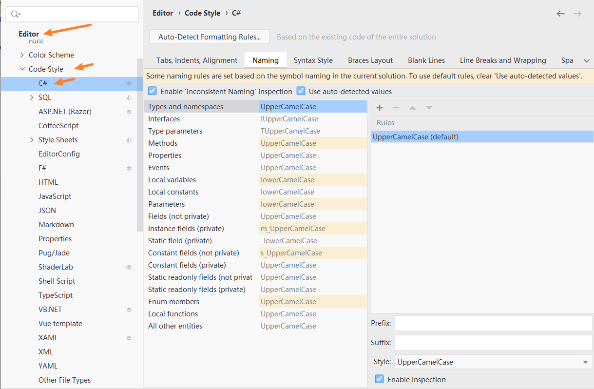
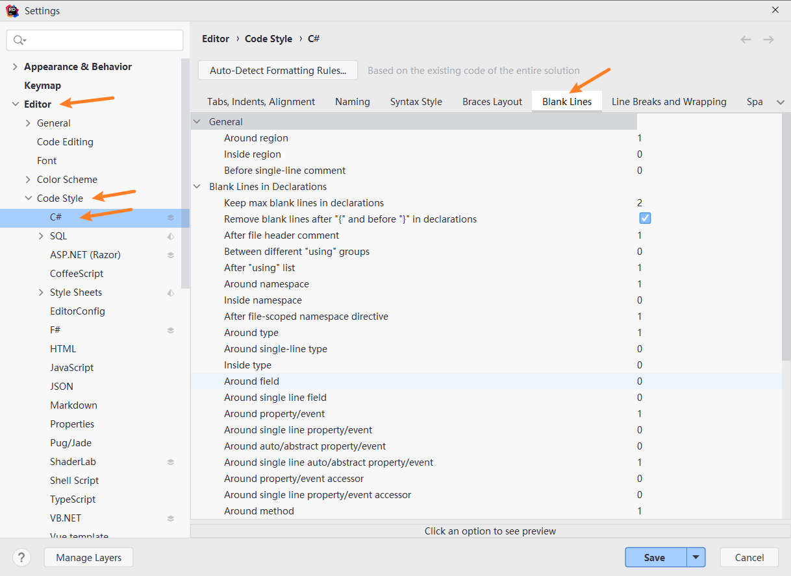
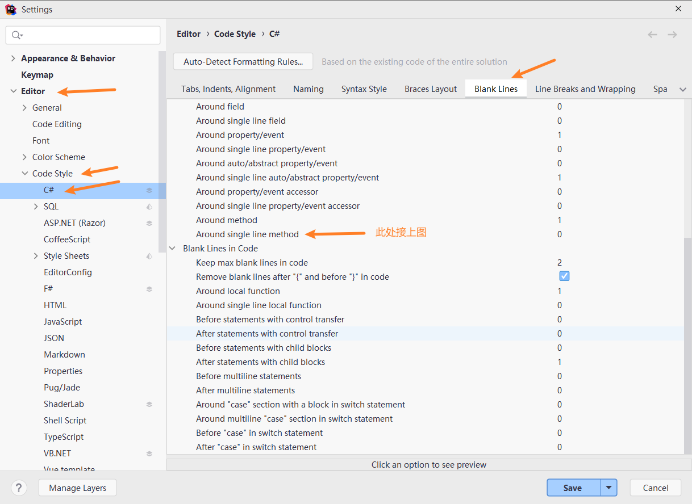
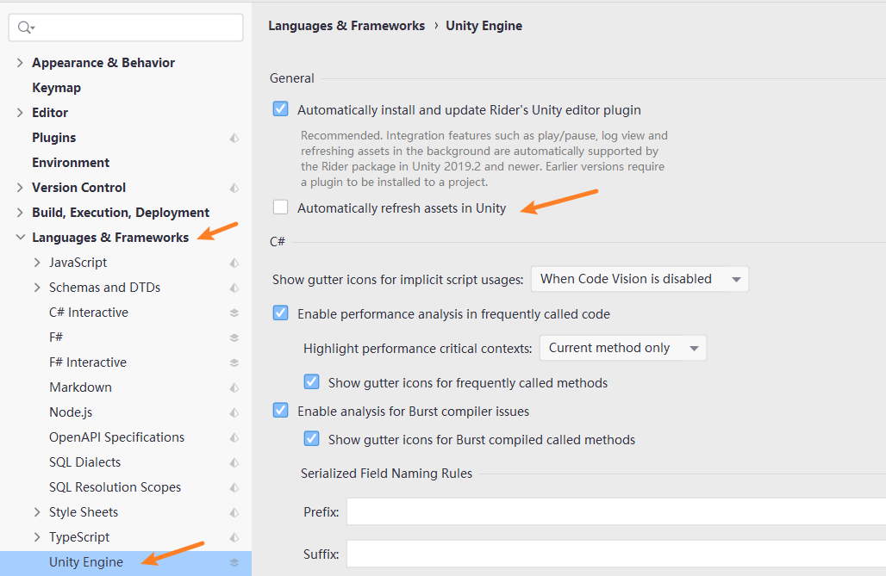

## Settings

File -> Settings

### 每行长度多少时，自动换行

Editor -> Code Style -> Hard wrap at ...



### 脚本修改标志符显示

Editor -> General -> Editor Tabs -> Mark modifled (*)



### 自动保存

Apperance & Behavior -> System Settings -> Autosave



- Save files when switching to a different application or a built-in terminal

  在切换到不同的应用程序或内置终端时保存文件

- Synchronize external changes when switching to the IDE window or opening an editor tab

  在切换到IDE窗口或打开一个编辑器标签时，同步外部变化

### C# 代码格式化设置

Editor -> Code Style -> C#

- Naming
- Blank lInes
- Line Breaks and Wrapping

#### 命名规则 Naming

##### 单个设置

光标移至 有下划线的单词，点击行前的灯泡，Inspection: "Field can be made readonly" -> Configure inspection severity -> Do not show（由于使用了统一设置，没试过）

##### 统一设置

Editor -> Code Style -> C# -> Naming



左上角 Enable ‘Inconsistent Naming’ Inspection，取消勾选，可以关闭脚本里有关命名不符合设置的规范提示。

常用格式选项：

- UpperCamelCase：首字符大写驼峰
- lowerCamelCase：首字符小写驼峰
- ALL_UPPER：全部大写
- Prefix：头部规则
- Suffix：尾部规则

常用选项：

- Instance field(private)：类的私有变量

例子：

想改类的私有变量命名规则，如 mCount。选中 Instance field(private)，在右下角 Prefix 处设置 m，Style 处设置 lowerCamelCase。

#### 空行 Blank Lines

Editor -> Code Style -> C# -> Blank Lines

##### 特性第一个变量声明后空一行设置

由于一连改了好几个设置，我也不知道是哪一个设置改好的

我的设置图：





#### 换行 Line Breaks and Wrapping

Editor -> Code Style -> C# -> Line Breaks and Wrapping

##### 特性换行规则设置


Unity 中编辑器的特性可以一条针对多条，如：

```c#
[Header("移动参数")]
public float speed = 8f;
public float crouchSpeedDivisor = 3f;
```

显然对于下面两行声明的变量 Header 都作用到了。但是使用代码格式化后，是这样显示的：

```c#
[Header("移动参数")] public float speed = 8f;

public float crouchSpeedDivisor = 3f;
```

所以首先我们需要特性的让后面可以换行。（<font color = skyblue>我将和特性相关的都设置成了 Never，也就是会换行</font>）

设置完成后代码格式化的样式：

```c#
[Header("移动参数")]
public float speed = 8f;

public float crouchSpeedDivisor = 3f;
```

可以发现两行变量声明之间空了一行，因此我们需要前往 <font color = skyblue>Blank Line</font> 进行设置。（<font color = skyblue>空一行和换行是有去别的，不能混淆概念</font>，你品，你细品）

Arttributes：特性，Arrangement：安排。所以，Arrangement of Arttributes：特性的排版

翻译：

- Place attribute section list on separate line if it is longer than 38

  如果特性部分的列表超过 38 个，请将其放在单独的一行中

- Keep existing arrangement of attributes

  保持现有的特性安排

- Place type attribute on the same line

  将特性和类型放在同一行

  Never

  ```C#
  [Attribute]
  class C { }
  
  [Attribute]
  class C1
  {
      // comment 
  }
  ```

  If owner is singleline

  ```C#
  [Attribute] class C { }
  
  [Attribute]
  class C1
  {
      // comment 
  }
  ```

  Always

  ```C#
  [Attribute] class C { }
  
  [Attribute] class C1
  {
      // comment 
  }
  ```

- Place method attribute on the same line

  将特性和方法放在同一行

- Place property/indexer/event attribute on the same line

  将特性和属性/索引器/事件放在同一行中。（<font color = cyan>索引器可能是指接口？</font>设置里给的预览是接口）

- Place accessories attribute on the same line

  将特性和附件放在同一行（<font color = cyan>附件可能指属性中的 get 和 set ？</font>）

- Place field attribute on the same line

  将特性和字段放在同一行（<font color = cyan>包括但不限于变量？</font>）

### 脚本保存后，Unity 后台是否自动刷新

Languages & Frameworks -> Unity Engine -> Automatically refresh assets in Unity

