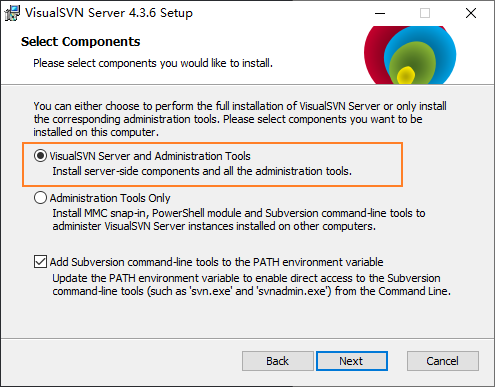
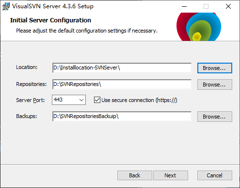
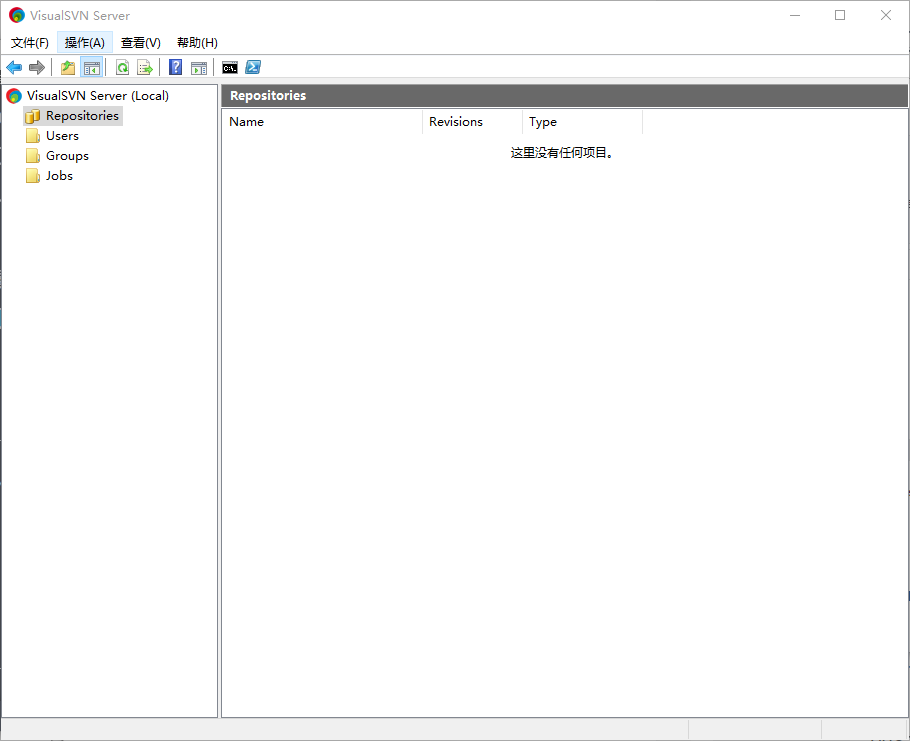
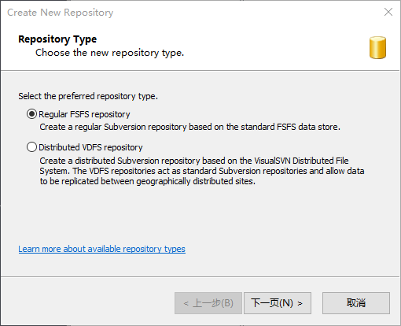
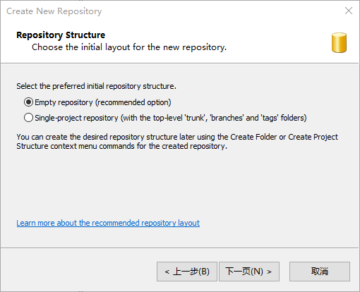
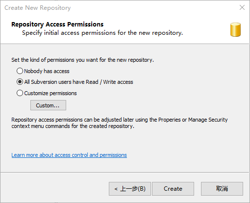
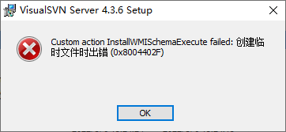

## SVN 服务端安装

官方网址：

https://www.visualsvn.com/server/download/

### 安装步骤

- VisualSVN Sever and Administration Tools：具有可视化界面（一般情况下勾选）

- Administration Tools Only：只有 Dos 管理界面
- Add Subversion command-line tools to the PATH environment variable：添加 SVN 系统指令到系统环境变量中（一定要勾选）

- Location：SVN 安装位置（不能出现中文、空格或特殊字符）
- Repositories：SVN 仓库位置
- Sever Port：端口号，可以自定义，自定义一般使用 8000 之后的端口号，防止重复
- Backups：备份地址

身份验证模式（默认即可，该项可以通过 SVN 服务器管理器重新配置）

- Use Subversion authentication：SVN 服务器将根据内部用户列表及其密码对用户进行身份验证
- Use Windows authentication：SVN 服务器将根据用户的 Windows 或Active Directory 对用户进行身份验证，具有单点登录和双因素身份验证支持。选择该项，安装程序会生成一个评估许可，免费的社区许可是不可用的。

### 创建仓库

启动程序位置：SVN安装位置\bin\VisualSVN Sever.msc

1. 双击打开 VisualSVN Sever.msc

- Repositories：仓库，存放被 SVN 管理的项目文件，可以存放源码、文档等

- Users：用户，能创建和编辑用户

- Groups：权限组，能创建和编辑用户组

2. 选中 Repositories -> 右键 -> Create New Repository...

标准文件夹结构：

- branches：分支，如果需要测试新技术或大范围修改，可以将主干代码拷贝到分支中进行，测试无误后可以合并到主干中
- tags：发布，发布版本需要放到 tags
- trunk：主干，主要的开发目录

3. 下一页 -> Repository Name

填写仓库名

4. 

5. 

### 报错

#### 创建临时文件时出错

先确定自己是否登录的是 Administrator，如果在 Administrator 账户下运行安装程序仍然报这个错误可以网上搜索方法尝试（因为我是通过登录 Administrator 账户解决的)。
