# 数学基础知识

## 笛卡尔坐标系

笛卡尔坐标系就是生活中常说的坐标系。

### 二维笛卡尔坐标系

必须满足以下两个条件

- 有一个原点
- 有两条过原点互相垂直的矢量，x 轴和 y 轴

因此，笛卡尔坐标系并不是唯一的，如 OpenGL 进行屏幕映射时使用的笛卡尔坐标系 与 DirectX 进行屏幕映射时使用的笛卡尔坐标系 不同。

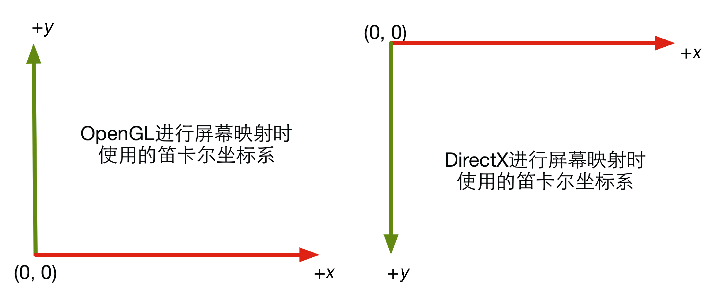

### 三维笛卡尔坐标系

- 有一个原点

- 有三个坐标轴，这 3 个坐标轴被称为 <font color=skyblue>基矢量</font>。

  3 个坐标间互相垂直且长度为 1，被称为 <font color=skyblue>标准正交基</font>。

  3 个坐标间互相垂直，但长度不为 1，被称为 <font color=skyblue>正交基</font>。

<font color=skyblue>正交：</font>互相垂直。

三维笛卡尔坐标系可分为 左手坐标系 和 右手坐标系。

#### 左手坐标系 和 右手坐标系

左手坐标系

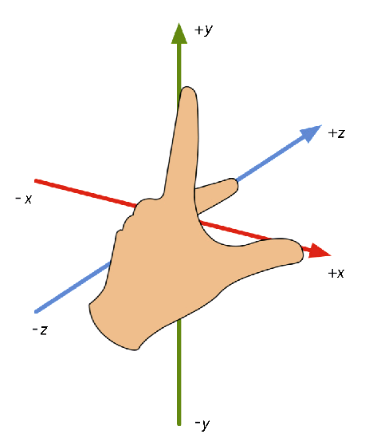

<center>左手坐标系</center>

右手坐标系

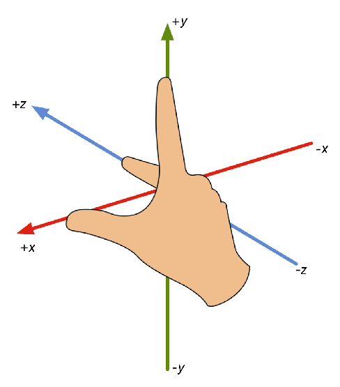

<center>右手坐标系</center>

#### 左手法则 和 右手法则

左手法则：定义左手坐标系旋转的正方向

右手法则：定义右手坐标系旋转的正方向

大拇指朝向旋转轴，其余手指就是旋转的正方向


#### 左手坐标系 和 右手坐标系的区别

使用左手坐标系 和 右手坐标系 描述同一件事，描述是不同的。

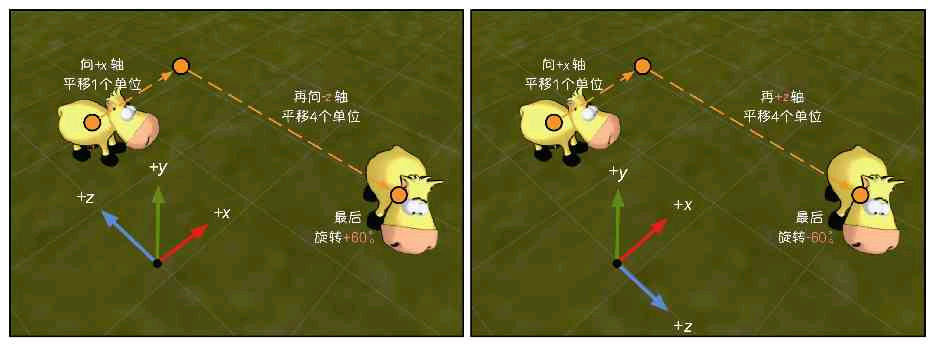

<center>左手坐标系&nbsp&nbsp&nbsp&nbsp&nbsp&nbsp&nbsp&nbsp&nbsp&nbsp&nbsp&nbsp&nbsp&nbsp&nbsp&nbsp&nbsp&nbsp&nbsp&nbsp&nbsp&nbsp&nbsp&nbsp&nbsp&nbsp&nbsp&nbsp&nbsp&nbsp&nbsp&nbsp&nbsp&nbsp&nbsp&nbsp&nbsp&nbsp&nbsp&nbsp&nbsp&nbsp&nbsp&nbsp&nbsp&nbsp&nbsp&nbsp&nbsp&nbsp&nbsp&nbsp右手坐标系</center>

Unity 中，模型空间 和 世界空间 都使用 <font color = skyblue>左手坐标系</font>。观察空间 使用 <font color = skyblue>右手坐标系</font>。

观察空间：也叫摄像机空间。以摄像机为原点的坐标系，+z 轴指向相机后，+y 轴向上。

<font color = cyan>猜测：</font>观察空间为右手坐标系是因为摄像机就像镜子，z 轴原本向前为正方向，透过镜子后向后为正方向。 

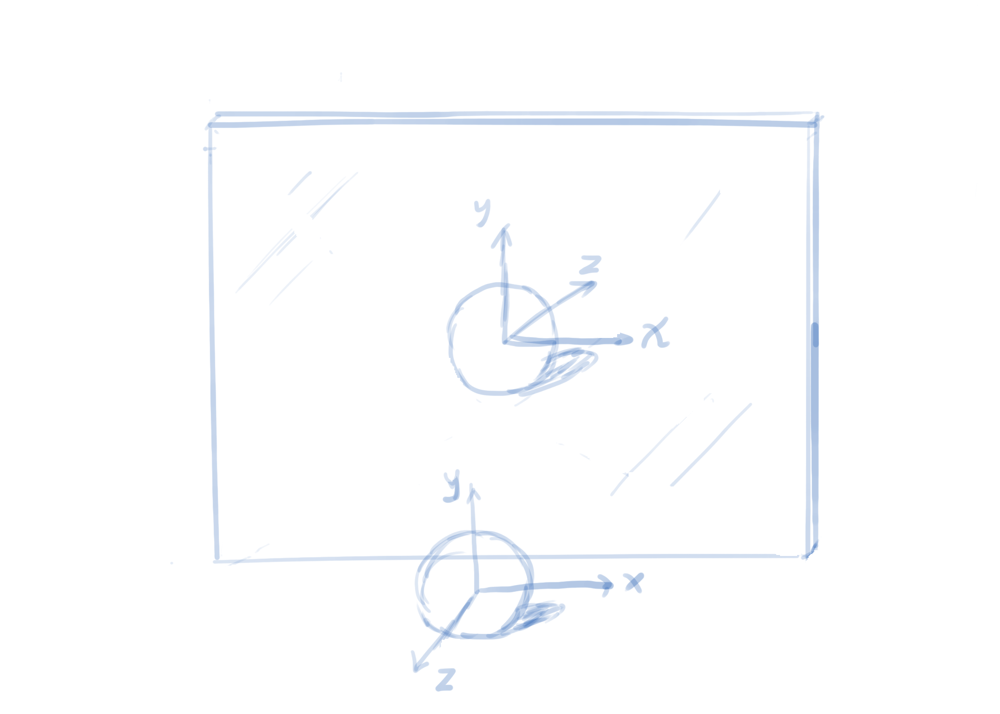

## 矢量

### 矢量加法的三角形定则

就是矢量加法。

### 矢量减法

某段向量 = 原点到某段向量的终点 - 原点到某段向量的起点

### 矢量的模

矢量的模 = 每个分量的平方相加后开根号

### 单位矢量 归一化

模为 1 的矢量就是单位矢量，也叫 被归一化的矢量。

单位矢量 = 矢量 / 矢量的模

<font color = skyblue>零矢量</font> 是不可被归一化的。零矢量：每个分量的值都为 0 。

### 矢量的点积

矢量的点积又叫内积，$ \vec{a} \cdot \vec{b}$ （ $\cdot$ 是不能省略的），其最后结果是一个 <font color=skyblue>标量</font>。

$$
\vec{a} \cdot \vec{b} = (a_x,\ a_y,\ a_z) \cdot (b_x,\ b_y,\ b_z) = a_xb_x + a_yb_y + a_zb_z
\\
\vec{a} \cdot \vec{b} = \vec{b} \cdot \vec{a}
$$

例子：
$$
(1,2,3) \cdot (5,-1,7) = 1 * 5 + 2 * (-1) + 3 * 7 = 5 - 2 + 21 = 24
$$
#### 几何意义

点积的几何意义是投影。单位向量 $\vec{a} \cdot \vec{b}$ 的几何意义是：向量 $\vec{b}$ 在<font color = skyblue>单位向量 $\vec{a}$ </font>方向上的投影。

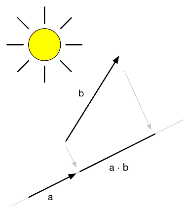

<center>向量 b 在单位向量 a 方向上的投影</center>

点积结果可能是一个负数，点积结果的正负号与两个向量的方向有关，如果它们方向相反（夹角大于 90°），结果小于 0；如果它们互相垂直（夹角为 90°），结果为 0；如果它们方向相同（夹角小于 90°），结果大于 0。

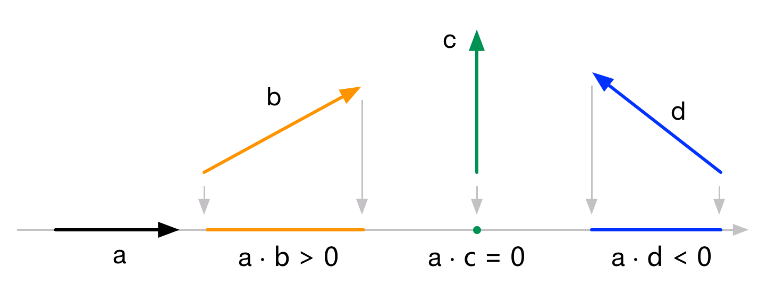

<center>点积的符号</center>

如果 $\vec{a}$ 不是单位向量，那么只需在 $\vec{a} \cdot \vec{b}$ 的基础上乘以 a 的长度即可。

#### 性质

性质一
$$
(k \vec{a}) \cdot \vec{b} = k (\vec{a} \cdot \vec{b})
$$
性质二
$$
\vec{a} \cdot (\vec{b} + \vec{c}) = \vec{a} \cdot \vec{b} + \vec{a} \cdot \vec{c}
\\
\vec{a} \cdot (\vec{b} - \vec{c}) = \vec{a} \cdot \vec{b} - \vec{a} \cdot \vec{c}
$$
性质三
$$
\vec{v} \cdot \vec{v} = v_xv_x + v_yv_y + v_zv_z = |v|^2
$$
这意味着<font color = skyblue>可以直接利用点积来求向量的模，当我们需要比较两个向量的长度大小时，可以直接使用点积来获得结果，这比 通过开方来计算向量长度 再比较 更省性能。</font>

#### 公式

公式一
$$
\vec{a} \cdot \vec{b} = |\vec{a}| \  |\vec{b}| \ cos\theta
\\
\theta = arcos(\vec{a}\ 的单位向量\  \cdot \  \vec{b}\ 的单位向量)
$$
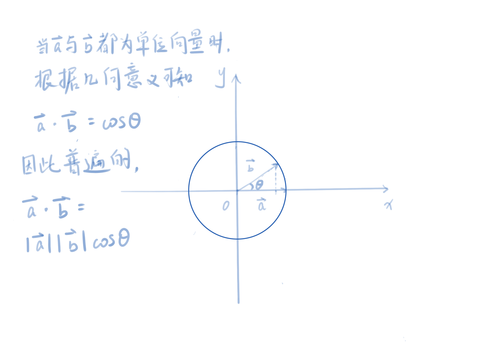

### 矢量的叉积

矢量的叉积又称外积，$\vec{a} \times \vec{b}$ （$\times$ 是不能省略的），其最后结果仍是一个矢量。
$$
\vec{a} \times \vec{b} = (a_x,\ a_y,\ a_z) \times (b_x,\ b_y,\ b_z) = (a_yb_z - a_zb_y,\ a_zb_x - a_xb_z,\ a_xb_y - a_yb_x)
$$

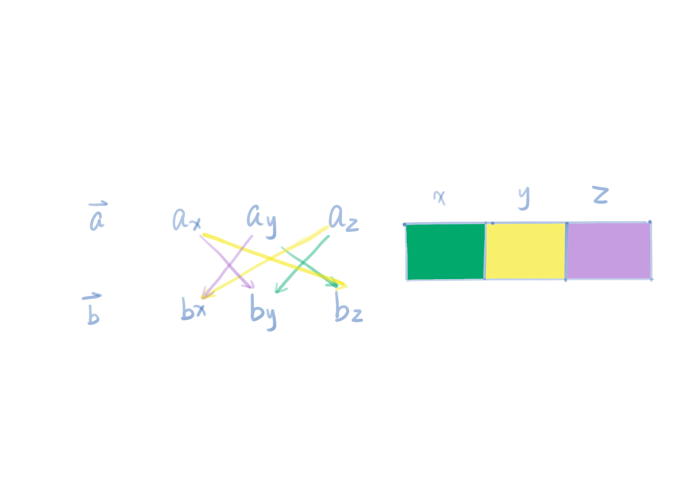

例子：
$$
\begin{aligned}
(1,2,3) \times (-2, -1, 4) &= (2 * 4 - 3 * (-1), 3 * (-2) - 1 * 4, 1 * (-1) - 2 * (-2)) 
\\
&= (8 + 3, -6 - 4, -1 + 4)
\\
&= (11, -10, 3)
\end{aligned}
$$
<font color = skyblue>注意：</font>$$\vec{a} \times \vec{b} \neq \vec{b} \times \vec{a}$$ ，$\vec{a} \times \vec{b} \times \vec{c} \neq \vec{a} \times (\vec{b} \times \vec{c})$，但是满足 $\vec{a} \times \vec{b} = -(\vec{b} \times \vec{a})$。

#### 几何意义

两个矢量的叉积会得到一个同时垂直于两个矢量的新矢量。新矢量的模：$|\vec{a} \times \vec{b}| = |\vec{a}| \times |\vec{b}| \  sin \theta$。该公式也是平行四边形的面积公式。平行四边形面积 = 底 × 高。平行四边形高 = $|\vec{a}| sin \theta$。

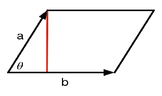

<center>平行四边形面积公式</center>

新矢量的方向：可以使用 右手法则 或 左手法则 旋转获得。两种方法都是先摊开手心，手指朝向 $\vec{a}$ 的方向，将手指朝着 $\vec{b}$ 的方向握紧，大拇指的方向即新矢量的方向。虽然左手和右手法则得到的方向是相反的，但是叉乘的结果始终不变。也就是说如果叉乘的结果大于 0，那么，在左手坐标系中，其方向是左手坐标系中的正方向；在右手坐标系中，其方向是右手坐标系中的正方向。小于 0，同理其方向都是在左、右手坐标系中的反方向。

#### 作用

用于计算垂直于一个平面、三角形的矢量，还可以判断三角面片的朝向。

如下图，三角形的三个顶点都位于 xy 平面上，人眼位于 z 轴的负方向，向 z 轴的正方向观察。可以通过叉乘判断人眼观察到的是三角面片的正面还是背面，3 个点的顺序是顺时针还是逆时针。

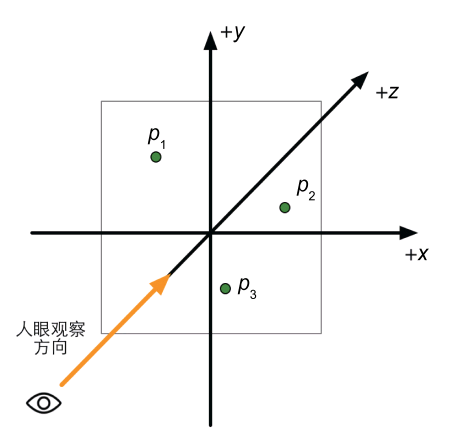

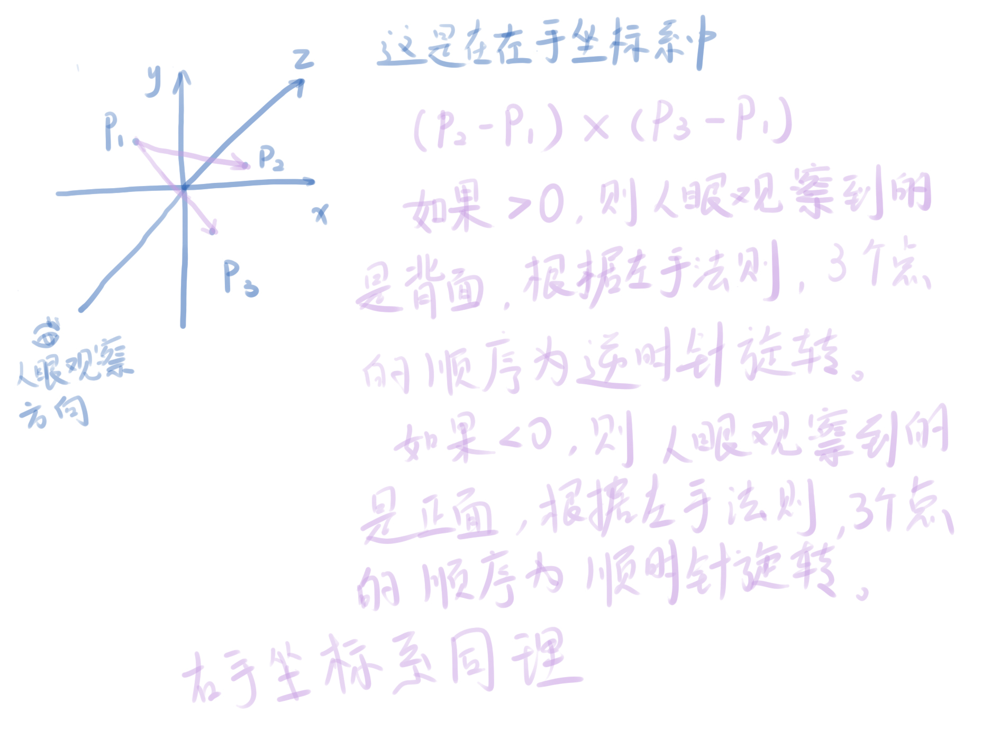

## 矩阵

矩阵可以把一个矢量从一个坐标空间转换到另一个坐标空间。

以下两种矩阵写法都可。

<font color = skyblue>在本笔记中以后都使用 `[]` 来包裹矩阵，矩阵名使用大写英文字母表示，矩阵的元素都以矩阵名的小写字母表示，这样好看一点。</font>
$$
\left[
\begin{matrix}
1 & 2 & 3 \\
4 & 5 & 6 \\
7 & 8 & 9
\end{matrix}
\right]
\qquad\qquad
\left(
\begin{matrix}
1 & 2 & 3 \\
4 & 5 & 6 \\
7 & 8 & 9
\end{matrix}
\right)
$$
矩阵的一般表达式。
$$
M = 
\left[
\begin{matrix}
m_{11} & m_{12} & m_{13} \\
m_{21} & m_{22} & m_{23} \\
m_{31} & m_{32} & m_{33}
\end{matrix}
\right]
$$

### 矩阵的乘法

#### 矩阵与标量

$$
\begin{align}
kM &= Mk
\\\\

&=k 
\left[
\begin{matrix}
m_{11} & m_{12} & m_{13} \\
m_{21} & m_{22} & m_{23} \\
m_{31} & m_{32} & m_{33}
\end{matrix}
\right]
\\\\

&=
\left[
\begin{matrix}
km_{11} & km_{12} & km_{13} \\
km_{21} & km_{22} & km_{23} \\
km_{31} & km_{32} & km_{33}
\end{matrix}
\right]
\end{align}
$$

#### 矩阵与矩阵

一个 $r \times n$ 的矩阵 A 和一个 $r \times c$ 的矩阵 B 相乘，它们的结果是一个 $r \times c$ 大小的矩阵。

矩阵与矩阵相乘，前一个矩阵的列数 必须和 后一个矩阵的行数 相等。<font color = skyblue> 这个条规定必须满足，否则两个矩阵无法相乘。</font>

$矩阵 A \times 矩阵 B = 矩阵 C$，$矩阵C$ 中的每一元素 c 的计算公式如下。
$$
\begin{aligned}
c_{ij} &= a_{i1}b_{1j} + a_{i2}b_{2j} + \cdots + a_{in}b_{nj}
\\
&= \sum_{k = 1}^{n}{a_{ik}b_{kj}}
\end{aligned}
$$

$c_{ij}$ 其实就是 矩阵 A 的第 i 行向量 与矩阵 B 的第 j 列向量的点乘。

##### 性质

性质一

通常情况下：
$$
AB \neq BA
$$
性质二

矩阵乘法满足结合律
$$
(AB)C = A(BC)
\\
ABCDE = ((A(BC))D)E = (AB)(CD)E
$$

#### 特殊的矩阵

##### 方块矩阵

方块矩阵（square matrix），简称方阵，指 行 和 列 数目相等的矩阵，常用的是 $ 3 \times 3 $ 和 $ 4 \times 4 $ 的方阵。

###### 对角元素

对角元素是只有方阵才具有的。方阵的对角元素是 行号 和 列号 相等的元素，如 $ m_{11} 、 m_{22} $等。

###### 对角矩阵

一个 除了对角元素外所有的元素都为 0 的矩阵。
$$
\left[
\begin{matrix}
5 & 0 & 0 & 0 & 0 \\
0 & 9 & 0 & 0 & 0 \\
0 & 0 & -6 & 0 & 0 \\
0 & 0 & 0 & 20 & 0 \\
0 & 0 & 0 & 0 & 8 
\end{matrix}
\right]
$$

###### 单位矩阵

一种特殊的对角矩阵。一种对角元素都为 1 的对角矩阵，一般用 $ I_n $ 来表示。
$$
I_4 = 
\left[
\begin{matrix}
1 & 0 & 0 & 0 & \\
0 & 1 & 0 & 0 & \\
0 & 0 & 1 & 0 & \\
0 & 0 & 0 & 1 &
\end{matrix}
\right]
$$
<font color = skyblue>任何矩阵与单位矩阵相乘的结果都还是原来的矩阵。</font>
$$
MI = IM = M
$$

# 基础知识

## 渲染流水线

由CPU流水线和GPU流水线共同构成

### CPU流水线

1. 把数据加载到内存

   将数据从硬盘（HDD）中加载到系统内存（RAM）中。然后，将网格和纹理等数据加载到显存（VRAM）中。这是因为显卡对显存的访问速度更快。同时，硬盘加载到内存的过程十分耗时，所以一些 CPU 可以访问的网格数据尽量不要移除。

2. 设置渲染状态

   渲染状态：定义了场景中网格是如何被渲染的。例如：使用哪个顶点着色器（Vertex Shader）/片元着色器（Fragment Shader）、光源属性、材质等。

   网格：可以看成形状不同的容器。

   纹理：可以看成物体表面的花纹。

   Draw Call：是一个 CPU 告诉 GPU 一切就绪的渲染命令。

3. 调用 Draw Call

   Draw Call 这个命令仅仅指向一个需要被渲染的图元（primitives）列表，不包含任何材质信息。因为，上一流程——设置渲染状态 已经给容器添上花纹了。这个流程就是通过 Draw Call 告诉 GPU 可以开始渲染了，并且 Draw Call 会执行本次需要调用渲染的图元列表。

### GPU流水线

GPU 接收到 Draw Call 命令后，进行的一系列流水线操作，最终把图元渲染到屏幕上。

GPU 流水线分为 几何阶段 和 光栅化阶段。

GPU 流水线中有一些流程是不可配置和编程的。

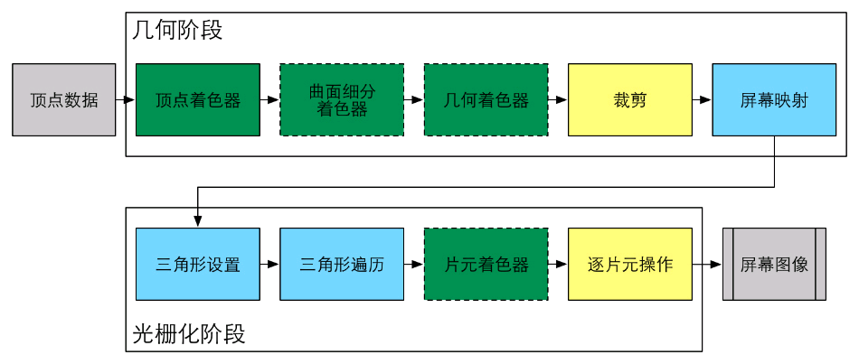

<center>绿色表示该阶段流水线阶段是完全可编程控制的；黄色表示该流水线阶段可以配置但不可编程的；蓝色表示该流水线阶段是由 GPU 固定实现的，开发者没有任何控制权。实现表示该 Shader 必须由开发者实现，虚线表示该 Shader 是可选的</center>

流程：

​		顶点数据 -> 几何阶段 -> 光栅化阶段 -> 屏幕图像

顶点数据是 GPU 流水线的输入，这些顶点数据是在 CPU 流水线的第一步加载到显存中，在由 Draw Call 指定，然后传递给顶点着色器。

顶点着色器（Vertex Shader）：用于实现顶点的空间变换、顶点着色等功能。

曲面细分着色器（Tessellation Shader）：用于细分图元。

几何着色器（Geometry Shader）：用于执行逐图元（Per-Primitive）的着色操作 或 用于产生更多的图元。

裁剪（Clipping）：将那些不在摄像机视野内的顶点裁剪掉，并提出某些三角图元的面片。

屏幕映射（Screen Mapping）：把每个图元的坐标转换到屏幕坐标系中。

三角形设置（Triangle Setup）和 三角形遍历（Triangle Traversal）阶段都是固定函数（Fixed Function）的阶段。

片元着色器（Fragment Shader）：用于实现逐片元（Per-Fragment）的着色操作。

逐片元操作（Per-Fragment Operations）：执行喝多重要的操作，例如修改颜色、深度缓冲、进行混合等。

#### 几何阶段

流程：

​		顶点着色器 -> 曲面细分着色器 -> 几何着色器 -> 裁剪 -> 屏幕映射

##### 顶点着色器

输入进来的每个顶点都会调用一次顶点着色器。顶点着色器本身不可以创建或这销毁任何顶点，且无法得到顶点与顶点之间的关系。也就是说，无法直到两个顶点是否属于同一个三角网格。

流程：

--> 为非必须流程

​		顶点输入 -> 顶点坐标变换 --> 计算顶点颜色 --> 输出后续阶段所需数据

顶点坐标变换：是一个必须进行的过程。其必须完成的工作是把顶点坐标从模型空间转换到齐次裁剪空间。例如下面代码：

```
o.pos = mul(UNITY_MVP, v.position)
```

该代码的功能是把顶点坐标转换到齐次裁剪坐标系下，然后通过硬件做透视除法后，得到归一化的设备坐标（Nomalized Device Coordinates，NDC）。NDC 的 z 分两范围在 [-1, 1]。

顶点着色器可以有不同的输出方式。经过光栅化后交给片元着色器 或者 把数据发送给曲面细分着色器 或者 几何着色器。

##### 裁剪

一个图元和摄像机视野的关系有 3 种：完全在视野内、部分在是视野内、完全在视野外。完全在视野内的图元就继续传递给下一个流水线阶段，完全在视野外的图元不会继续向下传递，而部分在视野内的图元需要进行一下处理。例如，一条线段的一个顶点在不在视野内，那么这个顶点应该用新顶点来代替，这个新顶点位于这条线段和视野边界交点。

##### 屏幕映射

把每个图元的 x 和 y 坐标转换到屏幕坐标系（Screen Coordinates）下。屏幕坐标系是一个二维坐标系，它和我们用于显示画面的分辨率有很大关系。这是一个缩放的过程。屏幕坐标系 和 z 坐标构成了窗口坐标系（Window Coordinates），这些值会一起被传递到光栅化阶段。

屏幕映射得到的屏幕坐标决定了顶点对应屏幕上哪个像素以及距离这个像素有多远。

OpenGL把屏幕的左下角做为最小的窗口坐标值。

#### 光栅化阶段

##### 三角形设置


##### 三角形遍历

## Unity 内置Shader

- Standard Surface Shader：会产生一个包含了标准光照模型的表面着色器模板，提供了典型的表面着色器。

- Unlit Shader：会产生一个不包含光照（但包含雾效）的基本的 顶点 / 片元着色器。

- Image Effect Shader：实现各种屏幕后处理效果，提供了一个基本模板。

- Compute Shader：会产生一种特殊的 Shader 文件，这类 Shader 旨在利用 GPU 的并行性来进行一些与常规渲染流水线无关的计算。

  更多介绍：https://docs.unity3d.com/Manual/class-ComputeShader.html

## Inspector 面板

Unity Shader 本质上就是一个文本文件，也有导入设置。


### Default Maps

指定该 Unity Shader使用的默认纹理，当任何材质第一次使用该 Unity Shader 时，这些纹理就会自动被赋予到相应的属性上。

### Surface Shader

是否是一个表面着色器。

Show generated code：打开一个新的文件，在这个文件里将显示 Unity 在背后为该 <font color=skyblue>表面着色器</font> 生成的顶点/片元着色器。这可以方便我们对这些生成的代码进行修改和保存，但需要复制到一个新的 Unity Shader 中才可保存。

### Fixed function

是否是一个固定函数着色器。

Show generated code：打开一个新的文件，在这个文件里将显示 Unity 在背后为该 <font color=skyblue>固定函数着色器</font> 生成的顶点/片元着色器。这可以方便我们对这些生成的代码进行修改和保存，但需要复制到一个新的 Unity Shader 中才可保存。

### Compiled code

可以检查 Unity Shader 针对不同图像编程接口（例如 OpenGL、D3D9、D3D11等）最终编译成的 Shader 代码。直接单击该按钮可以查看生成的底层的汇编指令。我们可以利用这些代码来分析和优化着色器。

### Render queue

使用的渲染队列

### Disable batching

是否关闭批处理

### Properties

属性列表

## 结构

```
// 与 Shader 的文件名无关，是对 Shader 的分类
Shader "MyShader/LearningShader1"
{
    // 定义了着色器所需的各种属性
    // 非必须的，主要是属性在 Unity 材质的 Inspector 面板中可视化，暴露出来方便调整
    Properties{
        // 属性名("Unity Inspector 面板中显示的属性名",属性类型) = 值
        // 当 Unity Inspector 面板中的值改变过后，将以 Unity Inspector 面板中的值为准
        // 属性与属性之间通过换行区分
        _Color("Color",Color) = (1,1,1,1)
    }
    
    // 一个 Shader 文件中可以有多个 SubShader，但至少有一个。
    // 多个 SubShader 用于适配不同的显卡，一些旧的显卡仅能支持一定数目的操作指令，当我们希望在旧的显卡上使用计算复杂度较低的着色器时，就可以再写一个 SubShader
    // 当显卡不适配第一个 SubShader 时，会自动选择第二个 SubShader，如果还不适配时，会继续选择下一个 SubShader，以此类推
    // 必须的
    SubShader{
    
        // 用于告诉 Unity 渲染引擎：如何以及何时渲染当前对象
        // 全局的，会用于所有 Pass 块
        // 非必须的
        Tags{
        	// "标签类型" = "标签值"
        }
        
        // 渲染状态，设置显卡的各种状态
        // 全局的，会用于所有 Pass 块
        // 非必须的
        
        // 一个 SubShader 中可以有许多的 Pass 块，但必须有一个 Pass 块
        // 每个 Pass 块定义了一次完整的渲染流程，如果 Pass 的数目过多，会造成渲染性能下降，因此应尽量使用最小数目的 Pass 块
        // 一个 Pass 块相当于一个方法
        Pass{
            // 该 Pass 块的名称
            // 通过这个名称，可以使用 ShaderLab 的 UsePass 命令来直接调用其他 Unity Shader 中的 Pass 块，可以提高代码的复用性
            // Unity 中会把所有 Pass 的名称转换成大写字母表示，所以在使用 UsePass 命令时必须将 Pass 的名称转换成大写形式
            Name "MyPassName"
            
            // Pass块中可以使用 CG 语言编写 Shader 代码
            // 当需要使用 Properties 中的属性时，需要重新定义一下，但 Properties 中的属性的值会传过来
            // 新定义的属性名需与 Properties 的属性名一样
            // 同时注意 Properties 中支持的类型，在 SubShader 中不一定支持，因此需要改变一下
            // 如 Color 要变成 float4
            CGPROGRAM           
            float4 _Color;
            
            // pragma vertex 顶点函数申明，函数名 vert 可以自定义
            #pragma vertex vert
            
            // pragma fragment 片元函数申明，函数名 frag 可以自定义
            #pragma fragment frag
            
            // 返回值 vert(形式参数)
            // float4 vector4 : POSITION 意思是将 POSITION 赋值给 vector4
            // float4 vert() : SV_POSITION 意思是 vert 函数的返回值将赋值给 SV_POSITION
            float4 vert(float4 vector4 : POSITION) : SV_POSITION {
            }
            
            ENDCG
        }
    }
    
    // 当以上所有 SubShader 都不支持时，会使用 Fallback 调用已经存在的 Shader
    // 也可以任性地关闭 Fallback 功能，Fallback Off
    // Fallback 在渲染阴影纹理时，会影响阴影的投射
    // 非必须的
    Fallback "vertexLit"
}
```

更多参考：https://docs.unity3d.com/2020.2/Documentation/Manual/SL-CustomShaderGUI.html

### SubShader

#### 标签 Tags

以下标签仅能用于 SubShader 中声明，不可用于 Pass 块中声明。

| 标签类型             | 说明                                                         | 例子                                   |
| -------------------- | ------------------------------------------------------------ | -------------------------------------- |
| Queue                | 控制渲染顺序，指定该物体属于哪一个渲染队列，通过这种方式可以保证所有的透明物体可以在所有不透明物体后面被渲染，也可以自定义使用的渲染队列来控制物体的渲染顺序 | Tags {"Queue" = "Transparent"}         |
| RenderType           | 对着色器进行分类，例如这是一个不透明的着色器，或是一个透明的着色器等。这可以被用于着色器替换（Shader Replacement）功能 | Tags {"RenderType" = "Opaque"}         |
| DisableBatching      | 一些 SubShader 在使用 Unity 的批处理功能时会出现问题，例如使用了模型空间下的坐标进行顶点动画。这时可以通过标签来直接指明是否对该 SubShader 使用处理 | Tags {"DisableBatching" = "True"}      |
| ForceNoShadowCasting | 控制使用该 SubShader 的物体受否会投射阴影                    | Tags {"ForceNoShadowCasting" = "True"} |
| IgnoreProjector      | 如果该标签值为 "Ture"，那么使用该 SubShader 的物体将不会受到 Projector 的影响。通常用于半透明物体 | Tags {"IgnoreProjector" = "True"}      |
| CanUseSpriteAtlas    | 当该 SubShader 是用于精灵（Sprite）时，将该标签设置为 "False" | Tags {"CanUseSpriteAtlas" = "False"}   |
| PreviewType          | 指明材质面板将如何预览该材质。默认情况下，材质将显示为一个球形，通过把该标签的值设为 "Plane" "SkyBox" 来改变预览类型 | Tags {"PreviewType" = "Plane"}         |

以下标签用于 Pass 块

| 标签类型       | 说明                                                         | 例子                                       |
| -------------- | ------------------------------------------------------------ | ------------------------------------------ |
| LightMode      | 定义该 Pass 在 Unity 的渲染流水线中的角色                    | Tags {"LightMode" = "ForwardBase"}         |
| RequireOptions | 用于指定当满足某些条件时才渲染该 Pass，它的值是一个有空格分隔的字符串。Unity 支持的选项有：SoftVegetation。<font color = grass>（待去官网上查看是否已更新）</font> | Tags {"RequireOptions" = "SoftVegetation"} |

#### 渲染状态 RenderSetup

以下渲染状态既可用于 SubShader 中，也可用于 Pass 块中。

| 状态名称 | 设置指令                                                     | 解释                                     |
| -------- | ------------------------------------------------------------ | ---------------------------------------- |
| Cull     | Cull Back \| Front \| Off                                    | 设置剔除模式：提出背面 / 正面 / 关闭剔除 |
| ZTest    | ZTest Less Greater \| Lequal \| GEqual \| Equal \| NotEqual \| Always | 设置深度测试时使用的函数                 |
| ZWrite   | ZWrite On \| Off                                             | 开启 / 关闭深度写入                      |
| Blend    | Blend SrcFactor DetFactor                                    | 开启并设置混合模式                       |

## 属性类型

### Color

颜色类型，rgba 每一个方向都在 0 ~ 1 之间

```
// Properties 中
_Color("Color",Color) = (1,1,1,1)
// SubShader 中
float4 _Color;
```

### Vector

四维向量

```
// Properties 中
_Vector("Vector",Vector) = (1,2,3,4)
// SubShader 中
float4 _Vector;
```

### Int

整数

```
// Properties 中
_Int("Int",Int) = 1314
// SubShader 中
float _int;
```

### Float、half、fixed

小数，没有 double 类型，所以数值不需要加 f

half、fixed 与 float 除范围不同，其他相同

范围：

- float：32 位二进制，32 位高精度浮点数，精确到小数点后 6 位。一般用于世界坐标、纹理坐标

- half：16 位二进制，16 位中精度浮点数，[-60000, 60000]，精确到小数点后 3 位。一般用于短向量、方向、本地坐标、高动态范围颜色

- fixed：11 位二进制，11 位低精度浮点数，[-2, 2]，精度为 1 / 256，一般用于普通颜色

float2、half2、fixed2：二维向量

float3、half3、fixed3：三维向量

float4、half4、fixed4：四维向量

```
// Properties 中
_Float("Float",Float) = 4.5
// SubShader 中
float _Float;
```

### Range

范围，Range(a,b) 相当于 [a,b]

```
// Properties 中
_Range("Range",Range(1,11)) = 6
// SubShader 中
float _Range;
```

### 2D

2D 纹理。`""` 中要么是空的，要么是内置的纹理名称，如 `"white"`、`"black"`、`"gray"`、`"bump"`。white 代表当 Unity Inspector 面板中未指定任何纹理时，默认使用白色的贴图。花括号的作用在 Unity 5.0 以后的版本中被 <font color = skyblue>移除</font> 了，如果我们需要类似的功能，需要自己在顶点着色器中编写计算相应纹理坐标的代码。在 Unity 5.0 以前的版本中，花括号的用处是用于指定一些纹理属性的，我们可以通过 TexGen CubeReflect、TexGen CubeNormal 等选项来控制固定管线的纹理坐标的生成。

3D、Cube 同理。

```
// Properties 中
_2D("Texture",2D) = "white"{}
// SubShader 中
sampler2D _2D;
```

### 3D

3D纹理

```
// Properties 中
_3D("Texture",3D) = "white"{}
// SubShader 中
sampler3D _3D;
```

### Cube

立方体纹理，一般用于天空盒子

```
// Properties 中
_Cube("Cube",Cube) = "white"{}
// SubShader 中
samplerCube _Cube;
```

## 特殊语义

### 顶点坐标 POSITION

### SV_POSITION

# 简单的例子

## 表面着色器

表面着色器被定义在 SubShader 语义块中的 CGPROGRAM 和 ENDCG 之间。这能使我们不必关心使用多少个 Pass 块、每个 Pass 块如何渲染等问题，我们只需关心使用什么纹理填充颜色，使用什么法线纹理填充法线，使用 Lambert 光照模型等。

```
Shader "Learning/简单的表面着色器"
{
    SubShader
    {
        Tags
		{
			"RenderType" = "Opaque"
		}
		
		CGPROGRAM
			// 使用 Lamber 光照模型
			#pragma surface surf Lambert
			
			struct Input {
				float4 color: COLOR;
			};
			
			void surf(Input IN,inout SurfaceOutput o) {
				o.Albedo = 1;
			}
		ENDCG
	}
	
    Fallback "Diffuse"
}
```

## 顶点 / 片元着色器

顶点 / 片元着色器的代码也需要定义在 CGPROGRAM 和 ENDCG 之间，但顶点 / 片元着色器是写在 Pass 语义块内，需要我们自己定义每个 Pass 块需要使用的代码。灵活性更高，能控制更多的渲染的实现细节。

```
Shader "Learning/简单的顶点片元着色器"
{
    SubShader
    {
        Pass
        {
            CGPROGRAM
            #pragma vertex vert
            #pragma fragment frag

            float4 vert(float4 v : POSITION) : SV_POSITION
            {
                return UnityObjectToClipPos(v);
            }
            
            fixed4 frag() : SV_Target
            {
                return fixed4(1.0,0.0,0.0,1.0);
            }
            ENDCG
        }
    }
}
```

## 固定函数着色器

不支持可编程管线着色器，对于一些较旧的设备（GPU仅支持 DirectX 7.0、OpenGL 1.5 或 OpenGL ES 1.1）如 iPhone 3。固定函数着色器一般可以完成一些非常简单的效果。 在 Unity 5.2 之后，所有固定函数着色器都会在背后被 Unity 编译成对应的顶点 / 片元着色器，因此真正意义上的固定函数着色器已经不存在了。固定函数着色器的代码被定义在 Pass 块中，这些代码相当于 Pass 块中的一些渲染设置，需要完全使用 ShaderLab 的语法来编写。

```
Shader "Learning/固定函数着色器"
{
    Properties
    {
        _Color("Main Color",Color) = (1,0.5,0.5,1)
    }
    SubShader
    {
        Pass
        {
            Material
			{
				Diffuse [_Color]
			}

			Lighting On
        }
    }
}
```

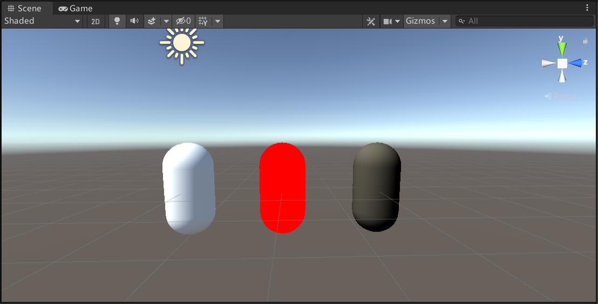

<center>从左至右：表面着色器、顶点 / 片元着色器、固定函数着色器</center>

## 着色器的选择

- 如果需要与各种光源打交道，需要使用表面着色器，但需要小心它在移动平台的性能
- 如果需要使用的光照数目非常少 或者 需要很多自定义渲染效果，使用顶点 / 片元着色器是一个更好的选择
- 需要在非常旧的设备上运行游戏的，选择固定函数着色器

 