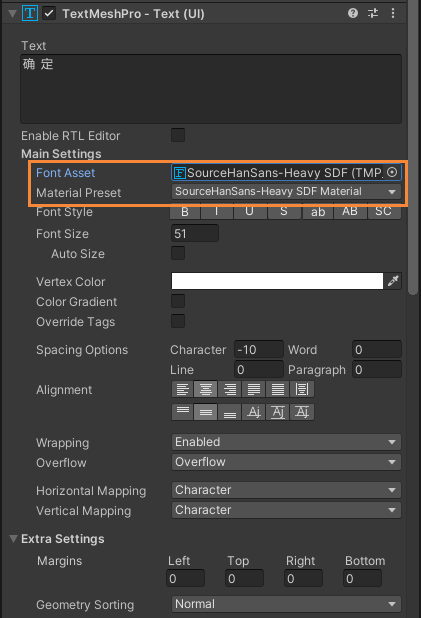

TextMeshPro

油管：https://www.youtube.com/@Zolran

### 中文字体制作

#### 准备

- 一个字体文件

  支持 `ttf` 和 `otf` 和 `otc` 格式？

  <font color=orange>注意：</font> 文件名不可以是中文

- 一个txt文本文件<font color = #e9c46a>（非必须）</font>

  里面放需要制作的字

#### 制作字体

Window -> TextMeshPro -> Font Asset Creator


##### Source Font File

字体文件


##### Sampling Point Size

<font color = skyblue>文档原文翻译：</font>

你可以控制用于生成字体纹理的字体的点尺寸。你可以手动设置一个自定义大小或使用自动大小。自动尺寸将尝试使用尽可能大的点尺寸，同时仍然适合纹理上的所有字符。你通常对 `SDF` 字体使用自动尺寸，而当你想对纯位图字体进行像素精确的控制时，则使用自定义尺寸。


<center>Auto vs. custom font size</center>

##### Padding

字符间的填充，以像素为单位。填充可以为 `SDF` 渐变创造空间， `Padding` 越大，过渡越平滑，以实现更高质量的渲染和更大的效果，如 厚的轮廓。

对于普通文本， `Padding` 为 5 通常不错。对于标题，`Padding` 为 7 不错。


<center>Padding 0, 5, and  10 for an SDF font </center>

##### Packing Method

<font color = skyblue>文档原文翻译</font>

最佳包装将找到尽可能大的自动字体大小，仍然适合纹理中的所有字符。快速打包的速度稍快，但最终可能会使用较小的字体大小。通常情况下，你在尝试设置时使用快速，在最终结果时使用最佳。

##### Altas Resolution

决定了支持多少汉字和字体清晰度，预览里发现字少了就改大这个

越大文件越大？

<font color = skyblue>文档原文翻译</font>

当使用 `SDF` 字体时，更高的分辨率会产生更精细的梯度，从而产生更高质量的文本。

对于大多数字体，当包括所有 `ASCII` 字符时，512 x 512 的纹理分辨率就可以了。

当你需要支持成千上万的字时，你将不得不使用大型纹理。但即使在最大的分辨率下，你也可能无法容纳所有的东西。在这种情况下，你可以通过创建多个字体资产来分割这些字符。把最常用的字符放在一个主要的字体资产中，其他的放在一个备用的字体资产中。

##### Character Set

字符集设置，即需要导出的字符是哪一种类型的。

固定字符集：

- `ASCII`
- `Extended ASCII`
- `ASCII Lowercase`
- `ASCII Uppercase`
- `Numbers + Symbols`

自定义字符集：

<font color = orange>注意：</font> 自定义字符集时别忘了添加 <font color=red>空格</font> ，除非不需要

<font color = 06d6a0>建议：</font> 自定义字符集用啥字就生成啥字，要是所有汉字都需生成时间会很长，并且别忘记调整 `Atlas Resolution` 大小

- `Custom Range`

  十进制是必须的，但 是 `Unicode` 编码?

  测了 `我` 这个字： `Unicode` 编码为 `\u6211` 十进制为 `25105` ，是 ok 的

- `Unicode Range (Hex)`

  十六进制

  汉字的 `Unicode` 编码最小值为 `4e00` ，最大值为 `9fa5` 

- `Custom Characters`

  直接输中文即可
  
- `Characters from File`

  用到准备的 `txt` 文件

  可以使用不止 `Unicode` 包含的字符

##### Render Mode

<font color = skyblue>文档原文翻译</font>

距离场模式创建SDF纹理，用于SDF着色器。这些字符是以高分辨率采样的，以创造良好的梯度。16倍是默认的，足以满足典型的使用。32倍的生成速度较慢，但对于复杂或小的字符来说可以产生更好的质量。

其他模式直接将字符渲染成位图，以便与纯位图的字体一起使用。光栅模式不使用抗锯齿，而平滑模式使用。两者都有一个带有提示的变体模式，它将字符像素与纹理像素对齐，以获得更清晰的结果。

`SMOOTH` 和 `RASTER` 和 `SDF` 之间区别还挺大的

- SMOOTH_HINTED

  微调的反锯齿渲染

- SMOOTH

  反锯齿渲染但没有微调

- Raster

  没有反锯齿或微调

- SDF16

  创建 `SDF` 图集的标准模式。字体将被向上采样 16 倍，以产生一个更精确的有符号距离场图集。

- SDF32

  与 `SDF16` 模式相同，但 是 向上采样 32 倍。这种模式将产生一个更准确的 `SDF` 图集。虽然更准确，但只能带来细微的视觉改善。这个选项应该在试图将一个完整的 `ASCII` 集装入一个 256 x 256 的小图集时，或者在处理一个具有高频曲线变化的复杂形状的字体时，大多会使用这个选项。

  <font color = orange>注意：</font> 这种处理模式将明显比 16 倍模式慢。

  

##### Get Kerning Pairs

<font color = skyblue>文档原文翻译</font>

决定已经在字体文件中存在的字偶距是否会被添加到字体资产中。如果在字体文件中没有发现字偶距，则新的字偶距总是可以在 `TextMeshPro` 字体资产编辑面板中被添加。


#### 相同字体不同材质

<font color = teal>情景说明：</font>

有时会遇到 `Font Asset` 相同，但是 材质设置 中，如 描边设置 `Outline` 等希望有不同的 颜色 或 其他设置 。 

<font color = teal>制作方法：</font>

创建一个 `Material` 将其名字设置为 `字体名 + 任意字符`

<font color=orange>注意：</font> 名字一定要这样设置，否则识别不出来


设置 `Shader` 属性： Shader -> TextMeshPro -> Distance Field

设置 `Debug Settings` 属性：将生成的 `SDF` 中的 `Texture` 拖入


根据需求设置 `Material` 其他设置

在用到的 `TextMeshPro` 组件中，先设置 `Font Asset` 的 `SDF` 字体，然后 `Material Preset` 设置成刚制作的 `Material` 




### TextMeshPro - Text 组件

#### 富文本

<font color = skyblue>原文翻译</font>

一个标签看起来像 `<tag>` 。许多标签在一个范围内操作，你可以用 `</tag>` 来结束这个范围。这种作用域可以嵌套，你不必按照你开始的顺序关闭它们。
有些标签有值和属性，如 `<tag = value>` 和 `<tag attribute = value>` 。这些参数要么是 名字 ，要么是 数字值 。数字 可以是 普通的十进制数字 、像素（如 `1px` ）、百分比（如 `80%` ）、字体单位（如 `1.2em` ），或者 十六进制的颜色值（如 `#FF` ）。名称可以带或不带 双引号，但如果有更多属性，最好使用 引号 。
标签 和 它们的属性最多可以有 128 个字符。这个限制不应该是一个问题，除非你使用 很长的字符串属性。

##### 水平对齐 align

```
<align=left>left</align>
<align=center>center</align>
<align=right>right</align>
<align=left>一行</align><align=right>内使用</align><align=center>最后一个标签的</align>对齐方式
```

