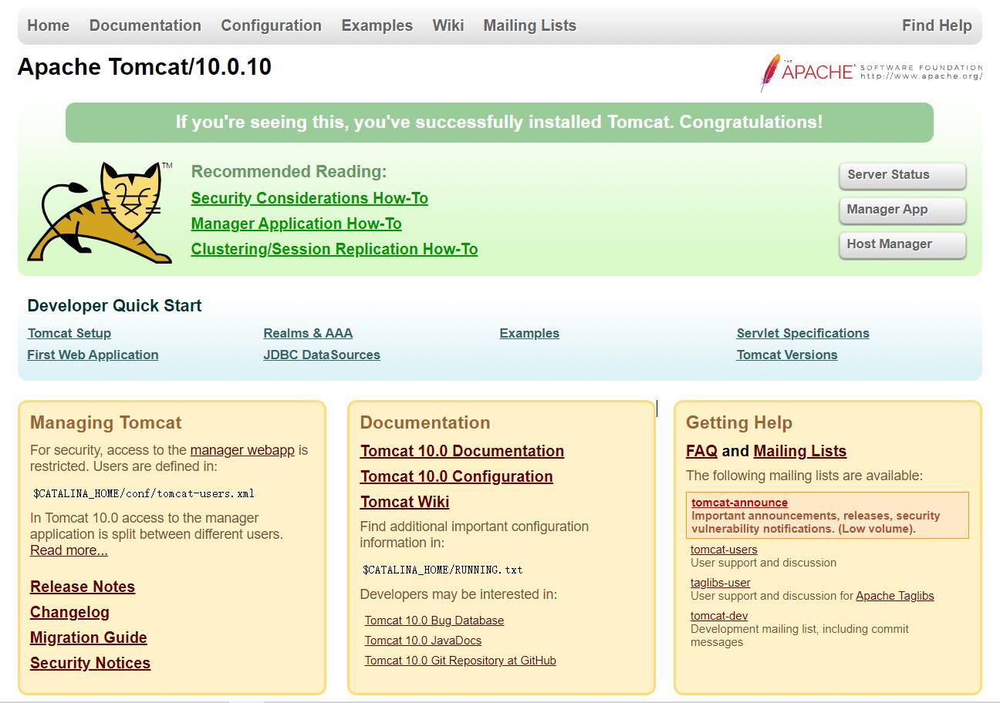
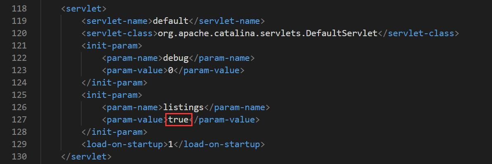
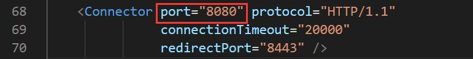

Tomcat 官网：https://tomcat.apache.org/

### 安装

1. zip 下载后解压缩到路径不含中文的任意目录

2. 双击 bin 目录下的 startup.bat 文件即可启动 Tomcat

3. 配置环境变量

   - 新建系统环境变量名为 CATALINA_HOME

     变量为 tomcat 安装路径，如：D:\installlocation-Tomcat\apache-tomcat-10.0.10

   - 新建系统环境变量名为 CATALINA_BASE

     变量为 tomcat 安装路径，如：D:\installlocation-Tomcat\apache-tomcat-10.0.10

   - 找到系统环境变量名 Path

     在 Path 中新增 %CATALINA_HOME%\lib;%CATALINA_HOME%\bin

4. 验证安装是否成功：运行 startup.bat，在浏览器中输入 `127.0.0.1:8080` 或 `localhost:8080`，出现下图所示，则代表成功

   

### 配置并创建本地服务器

1. 新建一个本地测试网页目录，该目录可以放在任意位置，如：`D:\LocalServerByMyself`。将 `webapps\ROOT` 下的 `WEB-INF` 文件夹复制粘贴至本地测试网页目录下。

2. 打开 conf 目录下的 server.xml 文件，找到 `<Valve className="org.apache.catalina.valves.AccessLogValve" directory="logs" prefix="localhost_access_log" suffix=".txt" pattern="%h %l %u %t &quot;%r&quot; %s %b" />`，在其下方添加一句 `<Context path="/server" docBase="D:\LocalServerByMyself"/>`

   `path` 表示在浏览器中输入的路径地址，如此处：在浏览器中输入 `localhost:8080/server` 即可。

   `docbase` 表示放本地测试网页目录的路径。

3. 打开 conf 目录下的 web.xml 文件，将如下所示的红框改为 true

   

4. 打开控制面板 -> 系统和安全 -> Windows Defender 防火墙 -> 左侧边栏，高级设置 -> 左侧边栏，入站规则 -> 右侧边栏，新建规则... -> 选择端口，下一步 -> 选择 TCP，选择特定本地端口，输入端口号，下一步 -> 选择允许连接，下一步 -> 选择需要应用该规则的范围，不知道可以三项都选，下一步 -> 输入名称，如：Tomcat 端口，输入描述（可选），完成

   端口号：在 conf 目录下的 server.xml 文件中，如下图所示查看

   

5. 在入站规则中找到 `Java(TM) Platform SE binary` -> 选中- > 右侧边栏，属性 -> 常规，操作，选择允许连接 -> 高级，配置文件，选择应用该规则的范围，可三项都选

   `Java(TM) Platform SE binary` 有多个，需要都配置一下

4. 配置完成，其他设备想要进入测试网页目录，只需与服务器连接同一局域网，通过 `ip + path ` 即可。

### 中文乱码问题

打开 conf 目录下 logging.properties 文件，将所有 `encoding = UTF-8` 都替换为 `encoding = GBK`

