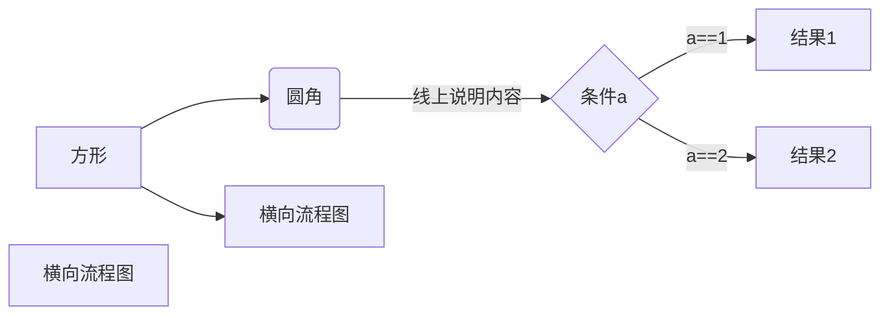
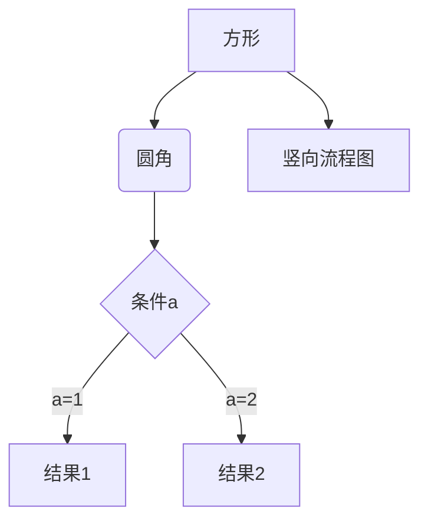
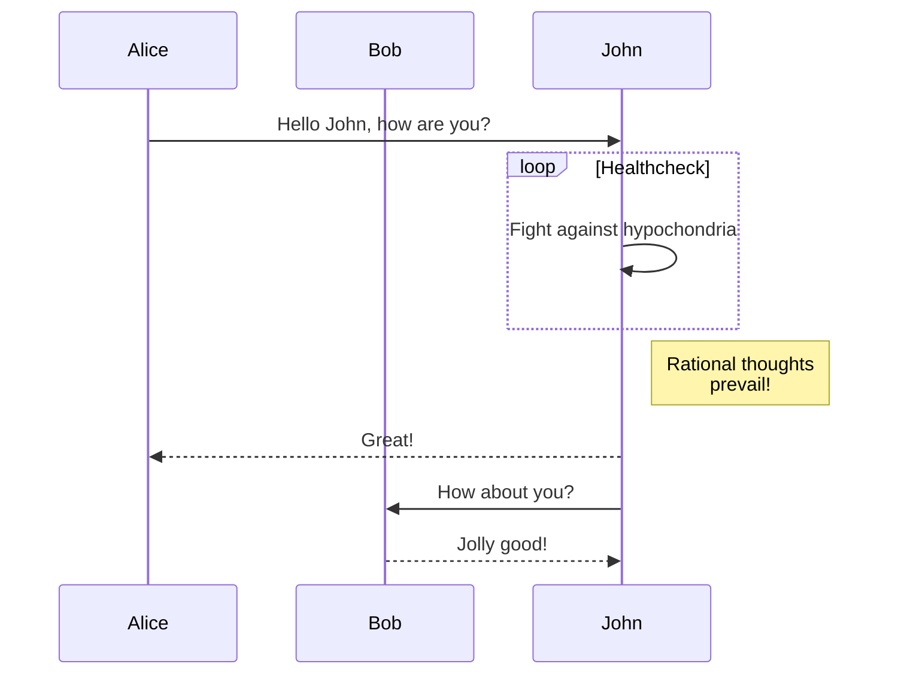
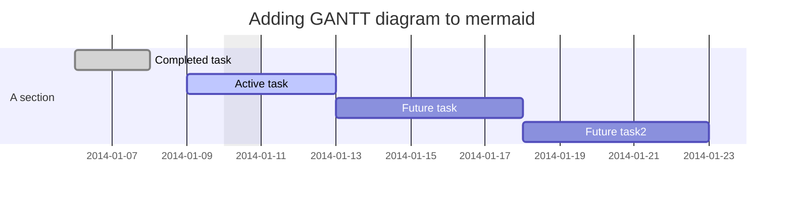
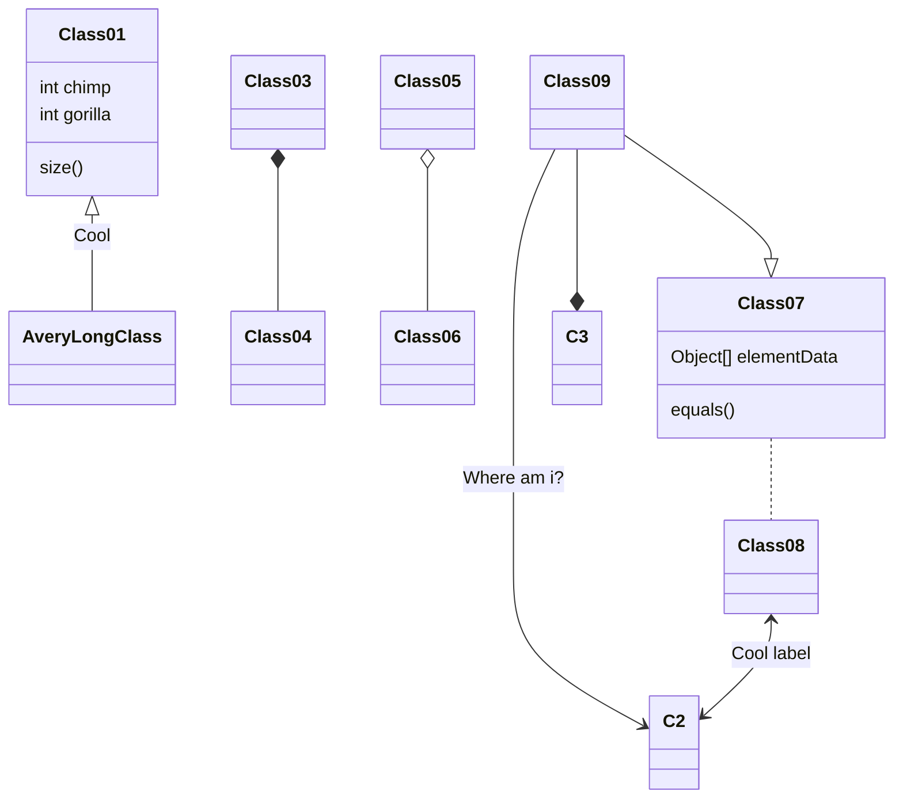
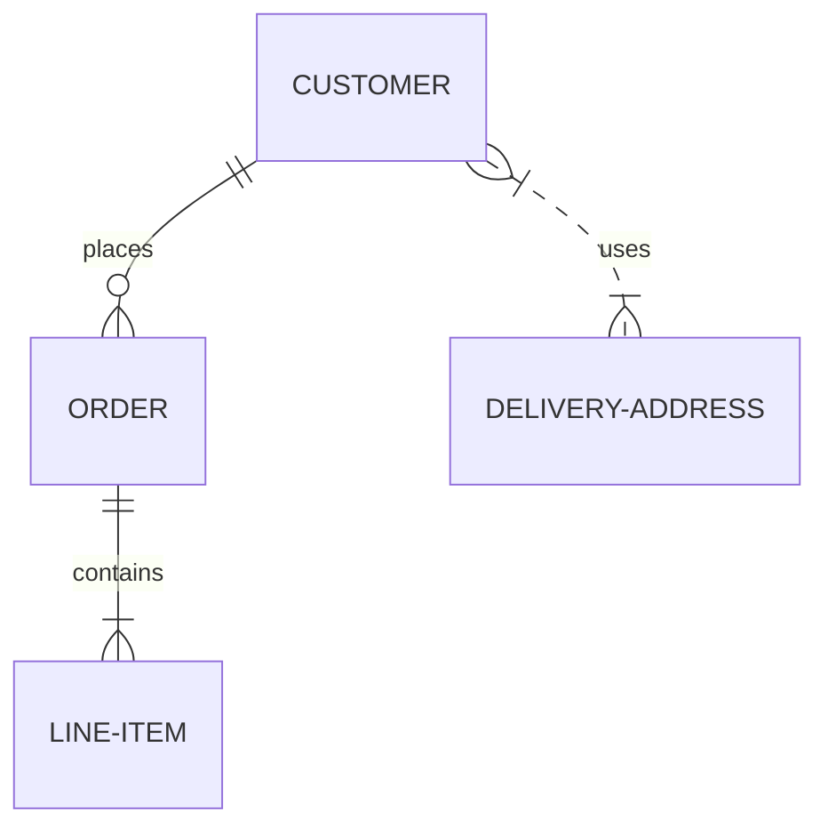
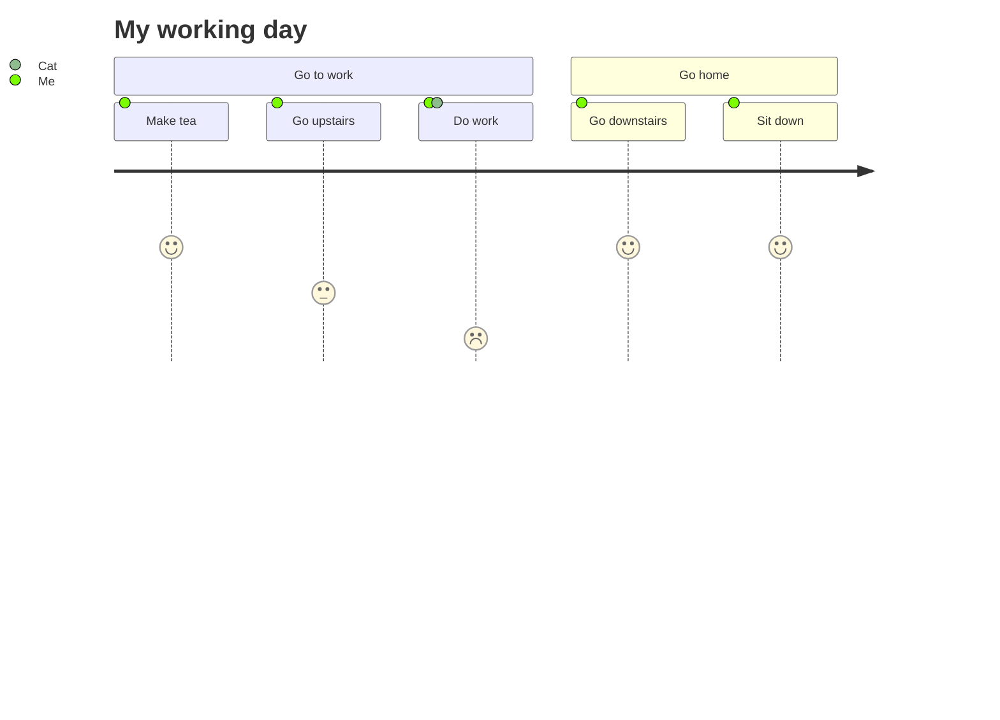

### 图的画法

有 3 种语法可以画图，分别是：mermaid、flow、sequence

但是任然不推荐使用代码画图，mermaid 太丑，flow 画出来的线有问题，所以还是建议使用工具画图后截图。

#### mermaid 语法

官网：https://mermaid-js.github.io/mermaid/#/

##### 流程图

声明：`graph LR` 代表横向，`graph TD` 代表竖向

方形：`键名[方形的内容]`

圆角：`键名(圆角的内容)`

条件：`键名{条件的内容}`

带箭头的实线：`-->`

线上的说名内容：`|线上的说明内容|`

###### 例子

横向的



竖向的



##### 时序图

申明： `sequenceDiagram`

参与者：`participant 键名`

循环：`loop` 开始，`end` 结束，中间写循环体

说明标签：`Note right of 键名: 内容` 标签显示在右侧，`Note right of 键名: 内容` 标签显示在左侧

换行：`<br/>`

实线：`->`，例子：`键名->键名: 内容`

带箭头的实线：`->>`

带箭头的虚线：`-->>`

虚线：-->

注释：%%

###### 例子



##### 甘特图

申明：`gantt`

日期格式：`dateFormat	YYYY-MM-DD`

台头：`title 台头内容`

其他见例子

###### 例子



##### 类图

声明：`classDiagram`

其他见例子

###### 例子



##### 实体关系图

声明：`erDiagram`

其他见例子

###### 例子



##### 用户旅程图

申明：journey

其他见例子

##### 例子



#### flow 语法

官网：http://flowchart.js.org/

##### 流程图

开始：`键名=>start: 内容`

结束：`键名=>end: 内容`

处理过程，方形：`键名=>operation: 内容`

预设处理，双边矩形：`键名=>subroutine: 内容`

判断，菱形：`键名=>condition: 内容`

数据输入输出，平行四边形：`键名=>inputoutput: 内容`

超链接：`:>链接地址` ，地址末尾加 `[blank]` 是新建窗口打开

其他见例子

###### 例子

例一

```flow
st=>start: Improve your
l10n process!
e=>end: Continue to have fun!:>https://youtu.be/YQryHo1iHb8[blank]
op1=>operation: Go to locize.com:>https://locize.com[blank]
sub1=>subroutine: Read the awesomeness
cond(align-next=no)=>condition: Interested to
getting started?
io=>inputoutput: Register:>https://www.locize.app/register[blank]
sub2=>subroutine: Read about improving
your localization workflow
or another source:>https://medium.com/@adrai/8-signs-you-should-improve-your-localization-process-3dc075d53998[blank]
op2=>operation: Login:>https://www.locize.app/login[blank]
cond2=>condition: valid password?
cond3=>condition: reset password?
op3=>operation: send email
sub3=>subroutine: Create a demo project
sub4=>subroutine: Start your real project
io2=>inputoutput: Subscribe

st->op1->sub1->cond
cond(yes)->io->op2->cond2
cond2(no)->cond3
cond3(no,bottom)->op2
cond3(yes)->op3
op3(right)->op2
cond2(yes)->sub3
sub3->sub4->io2->e
cond(no)->sub2(right)->op1

st@>op1({"stroke":"Red"})@>sub1({"stroke":"Red"})@>cond({"stroke":"Red"})@>io({"stroke":"Red"})@>op2({"stroke":"Red"})@>cond2({"stroke":"Red"})@>sub3({"stroke":"Red"})@>sub4({"stroke":"Red"})@>io2({"stroke":"Red"})@>e({"stroke":"Red","stroke-width":6,"arrow-end":"classic-wide-long"})
```

例二

```flow
st=>start: Start|past:>http://www.google.com[blank]
e=>end: End|future:>http://www.google.com
op1=>operation: My Operation|past
op2=>operation: Stuff|current
sub1=>subroutine: My Subroutine|invalid
cond=>condition: Yes
or No?|approved:>http://www.google.com
c2=>condition: Good idea|rejected
io=>inputoutput: catch something...|future

st->op1(right)->cond
cond(yes, right)->c2
cond(no)->sub1(left)->op1
c2(yes)->io->e
c2(no)->op2->e
```

#### sequence 语法

见例子

###### 例子

```sequence
李雷 -> 韩梅梅: Hello 梅梅, How are you?
Note right of 韩梅梅: 韩梅梅心想
韩梅梅 --> 李雷: I'm fine, thanks, and you?
```


