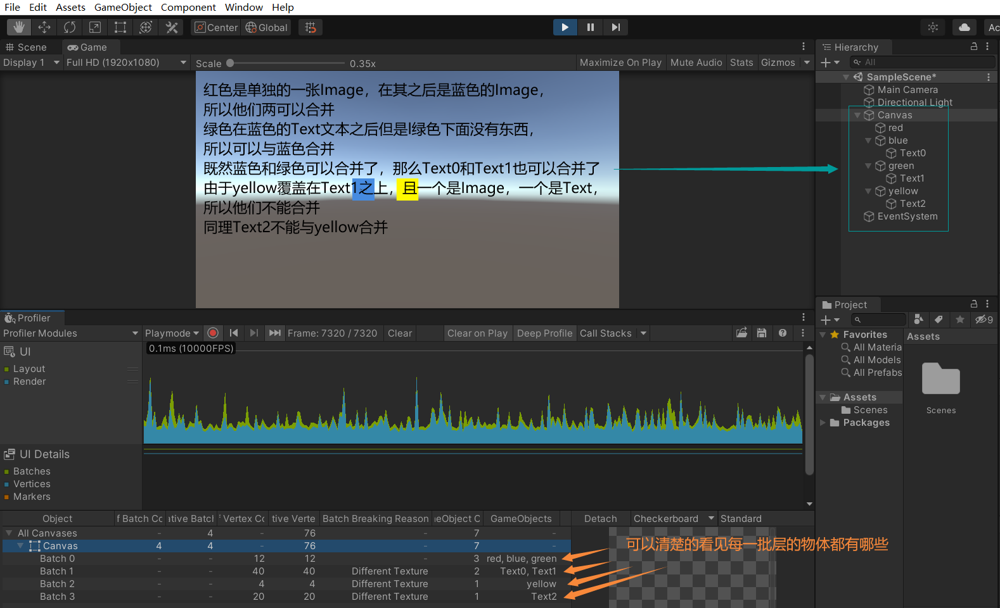

### 分析器 UI 部分的使用

#### 打开 UI 分析器

Window -> Analysis -> Profiler 或快捷键 `Ctrl + 7` 打开

如上图选择分析器模块：UI 和 UI Details Profiler 模块

#### 图表类别

UI 和 UI Details Profiler 模块的图表被分为五个类别。要更改图表中类别的顺序，可以在图表的图例中拖放这些类别。还可以单击某个类别的有色图例以切换是否显示。

##### UI Profiler 模块

- Layout

  Unity 在执行 UI 的布局通道方面花费的时间。这包括 HorizontalLayoutGroup、VerticalLayoutGroup 和 GridLayoutGroup 进行的计算。

- Render

  UI 在完成渲染部分中花费的时间。这是直接渲染到图形设备的成本，或者是渲染到主渲染队列的成本。

##### UI Details Profile 模块

- Batches

  显示一起批处理的绘制调用的总数。

- Vertices

  用于渲染 UI 某个部分的顶点总数。

- Markers

  显示事件标记。用户与 UI 交互（例如，单击按钮或更改滑动条值）时，Unity 将记录标记，然后将它们绘制为图表上的垂线和标签。

#### 模块详细信息面板

注意:  不用调整信息面板，每次运行都会重置信息面板，至少我没找到保存的地方。

选择 UI 或 UI Details Profiler 模块时，Profiler 窗口底部的模块详细信息面板会显示应用程序中 UI 的更多相关详细信息。据此可以检查应用程序中 UI 对象的相关性能分析信息。该面板被分为以下几列：

- Object

  应用程序在性能分析期间使用的 UI 画布的列表。双击一行可以突出显示场景中的匹配对象。

- Self Batch Count

  Unity 为画布生成的批次数量。

- Cumulative Batch Count

  Unity 为画布及其所有嵌套画布生成的批次数量。

- Self Vertex Count

  此画布渲染的顶点数量。

- Cumulative Vertex Count

  此画布和嵌套的画布渲染的顶点数量。

- Batch Breaking Reason

  Unity 拆分此批次的原因。有时 Unity 可能无法对对象同时进行批处理。常见原因包括：

  - 不与画布共面 (Not Coplanar With Canvas)：批处理需要对象的矩形变换与画布共面（未旋转）
  - 画布注入索引 (CanvasInjectionIndex)：CanvasGroup 组件存在并强制新建批次，例如在其余部分上显示一个组合框的下拉列表时。
  - 不同的材质实例、矩形裁剪、纹理、A8 纹理用法 (Different Material Instance, Rect clipping, Texture, or A8TextureUsage)：Unity 只能将具有相同材质、遮罩、纹理和纹理 Alpha 通道用法的对象一起进行处理。

- GameObject Count

  此批次中包含的游戏对象数量。

- GameObjects

  批次中的游戏对象的列表。

从列表中选择 UI 对象时，对象的预览将显示在面板右侧。预览上方的工具栏中有以下选项：

- Detach

  选择此按钮可在单独的窗口中打开 UI 画布。要重新连接该窗口，请将其关闭。

- Preview background

  使用下拉选单来更改预览背景的颜色。可以选择 Checkerboard、Black 或 White。如果 UI 具有特别浅色或深色的方案，这将很有用。

- Preview type

  使用下拉选单来选择 Standard、Overdraw 或 Composite Overdraw。

运行时，非活动状态下的 UI 不占批次数量，在第一次变为活动状态后，开始占批次数量。

UI 是透明队列。在渲染透明队列时，必须经过排序，才能正确渲染。因此，UGUI 在合批之前，会根据 UI 的 Depth、MateriaID 、ImageID、RendererOrder 进行排序，如果相邻的 UI 元素，并且 MateriaID 和 ImageID 相同则可以进行合批处理，

### 合批

合批过程是指 Canvas 合并 UI 元素的网格，并且生成发送给 Unity 渲染管线的命令。 Canvas 使用的网格都是从绑定在 Canvas 上的 CanvasRenderer 获得，但是不包含子 Canvas 的网格。UGUI 的层叠顺序是按照 Hierarchy 中的顺序从上往下进行的，也就是越靠上的组件，就会被绘制在越底部。所有相邻层的可合批的 UI 元素（具有相同材质和纹理），就会在一个 DrawCall 中完成。

#### Depth 计算算法

注意:  CurrentUI.depth 指的是层，相等的为同一批层，能够合并。相交指两个 UI 之间有重叠的地方。

1. 遍历所有 UI 元素（已深度优先排序），对当前每一个 UI 元素 CurrentUI ，如果不渲染，CurrentUI.depth = -1，如果渲染该UI且底下没有其他 UI 元素与其相交（rect Intersects），其 CurrentUI.depth = 0;

2. 如果 CurrentUI 下面只有一个的需要渲染的 UI 元素 LowerUI 与其相交，且可以Batch（material instance id 和 texture instance id 相同，即与 CurrentUI 具有相同的 Material和Texture），CurrentUI.depth = LowerUI.depth；否则，CurrentUI.depth = LowerUI.depth + 1;

   例子：

   

3. 如果 CurrentUI 下面叠了多个元素，这些元素的最大层是 MaxLowerDepth ，如果有多个元素的层都是 MaxLowerDepth ，那么 CurrentUI 和下面的元素是无法合批的；如果只有一个元素的层是 MaxLowerDepth ，并且这个元素和 CurrentUI 的材质、纹理相同，那么它们就能合批。

#### DrawCall 合批(Batch)

