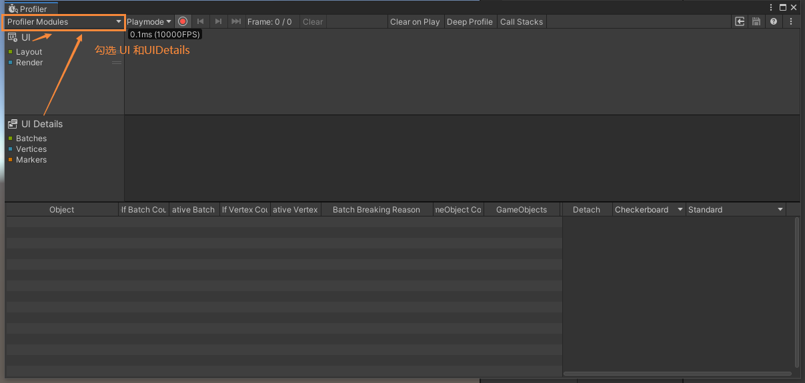
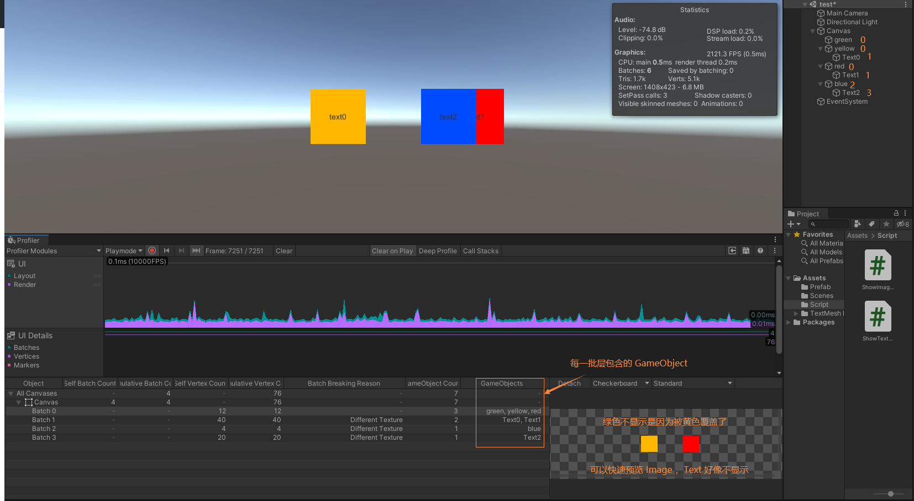
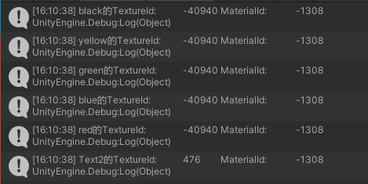
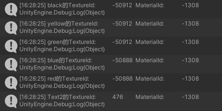

### 分析工具

#### UI 分析器

Window -> Analysis -> Profiler 或快捷键 `Ctrl + 7` 打开

如上图选择分析器模块：UI 和 UI Details Profiler 模块

##### 图表类别

UI 和 UI Details Profiler 模块的图表被分为五个类别。要更改图表中类别的顺序，可以在图表的图例中拖放这些类别。还可以单击某个类别的有色图例以切换是否显示。

###### UI Profiler 模块

- Layout

  Unity 在执行 UI 的布局通道方面花费的时间。这包括 HorizontalLayoutGroup、VerticalLayoutGroup 和 GridLayoutGroup 进行的计算。

- Render

  UI 在完成渲染部分中花费的时间。这是直接渲染到图形设备的成本，或者是渲染到主渲染队列的成本。

###### UI Details Profile 模块

- Batches

  显示一起批处理的绘制调用的总数。

- Vertices

  用于渲染 UI 某个部分的顶点总数。

- Markers

  显示事件标记。用户与 UI 交互（例如，单击按钮或更改滑动条值）时，Unity 将记录标记，然后将它们绘制为图表上的垂线和标签。

##### 模块详细信息面板

注意:  不用调整信息面板，每次运行都会重置信息面板，至少我没找到保存的地方。

选择 UI 或 UI Details Profiler 模块时，Profiler 窗口底部的模块详细信息面板会显示应用程序中 UI 的更多相关详细信息。据此可以检查应用程序中 UI 对象的相关性能分析信息。该面板被分为以下几列：

- Object

  应用程序在性能分析期间使用的 UI 画布的列表。双击一行可以突出显示场景中的匹配对象。

- Self Batch Count

  Unity 为画布生成的批次数量。

- Cumulative Batch Count

  Unity 为画布及其所有嵌套画布生成的批次数量。

- Self Vertex Count

  此画布渲染的顶点数量。

- Cumulative Vertex Count

  此画布和嵌套的画布渲染的顶点数量。

- Batch Breaking Reason

  Unity 拆分此批次的原因。有时 Unity 可能无法对对象同时进行批处理。常见原因包括：

  - 不与画布共面 (Not Coplanar With Canvas)：批处理需要对象的矩形变换与画布共面（未旋转）
  - 画布注入索引 (CanvasInjectionIndex)：CanvasGroup 组件存在并强制新建批次，例如在其余部分上显示一个组合框的下拉列表时。
  - 不同的材质实例、矩形裁剪、纹理、A8 纹理用法 (Different Material Instance, Rect clipping, Texture, or A8TextureUsage)：Unity 只能将具有相同材质、遮罩、纹理和纹理 Alpha 通道用法的对象一起进行处理。

- GameObject Count

  此批次中包含的游戏对象数量。

- GameObjects

  批次中的游戏对象的列表。

从列表中选择 UI 对象时，对象的预览将显示在面板右侧。预览上方的工具栏中有以下选项：

- Detach

  选择此按钮可在单独的窗口中打开 UI 画布。要重新连接该窗口，请将其关闭。

- Preview background

  使用下拉选单来更改预览背景的颜色。可以选择 Checkerboard、Black 或 White。如果 UI 具有特别浅色或深色的方案，这将很有用。

- Preview type

  使用下拉选单来选择 Standard、Overdraw 或 Composite Overdraw。

#### Rendering 分析器

Rendering Profiler 显示渲染统计信息。时间轴显示渲染的批次 (Batches)、SetPass 调用 (SetPass Calls)、三角形 (Triangles) 和顶点 (Vertices) 的数量。下方面板将显示更多渲染统计信息，这些统计信息与 GameView Rendering Statistics 窗口中显示的统计信息非常接近。

##### 模块详细信息面板

- SetPass Calls

  渲染 pass 的数量。每个 pass 都需要 Unity 运行时绑定一个新的着色器（新的材质、渲染状态、渲染顶点批次等），这可能会带来 CPU 开销。

#### Statistics 窗口

Game 视图的右上角有一个 Stats 按钮。按下此按钮时将显示一个覆盖窗口，其中显示实时渲染统计信息，这对于优化性能非常有用。显示的具体统计信息根据构建目标而有所不同。

- FPS and Time per frame 

  每秒帧数 和 处理和渲染一个游戏帧所花费的时间。请注意，此数字仅包括进行帧更新和渲染 Game 视图所用的时间；不包括在 Editor 中绘制 Scene 视图、检视面板处理和其他仅限于 Editor 的处理所花费的时间。

- Batches

  批处理 (Batching) 可让引擎尝试将多个对象的渲染组合到一个内存块中以便减少由于资源切换而导致的 CPU 开销。

- Saved by batching

  合并的批次数。为确保良好的批处理，应尽可能在不同对象之间共享材质。更改渲染状态会将批次分成具有相同状态的组。

- Tris

  绘制的三角形的数量。在针对低端硬件进行优化时，这一点非常重要。

- Verts

  绘制的顶点的数量。在针对低端硬件进行优化时，这一点非常重要。
  
- SetPass Calls

  渲染 pass 的数量。每个 pass 都需要 Unity 运行时绑定一个新的着色器，这可能会带来 CPU 开销。
  
- Visible Skinned Meshes

  渲染的蒙皮网格的数量。

- Animations

  播放的动画的数量。

### 图形绘制过程

在 Unity 中，每次绘制前 CPU 都需要做很多处理工作：确定哪些光源影响该对象，设置着色器和着色器参数，向图形驱动程序发送绘制命令，而图形驱动程序随后将准备发送到 显卡 的命令。显卡 收到命令后，GPU会开始图形渲染。

### 影响图形性能的主要因素

游戏的图形部分主要影响计算机的两个系统：CPU 和 GPU。CPU 和 GPU 的优化策略大不相同，优化 CPU 则让 GPU 做更多的工作，优化 GPU 则让 CPU 做更多的工作。

瓶颈及检查方法：

- GPU 
  - 受填充率或内存带宽制约。降低显示分辨率并运行游戏。如果显示分辨率降低后游戏运行更快，表明 GPU 填充率可能是限制因素。
  - GPU 有太多顶点需要处理。可接受的能确保良好性能的顶点数量取决于 GPU 和顶点着色器的复杂程度。一般来说，移动端应不超过 100,000 个顶点。另一方面，即使有数百万个顶点，PC 也能管理到位，不过最好还是通过优化尽可能减少此数量。
- CPU 
  - 受到需要渲染的批次数的限制。检查 Rendering Statistics 窗口中的 batches。渲染的批次越多，CPU 成本越高。
  - CPU 有太多顶点需要处理。这些顶点可能位于蒙皮网格、布料模拟、粒子或其他游戏对象和网格中。如上所述，通常较好的做法是在不影响游戏质量的情况下尽可能降低此数量。
- 其他问题
  - 如 脚本 和 物理系统 中，这些可以通过 Unity Profiler 找出。

### CPU 优化

情况说明及优化依据

GPU 的处理速度一般比 CPU 的处理速度快，但是每次绘制前都需要 CPU 先做处理工作，一旦渲染的批次变多，CPU 就要大量做绘制前的处理工作，加重了 CPU 的工作负担，也就导致 CPU 卡顿。

例如：如果有一千个三角形，如果它们都在一个网格中，而不是每个三角形在一个网格中（这种情况下加起来就有 1000 个网格），则 CPU 处理起来就比较容易。两种方案的 GPU 成本非常相似，但 CPU 完成渲染一千个对象（而不是一个）的工作要高得多。

优化

- 减少可见对象数量。

- 通过手动方式或使用 Unity 的绘制调用批处理将近处对象组合在一起。

  绘制调用批处理的前提：使用相同纹理 (Texture) 和 材质 (Marterial)。Unity 会自动组合。

- 通过将单独的纹理放入更大的纹理图集，在对象中使用更少的材质。

  一个 Canvas 中的图片尽量放在一个图集 (Sprite Altas) 内，图集不同会影响 batches。

- 减少可能导致对象多次渲染的因素（例如反射、阴影和每像素光照）。

- 在暂停菜单、等待玩家行动等 场景相对简单 或 内容大多为静态 或 活动较低的时间段 中可以使用 OnDemandRendering 降低帧率来防止移动设备温度升高、延长设备电池续航时间等。

  OnDemandRendering 在 Android 上与 Optimized Frame Pacing（优化帧的速率）一起使用时需注意：

  - 如果还使用 OpenGL ES，则 Optimized Frame Pacing 在帧率为 20、30 或 60 帧/秒时效果最好。若要确保以其中一个帧率进行渲染，请使用 OnDemandRendering.effectiveRenderFrameRate。
  - Vulkan 不那么严格，可使用更多数量的有效帧率。
  - 如果请求使用不兼容的帧率，则应用程序会以尽可能快的速度进行渲染。另请注意，太高的 renderFrameInterval 可能会导致应用程序无响应，因为渲染帧之间的时间太长。

  更多关于 OnDemandRendering 见 Unity 官网。

### GPU 优化

优化

- 注意顶点不要超过 100,000 个。
- 压缩纹理
- 纹理Mipmap

### 绘制调用批处理 (Draw call batching)

为了在屏幕上绘制一个 GameObject 在屏幕上，引擎必须向图形 API（如 OpenGL 或 Direct3D）发出绘制调用。绘制调用通常是资源密集型操作，图形 API 为每次绘制调用执行大量工作，这导致 CPU 方面的性能开销。这主要是由绘制调用之间的状态变化造成的（比如 切换到不同的材料），而这种情况会导致图形驱动程序中执行资源密集型验证和转换步骤。

Unity 使用两种方法来应对此情况：

- 动态批处理：对于足够小的网格，此方法会在 CPU 上转换网格的顶点，将许多相似顶点组合在一起，并一次性绘制它们。
- 静态批处理：将静态（不移动）游戏对象组合成大网格，并以较快的速度渲染它们。

与手动合并游戏对象相比，内置批处理有几个好处；最值得注意的是，仍然可以单独剔除游戏对象。但是，也有一些缺点；静态批处理会导致内存和存储开销，动态批处理会产生一些 CPU 开销。

在 Unity 的 Player 设置中的 Other Settings 下方可以启用或禁用动态和静态批处理。

#### 批处理的材质设置

尽可能使用 共享材质 ，纹理不同可以打成一个 图集 从而一起批处理。不同材质的阴影投射物的 阴影 pass 所需材质中的值相同，则这些阴影也可以一起批处理。

 注意：从脚本访问共享材质属性，修改 Renderer.material 将创建该材质的副本。应使用 Renderer.sharedMaterial 来保留共享的材质。

#### 动态批处理（网格）

如果移动的游戏对象共享相同材质并满足其他条件，则 Unity 可自动在同一绘制调用中批处理这些游戏对象。动态批处理是自动完成的，无需您进行任何额外工作。

- 批处理动态游戏对象在每个顶点都有一定开销，因此批处理仅会应用于总共包含不超过 900 个顶点属性且不超过 300 个顶点的网格。

  如果着色器使用顶点位置、法线和单个 UV，最多可以批处理 300 个顶点，而如果着色器使用顶点位置、法线、UV0、UV1 和切线，则只能批处理 180 个顶点。

  注意：将来可能会更改属性数量限制。

- 如果游戏对象在变换中包含镜像，则不会对这些对象进行批处理（例如，具有 +1 缩放的游戏对象 A 和具有 –1 缩放的游戏对象 B 无法一起接受批处理）。

- 即使游戏对象基本相同，使用不同的材质实例也会导致游戏对象不能一起接受批处理。例外情况是阴影投射物渲染。

- 带有光照贴图的游戏对象具有其他渲染器参数：光照贴图索引和光照贴图偏移/缩放。通常，动态光照贴图的游戏对象应指向要批处理的完全相同的光照贴图位置。

- 多 pass 着色器会中断批处理。

  - 几乎所有的 Unity 着色器都支持前向渲染中的多个光照，有效地为它们执行额外 pass。“其他每像素光照”的绘制调用不进行批处理。
  - 旧版延迟（光照 pre-pass）渲染路径会禁用动态批处理，因为它必须绘制两次游戏对象。

因为动态批处理的工作原理是将所有游戏对象顶点转换到 CPU 上的世界空间，所以仅在该工作小于进行绘制调用的情况下，才有优势。绘制调用的资源需求取决于许多因素，主要是使用的图形 API。例如，对于游戏主机或诸如 Apple Metal 之类的现代 API，绘制调用的开销通常低得多，通常动态批处理根本没有优势。

### Canvas 优化

情况说明及优化依据

一个 Canvas 下的所有 UI 元素都是合在一个网格 (Mesh) 中的，过大的 网格 在更新时开销很大。每次渲染一个 Canvas，Unity 会尽可能的合并 Canvas 中的 UI 元素为一个批次。当该 Canvas 内有一个 UI 元素发生改变，Unity 就要重新对该 Canvas 进行合批。

每一个 Canvas 都是可以作为一个单独渲染的存在，即一个 Canvas 下面 GameObject 发生改变，只有该 Canvas 需要重建，其他 Canvas 不受影响。

优化要点

- 每个较复杂的 UI 界面，都自成一个 Canvas（可以时子 Canvas）。在 UI 界面很复杂时，要划分更多的子 Canvas。
- 动静分离。
- Canvas 也不能细分的太多，因为会导致 Draw Call 的上升。因为 一个 Canvas 至少会有一个渲染批次。一般 Canvas 分几十个即可，千万不要分 上百个 。
- 把一个面板的 UI 资源放到一个图集里，这样只需要加载一个图集。如果一个面板的 UI 资源来自于多个图集，Unity 要将所有该面板用到的 图集 都加载一遍，这会造成显卡的卡顿。
- 背景大图不要和小图放在一个图集里。背景大图应该是指该面板用不到的大图？

### 半透明优化 Overdraw（GPU）

情况说明及优化依据

如果一个 UI 界面上有许多半透明的 UI 元素，这会导致这些半透明的 UI 元素所在的位置的像素点会被绘制多次，会造成GPU的性能开销。没有半透明的 UI 元素所在的位置的像素点会保留靠近屏幕位置的像素点，剔除远离屏幕位置的像素点。而有半透明的 UI 元素所在的位置的 距离屏幕远的 像素点不能被剔除。这会造成光栅化阶段的填充像素过多。

在 UGUI 中使用 Alpha = 0 的不可见 Image 参与 Raycast，譬如在屏幕空白处点击的相应等虽然这些元素在屏幕上不可见但依然参与了绘制。

优化要点

- 禁用不可见的 UI。比如当打开一个系统是如果完全挡住了另外一个系统，则可以将被遮挡住的系统禁用。
- 不要使用空的 Image。在 Unity 中，RayCast 使用 Graphic 作为基本元素来检测 touch ，使用空的 Image 并将 alpha 设置为 0 来接受 touch 事件会产生不必要的 overdraw。
- 无图 UI 遮罩点击优化。

### ScrollView 问题

- 背包内只有几十个物品的时候问题不大，上百个物品的时候会有大问题。
- 每次拖动 ScrollView 时都会引发 OnValueChanged 事件。
- 每当 ScrollView 滚动整个 Canvas 时，它就会变脏，会引起 Canvas 重新合批。所以，将每隔 ScrollView 放在单独的 Canvas 上。
- EventSystem.Update() 处理会处理场景中的输入检测，使光线投射过滤层次结构以查找接受此输入的组件。从图形和文本中删除不必要的 RaycastTarget 属性将缩短处理时间。所以，如果物品不能点击就千万不要挂 Graphics Raycaster 。
- 不要使用个人和类型的蒙版组件，包括 RectMask2D。Mask 组件 虽然可以使不需要显示的部分不显示，但是该不显示的部分任然参与渲染。每次拖动 ScrollView ，Canvas 都会重新合批，而这些不显示的部分也会进行重新合批。
- ScrollRect 不会关闭不在可视范围内的物品。
- 当 ScrollView 中有很多元素时，使用对象池解决方案。

当有物体在滚动时不可见了，那么必有一个物体可见了，所以只需要使用这个不可见的物体显示可见的物体就可以了。

方法一：

初始化或滚动时：

- 计算可视范围
- 遍历每一格，判断其是否位于可视范围内
- 若可见，则显示
- 不可见，则隐藏

滚动时：

- 重新计算可见的格子
- 若有格子移出，则将其栏位用于新的移入的格子的显示

### UGUI 其他优化要点

优化要点

- 不处理点击的 GameObject 不要挂 Graphics Raycaster。因为，一旦挂上 Unity 会在每一帧检查该 UI 元素是否被点击。
- 少用 LayoutGroup 或者 Content Size Fitter。因为，用户一旦进行点击、滚动滚动条等操作，会造成整个 UI 界面重新绘制，LayoutGroup 和 Content Size Fitter 会进行重新布局运算，从而消耗大量计算时间。如背包中存放 1000 个物品，其实际开销是十分巨大的。可以自己写算法实现
- 遍历 SetDirty对象会消耗性能

### 合批

合批过程是指 Canvas 合并 UI 元素的网格，并且生成发送给 Unity 渲染管线的命令。 Canvas 使用的网格都是从绑定在 Canvas 上的 CanvasRenderer 获得，但是不包含子 Canvas 的网格。UGUI 的层叠顺序是按照 Hierarchy 中的顺序从上往下进行的，也就是越靠上的组件，就会被绘制在越底部。所有相邻层的可合批的 UI 元素（具有相同材质和纹理），就会在一个 DrawCall 中完成。

#### Depth 计算算法

注意:  CurrentUI.depth 指的是层，相等的为同一批层，符合material instance id 和 texture instance id 相同的条件就能够合并。相交指两个 UI 之间在 Game 窗口中有重叠的地方。重叠是对的。网上没有说只要显示重叠就可以，但我的测试结果与 Z 轴无关。

1. 遍历所有 UI 元素（已深度优先排序），对当前每一个 UI 元素 CurrentUI ，如果不渲染，CurrentUI.depth = -1，如果渲染该UI且底下没有其他 UI 元素与其相交（rect Intersects），其 CurrentUI.depth = 0;

2. 如果 CurrentUI 下面只有一个需要渲染的 UI 元素 LowerUI 与其相交，且可以Batch（material instance id 和 texture instance id 相同，即与 CurrentUI 具有相同的 Material 和 Texture），CurrentUI.depth = LowerUI.depth；否则，CurrentUI.depth = LowerUI.depth + 1;

3. 如果 CurrentUI 下面叠了多个元素，这些元素的最大层是 MaxLowerDepth ，判断 CurrentUI 是否与所有为 MaxLowerDepth 的 UI 元素中的任意一个具有相同的 Material 和 Texture，如果有那么它们就能合批。也就是按照前两条规则遍历计算所有的层级号，其中最大的那个作为自己的层级号。

4. Unity 以 Canvas 为单位进行绘制，按照前两条规则，当遍历 Hierarchy  进行处理时，如果列表中有 X 元素 Z 轴不为 0，则处理会被打断，X 元素之前的归为一个处理批次，X 元素以及 X 元素之后的元素归为一个处理批次。

   没看懂，自己测试 Z 轴不同不影响。

5. 不同图集会影响 Texture id ，导致图片不在同一批次。

6. Mask 会独自占用一个批并导致同时挂载的 Image 也占用一个批，所以占两个批

例子

例1：

从上至下看 Hierarchy 窗口

绿色 下面没有东西，按照规则 1， `green.Depth = 0`

黄色 叠在 绿色上面，按照规则 2， `yellow.Depth = green.Depth`，所以 `yellow.Depth = 0`

Text0 叠在 黄色上面，按照规则 2，不是同一种 Texture， `Text0.Depth = yellow.Depth + 1` ，所以 `Text0.Depth = 1`

红色 下面没有东西，按照规则 1， `red.Depth = 0` 

Text1 叠在 红色上面，按照规则 2，不是同一种 Texture， `Text0.Depth = yellow.Depth + 1` ，所以 `Text1.Depth = 1`

蓝色 叠在 Text1 上面，按照规则 2，不是同一种 Texture， `blue.Depth = Text1.Depth + 1`，所以 `blue.Depth = 2`

Text2 叠在 蓝色上面，按照规则 2，不是同一种 Texture， `Text2.Depth = blue.Depth + 1` ，所以 `Text2.Depth = 3`

相同 `Depth` 且 `Texture` 和 `Material` 的在同一批，所以：

- Batch0：green, yellow, red
- Batch1：Text0, Text1
- Batch2：blue
- Batch3：Text2

例2：

使用 1 个图集：

可以看出 Texture id 是相同的

使用 2 个图集后：

可以发现不同图集 Texture id 不同
