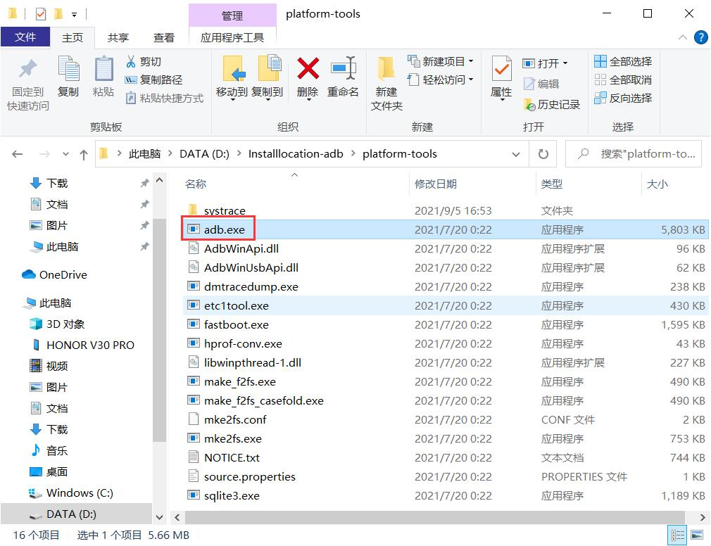
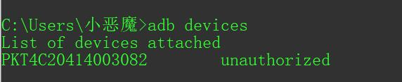
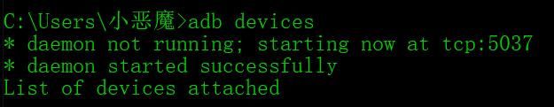

### 安装

下载地址：https://developer.android.google.cn/studio/releases/platform-tools

1. 将下载下来的压缩包解压后的文件夹放在任意目录下

2. 配置环境变量，系统环境变量 Path 中添加一条路径，该路径下需要有 `adb.exe` 文件，如：`D:\Installlocation-adb\platform-tools`。<font color=orange>路径尽量不要出现中文，会乱码的</font>

   

3. 检查是否安装成功，在命令提示符（cmd）中输入 `adb version` ，若有版本提示，则成功

### 连接手机

1. 手机需要先打开开发者模式，一般情况：设置 -> 关于手机 -> 版本号 -> 一顿狂点，好像型号不同点击次数也不同，点就对了

2. 打开 USB 调试

   华为鸿蒙系统：设置 -> 系统和更新 -> 开发人员选项 -> 调试，打开USB 调试，打开 "仅充电" 模式下允许 ADB 调试

3. <font color = orange>手机必须与电脑连接同一个局域网</font>

4. 手机插 USB 线连接电脑，选择仅充电

5. 弹出是否允许 USB 调试的提示框，可勾选始终允许使用这台计算机进行调试 -> 确定

6. 在命令提示符中输入 `adb devices` 查看可连接设备

   成功：

   

   没有设备：

   

   <font color = orange>没有设备可能原因：</font>

   - 手机未打开 USB 调试模式

   - 5037 端口被占用

     ```shell
     # 关闭 adb
     adb kill-server
     # 启动 adb 
     adb start-server
     # 查看 adb 是否有进程，5037 端口是否被占用
     # 若被占用会提示 cannot bind to 127.0.0.1:5037
     adb nodaemon server
     # 查看 5037 端口被哪个进程占用了
     netstat -ano | findstr "5037"
     # 根据获取的 PID 杀掉进程
     # 在杀掉进程前可以进入任务管理器 -> 详细信息 -> 找到该 PID 的进程确认是否要杀掉
     taskkill /f /pid PID
     如：taskkill /f /pid 14812
     ```

7. 在 `adb devices` 有设备的前提下，在命令提示符中输入 `adb tcpip 5555`，成功会提示 `restarting in TCP mode port: 5555 `

8. 在命令提示符中输入 `adb connect 手机IP地址:5555` ，成功会提示 `connected to 手机IP地址:5555`。至此手机连接成功，手机以后可以使用无线连接，直接在命令提示符中输入 `connected to 手机IP地址:5555`即可，无需插线，但必须与电脑连在同一个局域网内

   查看手机IP地址：设置 -> 关于手机 -> 状态信息 -> IP 地址

9. 断开连接，在命令提示符中输入 `adb disconnect 手机IP地址:5555`，成功会提示 `disconnected 手机IP地址:5555`

